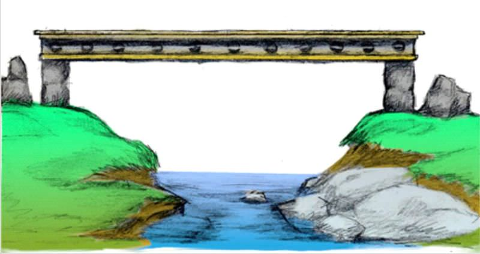
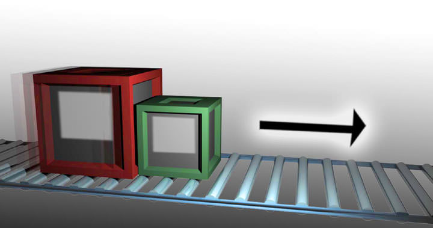
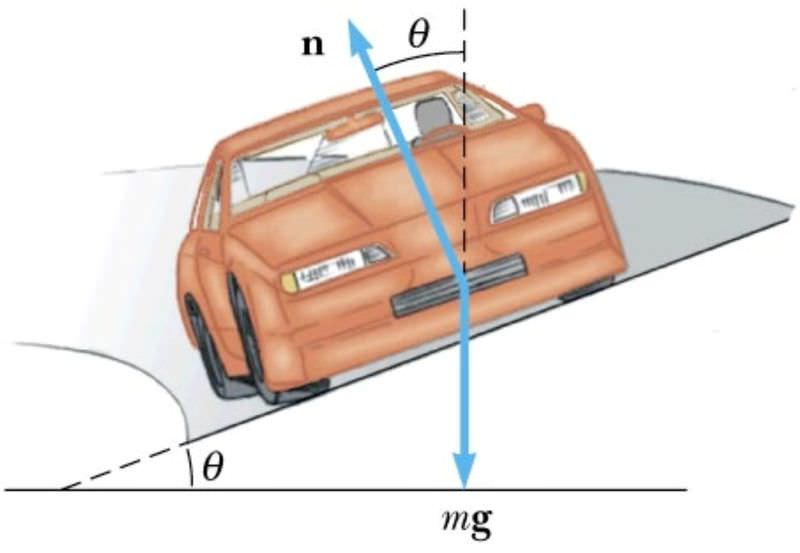

<!--
author:    James J Dann; James H Dann, PhD 

email:    LiaScript@web.de

version:  0.0.1

language: en

narrator: US English Female

comment:  CK-12 Basic Physics - Second Edition updates CK-12 Basic Physics and is intended to be used as one small part of a multifaceted strategy to teach physics conceptually and mathematically.

logo:     ../cover.jpg

tags:      circular motion, physics, electric circuits, electrostatics, energy, force, gravity, heat, light, momentum, motion, Optics, projectile motion, Units, Wave

-->

# People's Physics Book - Basic

> This document was automatically translated to LiaScript from
>
> https://www.ck12.org/book/peoples-physics-book-basic/

## 1.0 Basic Physics SE-Units

<article>

Units identify what a specific number represents. For example, the number 42 can be used to represent 42 miles, 42 pounds, or 42 elephants! Without the units attached, the number is meaningless. Also, correct unit cancellation can help you find mistakes when you work out problems.

**Key Concepts**

* Every calculation and answer to a physics problem must include units. Even if a problem explicitly asks for a speed in meters per second (m/s), the answer is 5 m/s, not 5.
* When you’re not sure how to attack a problem, you can often find the appropriate equation by thinking about which equation will provide an answer with the correct units. For instance, if you are looking to predict or calculate a distance, use the equation where all the units cancel out, with only a unit of distance remaining.
* This book uses _SI units_ (La Système International d’Unités).
* When converting speeds from one set of units to another, remember the following rule of thumb: a speed measured in _mi/hr_ is about a little more than double the value measured in _m/s_ (_i.e._, 10 m/s is equal to about 20 MPH). Remember that the speed itself hasn’t changed, just our representation of the speed in a certain set of units.
* If a unit is named after a person, it is capitalized. So you write “10 Newtons,” or “10 N,” but “10 meters,” or “10 m.”
* Your weight is simply the force of gravity on you, so pounds are just the English version of Newtons

**Key Equations**

* 1 meter = 3.28 feet
* 1 mile = 1.61 kilometers
* 1 lb. (1 pound) = 4.45 Newtons
* 1 kg is equivalent to 2.21 lb. on Earth where acceleration of gravity is $9.8 \ m/s^2$

**An Example of unit conversion:**

20 m/s = ? mi/hr

20 m/s (1 mi/1600 m) = .0125 mi/s

.0125 mi/s (60 s/min) = .75 mi/min

.75 mi/min (60 min/hr) = 45 mi/hr

**Calculator 101 –TI83**

* **Arrow Keys:** Use the arrow keys to scroll around on the line that your typing your calculation and use the DEL key to delete anything. Use the insert key (type $2^{\text{nd}}$ then DEL) to add something in.
* **Calculator only does what you tell it to:** The order of operation is as follows and in order: exponents, multiplication and division, adding and subtracting.
* **Some useful tips:** The orange key in the upper left corner is very handy. If you hit this button first and then another key, the calculator will operate the command in orange above the key. Here are some good ones

__$\boxed{2^{\text{nd}}}$ then $\boxed{\text{ENTER}}$ = ENTRY: the calculator will repeat the last line. If you want the one above it, do it twice. Etc.__

$\boxed{2^{\text{nd}}}$ then $\boxed{(-)}$ = ANS: the calculator will put in the answer from last calculation into your equation

* **Scientific Notation:** On the calculator the best way to represent $3 \times 10^8$ is to type in 3E8, which means 3 times ten to the eighth power. You get the ‘E’ by hitting the $\boxed{2^{\text{nd}}}$ then $\boxed{,}$.
* **Common Problems:** _Student wants to divide 400 by_ $2 \pi$, but types ‘$400/2 \pi$’ into calculator. The calculator reads this as ‘400 divided by 2 and multiplied by $\pi$’. What you should do is either ‘$400/(2 \pi)$’ or ‘$400/2$’ enter then ‘$/\pi$’ enter.

___Student wants multiply 12 by the result of 365-90,_ but types in ‘$12*365-9$’. The calculator multiplies 12 by 365 _then_ subtracts 90. What you should do is type in ‘$12*(365-90)$’.__

_Negative Exponents:_ You must use the white ‘$(-)$’ key for negative exponents.

* **Rounding:** Round your answers to a reasonable number of digits. If the answer from the calculator is 1.369872654389, but the numbers in the problem are like 21 m/s and 12s, you should round off to 1.4. To report the full number would be misleading (i.e. you are telling me you know something to very high accuracy, when in fact you don’t). Do not round your numbers while doing the calculation, otherwise you’ll probably be off a bit due to the dreaded ‘round off error’.
* **Does your answer make sense:** Remember you are smarter than the calculator. Check your answer to make sure it is reasonable. For example, if you are finding the height of a cliff and your answer is 0.00034 m. That can’t be right because the cliff is definitely higher than 0.34 mm. Another example, the speed of light is $3 \times 10^8 \ m/s$ (i.e. light travels 300 million meters in one second). Nothing can go faster than the speed of light. If you calculate the speed of a car to be $2.4 \times 10^{10} \ m/s$, you know this is wrong and possibly a calculator typ-o.

**Key Applications**

The late, great physicist Enrico Fermi used to solve problems by making educated guesses. For instance, say you want to _guess_timate the number of cans of soda drank by everybody in San Francisco in one year. You’ll come pretty close if you guess that there are about 800,000 people in S.F., and that each person drinks on average about 100 cans per year. So, 80,000,000 cans are consumed every year. Sure, this answer is wrong, but it is likely not off by more than a factor of 10 (i.e., an “order of magnitude”). That is, even if we guess, we’re going to be in the _ballpark_ of the right answer. That is always the first step in working out a physics problem.

| **_Type of measurement_** | **_Commonly used symbols_** | **_Fundamental units_** |
| --- | --- | --- |
| length or position | $d, x, L$ | meters (m) |
| time | $t$ | seconds (s) |
| velocity | $v$ | meters per second (m/s) |
| mass | $m$ | kilograms (kg) |
| force | $F$ | Newtons (N) |
| energy | $E, K, U, Q$ | Joules (J) |
| power | $P$ | Watts (W) |
| electric charge | $q, e$ | Coulombs (C) |
| temperature | $T$ | Kelvin (K) |
| electric current | $I$ | Amperes (A) |
| electric field | $E$ | Newtons per Coulomb (N/C) |
| magnetic field | $B$ | Tesla (T) |

_Pronunciation table for commonly used Greek letters_

$$
\begin{align*}
&\mu \ \text{``mu''} & & \tau \ \text{``tau''} & & \Phi \ \text{``phi''}^\ast & & \omega \ \text{``omega''}  & & \rho \ \text{``rho''}\\
&\theta \ \text{``theta''}  & & \pi \ \text{``pi''}  & & \Omega \ \text{``omega''}^\ast  & & \lambda \ \text{``lambda''}  & & \Sigma \ \text{``sigma''}^\ast \\
&\alpha \ \text{``alpha''}  & & \beta \ \text{``beta''}  & & \gamma \ \text{``gamma''}  & & \Delta \ \text{``delta''}^\ast  & & \varepsilon \ \text{``epsilon''}
\end{align*}
$$

$^\ast$upper case

(a subscript zero, such as that found in $``X_0''$ is often pronounced “naught” or “not”)

**Units and Problem Solving Problem Set**

_‘Solving a problem is like telling a story.’_ -Deb Jensen 2007

For the following problems and all the problems in this book, show the equation you are using before plugging in the numbers, then show each and every step as you work down line by line to get the answer. Equally important, show the units canceling at each step.

**Example:**

Problem: An $8^{\text{th}}$ grader is timed to run 24 feet in 12 seconds, what is her speed in meters per second?

Solution:

$$
\begin{align*}
D & = rt\\
24 \ ft & = r(12 \ s)\\ 
r & = 24 \ ft/12 \ s = 2 \ ft/s\\
r & = 2 \ ft/s \ast (1 m/3.28 \ ft) = 0.61 \ m/s
\end{align*}
$$

1.  Estimate or measure your height.
    1.  Convert your height from feet and inches to meters
    2.  Convert your height from feet and inches to centimeters (100 cm = 1 m)
2.  Estimate or measure the amount of time that passes between breaths when you are sitting at rest.
    1.  Convert the time from seconds into hours
    2.  Convert the time from seconds into milliseconds (ms)
3.  Convert the French speed limit of 140 km/hr into mi/hr.
4.  Estimate or measure your weight.
    1.  Convert your weight in pounds on Earth into a mass in kg
    2.  Convert your mass from kg into $\mu g$
    3.  Convert your weight into Newtons
5.  Find the _SI_ unit for pressure (look it up on internet).
6.  An English lord says he weighs 12 stones.
    1.  Convert his weight into pounds (you may have to do some research online)
    2.  Convert his weight from stones into a mass in kilograms
7.  If the speed of your car increases by 10 mi/hr every 2 seconds, how many mi/hr is the speed increasing every second? State your answer with the units mi/hr/s. \[Figure 2\]
8.  A tortoise travels 15 meters (m) in two days. What is his speed in m/s? mi/hr?
9.  $80 \ m + 145 \ cm + 7850 \ mm = X \ mm.$ What is $X$?
10. A square has sides of length 45 mm. What is the area of the square in $mm^2$?
11. A square with area $49 \ cm^2$ is stretched so that each side is now twice as long. What is the area of the square now? Convert to $m^2$
12. A spacecraft can travel 20 km/s. How many km can this spacecraft travel in 1 hour (h)?
13. A dump truck unloads 30 kilograms (kg) of garbage in 40 s. How many kg/s are being unloaded?
14. Looking at the units for Electric field (_E_) in the table at the beginning of the chapter, what do you think the formula is for Force in an electric field?
15. Estimate the number of visitors to Golden Gate Park in San Francisco in one year. Do your best to get an answer that is right within a factor of 10. Show your work and assumptions below.
16. Estimate the number of plastic bottles of water that are used in one year at Menlo.

**Answers:**

1.  We will solve this problem for a person of height 5 ft. 11 in (equivalent to 71/12 fit). 
    1.  $71/12 \ ft * (1 \ m/3.28 \ ft) = 1.80 \ m$
    2.  The same person is 180 cm
2.  We will solve this problem assuming 3 seconds between breaths.
    1.  $3 \ seconds = \frac{1}{1200} \ hours$
    2.  $3 \times 10^3 \ ms$
3.  87.5 mi/hr
4.  (c) If the person weighs 150 lb. this is equivalent to 668 N
5.  Pascals (Pa), which equals $N/m^2$
6.  1 stone is equal to 14 pounds.
    1.  168 lb.
    2.  76.2 kg
7.  5 mi/hr/s
8.  $0.0000868 \ m/s = 8.7 \times 10^{-5} \ m/s, 1.9 \times 10^{-4} \ mph$
9.  89,300 mm
10. $2025 \ mm^2$
11. $196 \ cm^2, 0.0196 \ m^2$
12. 72,000 km/h
13. 0.75 kg/s
14. $F = qE$
15. Discuss in class
16. Discuss in class

</article>

## 2.0 Basic Physics SE-SHM Wave

<article>

**The Big Idea**

The development of devices to measure time like a pendulum led to the analysis of _periodic motion._ Motion that _repeats itself in equal intervals of time_ is called _harmonic motion._ When an object moves back and forth over the _same path_ in harmonic motion it is said to be _oscillating._ If the amount of motion of an oscillating object (the distance the object travels) stays the same during the period of motion, it is called _simple_ harmonic motion(SHM). A grandfather clock’s pendulum and the quartz crystal in a modern watch are examples of SHM.

Objects in motion that return to the same position after a fixed period of time are said to be in _harmonic motion._ Objects in harmonic motion have the ability to transfer some of their energy over large distances. They do so by creating waves in a medium. Imagine pushing up and down on the surface of a bathtub filled with water. Water acts as the medium that carries energy from your hand to the edges of the bathtub. Waves transfer energy over a distance without direct contact of the initial source. In this sense waves are phenomena not objects.

**Key Concepts**

* The oscillating object does not lose any energy in SHM. Friction is assumed to be zero.
* In harmonic motion there is always a _restorative force_, which acts in the opposite direction of the velocity. The restorative force changes during oscillation and depends on the position of the object. In a spring the force is the spring force; in a pendulum it is the component of gravity along the path. In both cases, the force on the oscillating object is directly opposite that of the direction of velocity.
* Objects in simple harmonic motion do not obey the “Big Three” equations of motion because the acceleration is not constant. As a spring compresses, the force (and hence acceleration) increases. As a pendulum swings, the tangential component of the force of gravity changes, so the acceleration changes.
* The **period**, $T$, is the amount of time for the harmonic motion to repeat itself, or for the object to go one full cycle. In SHM, $T$ is the time it takes the object to return to its exact starting point and starting direction.
* The **frequency**, $f$, is the number of cycles an object goes through in 1 second. Frequency is measured in Hertz (Hz). 1 Hz = 1 cycle per sec.
* The **amplitude**, $A$, is the distance from the _equilibrium_ (or center) _point_ of motion to either its lowest or highest point (_end points_). The amplitude, therefore, is half of the total distance covered by the oscillating object. The amplitude can vary in harmonic motion but is constant in SHM.
* A **_medium_** is the substance through which the wave travels. For example, water acts as the medium for ocean waves, while air molecules act as the medium for sound waves.
* When a wave passes through a medium, the medium is only temporarily disturbed. When an ocean wave travels from one side of the Mediterranean Sea to the other, no actual water molecules move this great distance. Only the _disturbance_ propagates (moves) through the medium.
* An object oscillating with frequency $f$ will create waves which oscillate with the same frequency $f$.
* The **speed** $v$ **and wavelength** $\lambda$ of a wave depend on the nature of the medium through which the wave travels.
* There are two main types of waves we will consider: **longitudinal** and **transverse** waves.
* In **longitudinal** waves, the vibrations of the medium are in the _same direction_ as the wave motion. A classic example is a wave traveling down a line of standing dominoes: each domino will fall in the same direction as the motion of the wave. A more physical example is a sound wave. For sound waves, high and low pressure zones move both forward and backward as the wave moves through them.
* In **transverse** waves, the vibrations of the medium are _perpendicular_ to the direction of motion. A classic example is a wave created in a long rope: the wave travels from one end of the rope to the other, but the actual rope moves up and down, and not from left to right as the wave does.
* Water waves act as a mix of longitudinal and transverse waves. A typical water molecule pretty much moves in a circle when a wave passes through it.
* Most wave media act like a series of connected oscillators. For instance, a rope can be thought of as a large number of masses (molecules) connected by springs (intermolecular forces). The speed of a wave through connected harmonic oscillators depends on the distance between them, the spring constant, and the mass. In this way, we can model wave media using the principles of simple harmonic motion.
* The speed of a wave on a string depends on the material the string is made of, as well as the tension in the string. This fact is why _tightening_ a string on your violin or guitar will _increase_ the frequency, or pitch, of the sound it produces.
* The speed of a sound wave in air depends subtly on pressure, density, and temperature, but is about 343 m/s at room temperature.

**Key Equations**

* $T = \frac{1}{f}$ ; period and frequency are inversely related
* $v = f \lambda$ ; wave speed equals wavelength times oscillation frequency
* $f_{\text{beat}} = |f_1 -f_2|$ ; two interfering waves create a beat wave with frequency equal to the difference in their frequencies.
* $T_p =2\pi \sqrt{\frac{L}{g}}$ ; the period of oscillation for a pendulum (i.e. a mass swinging string) swinging at small angles (say, $\theta < 15^\circ$) withdepends on the length of the pendulum and the acceleration due to gravity.

**Key Applications**

* _Constructive interference_ occurs when two waves combine to create a larger wave. This occurs when the peaks of two waves line up.
* _Destructive interference_ occurs when two waves combine and cancel each other out. This occurs when a peak in one wave lines up with a trough in the other wave.
* When waves of two different frequencies interfere, a phenomenon known as _beating_ occurs. The frequency of a beat is the difference of the two frequencies.
* When a wave meets a barrier, it reflects and travels back the way it came. The reflected wave may interfere with the original wave. If this occurs in precisely the right way, a _standing wave_ can be created. The types of standing waves that can form depend strongly on the speed of the wave and the size of the region in which it is traveling.
* A couple typical standing waves are shown below. The first is the motion of a simple jump-rope. _Nodes_ are the places where the rope doesn’t move at all; _antinodes_ occur where the motion is greatest. The second is a string in its $5^{th}$ harmonic

")

\[Figure 3\]

* Longitudinal waves, like sound waves, have compression and rarefaction zones. The compression zones are where, for example in a sound wave traveling through air, the air molecules are densely packed. The rarefaction zones are areas where the air molecules are loosely packed, like a vacuum zone. Us teachers will often draw longitudinal waves as transverse waves, but remember the difference.

 are moving. When a source of a wave is moving towards you, the apparent frequency of the wave you detect is higher than that emitted. For instance, if a car approaches you while playing a note at 500 Hz, the sound you hear will be slightly higher. The opposite occurs (the frequency observed is lower than emitted) for a receding wave or if the observer moves away from the source. It’s important to note that the speed of the wave does not change –it’s traveling through the same medium so the speed is the same. Due to the relative motion between the source and the observer the frequency changes, but not the speed of the wave. Note that while the effect is similar for light and electromagnetic waves the formulas are not exactly the same as for sound.")

**Solved Examples**

**Example 1:** A bee flaps its wings at a rate of approximately 190 Hz. How long does it take for a bee to flap its wings once (down and up)?

_Question:_ $T = ?$ \[sec\]

_Given:_ $f = 190 \ Hz$

_Equation:_ $T = \frac{1}{f}$

_Plug n’ Chug:_ $T = \frac{1}{f} = \frac{1}{190 \ Hz} = 0.00526 \ s = 5.26 \ ms$

_Answer:_ $\boxed{\mathbf{5.26 \ ms}}$

**Example 2:** Wild 94.9 in San Francisco operates at a frequency of 94.9 MHz. What is the wavelength of these waves?

_Question:_ $\lambda = ? [m]$

_Given:_ $f = 94.9 \ MHz = 94.9 \times 10^6 \ Hz$

${\;} \qquad \quad v = c = 3.00 \times 10^8 \ m/s$

_Equation:_ $v = f \cdot \lambda$ therefore $\lambda = \frac{v}{f}$

_Plug n’ Chug:_ $\lambda = \frac{v}{f} = \frac{3.00 \times 10^8 \ m/s}{94.9 \times 10^6 \ Hz} = 3.16 \ m$

_Answer:_ $\boxed{\mathbf{3.16 \ m}}$

**Example 3:** While on vacation in Hawaii you observe waves at the Banzai Pipeline approaching the shore at 6.0 m/s. You also note that the distance between waves is 28 m. Calculate (a) the frequency of the waves and (b) the period.

_Question_ **_a_**_:_ $f= ? [Hz]$

Given: $v = 6.0 \ m/s$

${\;} \qquad \quad \lambda = 28 \ m$

_Equation:_ $v = f \cdot \lambda$ therefore $f = \frac{v}{\lambda}$

_Plug n’ Chug:_ $f = \frac{v} {\lambda} = \frac{6.0 \ m/s}{28 \ m} = 0.21 \ Hz$

_Answer:_ $\boxed{\mathbf{0.21 \ Hz}}$

_Question_ **_b_**_:_ $T = ? [s]$

_Given:_ $f = 0.21 \ Hz$

_Equation:_ $T = \frac{1}{f}$

_Plug n’ Chug:_ $T = \frac{1}{f} = \frac{1}{0.21 \ Hz} = 4.76 \ s$

_Answer:_ $\boxed{\mathbf{4.76 \ s}}$

_Be sure to show all your work in the space provided!_

1.  Take two classic examples of simple harmonic motion and answer the following questions.
    1.  Does the period of a pendulum depend upon the pendulum’s mass or length? If the pendulum is lengthened, what happens to its frequency of oscillation? What happens to its period?
    2.  Does the period of a mass on a spring depend upon the mass or length of the spring? If the spring is replaced with a ‘stiffer’ spring (and thus a larger spring constant), what happens to its frequency of oscillation? What happens to its period?
2.  If you tap your toe into a calm swimming pool, circular waves result.
    1.  What does the fact that those waves are circular tell you about the speed of the wave in different directions?
    2.  If you tap your toe more frequently, what happens to the wavelength of those waves? What happens to the period of the waves?
3.  Blue light has a shorter wavelength than red light. Which color has the higher frequency? Which moves faster in a vacuum?
4.  What changes about a wave in the Doppler effect: Frequency? Wavelength? Speed? Is it correct to say that if an ambulance is moving towards you the speed of the sound from its siren is faster than normal? Discuss.
5.  Astronomers can tell from looking at the spectrum of some galaxies that they’re moving – the light is “red-shifted”, meaning the wavelengths look longer than if the galaxies were at rest relative to us.
    1.  Are those galaxies moving towards us or away from us?
    2.  If an astronomer looked at the sun and saw light “red-shifted” on one side and “blue-shifted” on the other, what would that information tell them about the sun?
6.  A boat moving through the water does not always produce a bow wave, or wake. What has to be true about the boat’s speed to produce a bow wave?
7.  Describe the pressure changes in the air as a sound wave passes a given point, then explain why a very loud sound can damage your tympanic membrane (ear drum).
8.  If the frequency of a sound wave is tripled, what happens to its speed and wavelength? Explain briefly\[Figure 6\]
9.  The Indian instrument called a “sitar” uses two sets of strings, one above the other. Only one set of strings is played but both make sound. Research the sitar and explain briefly how this works. For more information about the Sitar, see http://www.britannica.com/EBchecked/topic/546792/sitar .
10. “Noise-cancelling” headphones are useful for listening to music on noisy airplane flights – they cancel out the background sound on the plane. They’re also used by jackhammer operators to protect their ears. To be used properly the headphones briefly sample the background sound, then the “noise cancelling” comes on. Explain why this sampling is necessary and how the headphones work. Do a little research online if necessary to answer this question.
11. While treading water, you notice a buoy way out towards the horizon. The buoy is bobbing up and down in simple harmonic motion. You only see the buoy at the most upward part of its cycle. You see the buoy appear 10 times over the course of one minute.
    1.  What is the restoring force that is leading to simple harmonic motion?
    2.  What are the period $(T)$ and frequency $(f)$ of its cycle? Use the proper units.
12. Bored in class, you start tapping your finger on the table. Your friend, sitting right next to you also starts tapping away. But while you are tapping once every second, you’re friend taps twice for every one tap of yours.
    1.  What is the Period and frequency of your tapping?
    2.  What is the Period and frequency of your friend’s tapping?
    3.  Your tapping starts small waves going down the desk. Sort of like hitting a bell with a hammer. The frequency of the sound you hear is 1200 Hz. You know the wave speed in wood is about 3600 m/s. Find the wavelengths generated by your tapping.
13. Give some everyday examples of simple harmonic motion.
14. The pitch of a Middle C note on a piano is 263 Hz. This means when you hear this note, the hairs (cilia) in your inner ears wiggle back and forth at this frequency.
    1.  What is the period of oscillation for your ear hairs?
    2.  What is the period of oscillation of the struck wire within the piano?
15. You’re sitting on Ocean Beach in San Francisco one fine afternoon and you notice that the waves are crashing on the beach about 6 times every minute.
    1.  Calculate the frequency and period of the waves.
    2.  You estimate that it takes 1 wave about 4 seconds to travel from a surfer 30 m off shore to the beach. Calculate the velocity and average wavelengths of the wave.
16. A mass is oscillating up and down on a spring. Below is a graph of its vertical position as a function of time. \[Figure 7\]
    1.  Determine the
        1.  amplitude,
        2.  period and
        3.  frequency.
    2.  What is the amplitude at $t = 32$ seconds?
    3.  At what times is the mass momentarily at rest? How do you know?
    4.  Velocity is defined as change in position over time. Can you see that would be the slope of this graph? (slope = rise over run and in this case the ‘rise’ is position and the ‘run’ is time). Find the instantaneous speed at $t = 20$ sec.
17. The Sun tends to have dark, Earth-sized spots on its surface due to kinks in its magnetic field. The number of visible spots varies over the course of years. Use the graph of the sunspot cycle below to answer the following questions. (Note that this is real data from our sun, so it doesn’t look like a _perfect_ sine wave. What you need to do is estimate the _best_ sine wave that fits this data.) \[Figure 8\]
    1.  Estimate the period $T$ in years.
    2.  When do we expect the next “solar maximum?”
18. Human beings can hear sound waves in the frequency range 20 Hz – 20 kHz. Assuming a speed of sound of 343 m/s, answer the following questions.
    1.  What is the shortest wavelength the human ear can hear?
    2.  What is the longest wavelength the human ear can hear?
19. The speed of light $c$is 300,000 km/sec.
    1.  What is the frequency in Hz of a wave of red light $(\lambda = 0.7 \times 10^{-6} \ m)$?
    2.  What is the period $T$ of oscillation (in seconds) of an electron that is bouncing up and down in response to the passage of a packet of red light? Is the electron moving rapidly or slowly?
20. Radio signals are carried by electromagnetic waves (i.e. light waves). The radio waves from San Francisco radio station KMEL (106.1 FM) have a frequency of 106.1 MHz. When these waves reach your antenna, your radio converts the motions of the electrons in the antenna back into sound.
    1.  What is the wavelength of the signal from KMEL?
    2.  What is the wavelength of a signal from KPOO (89.5 FM)?
    3.  If your antenna were broken off so that it was only 2 cm long, how would this affect your reception?
21. Below you will find actual measurements of acceleration as observed by a seismometer during a relatively small earthquake. \[Figure 9\]An earthquake can be thought of as a whole bunch of different waves all piled up on top of each other.
    1.  Estimate (using a ruler) the approximate period of oscillation $T$ of the minor aftershock which occurs around $t = 40$ sec.
    2.  Convert your estimated period from part (a) into a frequency $f$ in Hz.
    3.  Suppose a wave with frequency $f$ from part (b) is traveling through concrete as a result of the earthquake. What is the wavelength $\lambda$ of that wave in meters? (The speed of sound in concrete is approximately $v = 3200 \ m/s$.)
22. The speed of sound $v$ in air is approximately $331.4 \ m/s + 0.6 \ T$, where $T$ is the temperature of the air in Celsius. The speed of light $c$ is 300,000 km/sec, which means it travels from one place to another on Earth more or less instantaneously. Let’s say on a cool night (air temperature $10^\circ$ Celsius) you see lightning flash and then hear the thunder rumble five seconds later. How far away (in km) did the lightning strike?
23. Reread the difference between _transverse_ and _longitudinal_waves. For each of the following types of waves, tell what type it is and why. (Include a sketch for each.)
    * sound waves
    * water waves in the wake of a boat
    * a vibrating string on a guitar
    * a swinging jump rope
    * the vibrating surface of a drum
    * the “wave” done by spectators at a sports event
    * slowly moving traffic jams
24. For every vertical dashed line, add the two waves together and sketch the resultant wave on the third graph. Be as exact as possible. The two waves have different frequencies, but the same amplitude of 1 m. What is the frequency of the resultant wave? How will the resultant wave sound different? \[Figure 10\]
25. The simple bridge shown here oscillated up and down pretty violently four times every second as a result of an earthquake. \[Figure 11\]
    1.  What was the frequency of the shaking in Hz?
    2.  Why was the bridge oscillating so violently?
    3.  Calculate two other frequencies that would be considered “dangerous” for the bridge.
    4.  What could you do to make the bridge safer?
26. The length of the western section of the Bay Bridge is 2.7 km. \[Figure 12\]
    
    1.  Draw a side-view of the western section of the Bay Bridge and identify the seven nodes in this section of the bridge.
    2.  Assume that the bridge is concrete (the speed of sound in concrete is 3200 m/s). What is the lowest frequency of vibration for the bridge? (You can assume that the towers are equally spaced, and that the central support is equidistant from both middle towers. The best way to approach this problem is by drawing in a wave that “works.”)
    3.  What might happen if an earthquake occurs that shakes the bridge at precisely this frequency?
    
    
    
    \[Figure 13\]
27. Aborigines, the native people of Australia, play an instrument called the Didgeridoo like the one shown above. The Didgeridoo produces a low pitch sound and is possibly the world’s oldest instrument. The one shown above is about 1.3 m long and open at both ends.
    1.  Knowing that when a tube is open at both ends there must be an antinode at both ends, draw the first 3 harmonics for this instrument.
    2.  Calculate the frequency of the first 3 harmonics assuming room temperature and thus a velocity of sound of 340 m/s. Then take a shot at deriving a generic formula for the frequency of the $n$th standing wave mode for the Didgeridoo, as was done for the string tied at both ends and for the tube open at one end.
28. At the Sunday drum circle in Golden Gate Park, an Indian princess is striking her drum at a frequency of 2 Hz. You would like to hit your drum at another frequency, so that the sound of your drum and the sound of her drum “beat” together at a frequency of 0.1 Hz. What frequencies could you choose?
29. Students are doing an experiment to determine the speed of sound in air. They hold a tuning fork above a large empty graduated cylinder and try to create resonance. The air column in the graduated cylinder can be adjusted by putting water in it. At a certain point for each tuning fork a clear resonance point is heard. The students adjust the water finely to get the peak resonance then carefully measure the air column from water to top of air column. (The assumption is that the tuning fork itself creates an anti-node and the water creates a node.) The following data were collected:

| **Frequency of tuning fork (Hz)** | **Length of air column (cm)** | **Wavelength (m)** | **Speed of sound (m/s)** |
| --- | --- | --- | --- |
| 184 | 46  |     |     |
| 328 | 26  |     |     |
| 384 | 22  |     |     |
| 512 | 16  |     |     |
| 1024 | 24  |     |     |

29. 1.  Fill out the last two columns in the data table.
    2.  Explain major inconsistencies in the data or results.
    3.  The graduated cylinder is 50 cm high. Were there other resonance points that could have been heard? If so what would be the length of the wavelength?
    4.  What are the inherent errors in this experiment?
30. A train, moving at some speed lower than the speed of sound, is equipped with a gun. The gun shoots a bullet forward at precisely the speed of sound, relative to the train. An observer watches some distance down the tracks, with the bullet headed towards him. Will the observer hear the sound of the bullet being fired before being struck by the bullet? Explain.
31. Peter is playing tones by blowing across the top of a glass bottle partially filled with water. He notices that if he blows softly he hears a lower note, but if he blows harder he hears higher frequencies. 
    1.  In the 120 cm long tubes below draw three diagrams showing the first three harmonics produced in the tube. Please draw the waves as transverse even though we know sound waves are longitudinal (reason for this, obviously, is that it is much easier to draw transverse waves rather than longitudinal). Note that the tube is CLOSED at one end and OPEN at the other. \[Figure 14\] 
    2.  Calculate the frequencies of the first three harmonics played in this tube, if the speed of sound in the tube is 340 m/s. 
    3.  The speed of sound in carbon dioxide is lower than in air. If the bottle contained CO2 instead of air, would the frequencies found above be higher or lower? Knowing that the pitch of your voice gets higher when you inhale helium, what can we say about the speed of sound in He.

**Answers:**

11. 6s, 0.167 Hz
12.   
    1.  1.0s, 1 Hz
    2.  0.5s, 2 Hz
    3.  3 m

14.   
    1.  0.0038 s
    2.  0.0038 s

15.   
    1.  0.1 Hz, 10.0 s
    2.  7.5 m/s, 75 m
16.   
    1.    
        1.  8 m;
        2.  20 s ;
        3.  0.05 Hz;
    2.  – 4 m
    3.  $\sim$ 2.3 m/s
17.   
    1.  About 11 years
    2.  About 2014

(see http://solarscience.msfc.nasa.gov/SunspotCycle.shtml for more info)

18.   
    1.  1.7 cm
    2.  17 m
19. 1.  $4.3 \times 10^{14} \ Hz$
    2.  $2.3 \times 10^{-15} \ s$
20.   
    1.  2.83 m
    2.  3.35 m
    3.  rule of thumb, antenna should be $\frac{1}{4} \lambda$, so quality of reception will suffer
21. 1.  about 1.5 s
    2.  about 0.67 Hz
    3.  4.8 km (for above estimates)
22. 1.7 km

25.   
    1.  4 Hz
    2.  It was being driven near its resonance frequency
    3.  8 Hz, 12 Hz
26.   
    1.  3 wavelengths, $6^{th}$ harmonic
    2.  3.56 Hz
    3.  Resonance will occur, the amplitude will go out of control, bridge will collapse

27. b. 131 Hz, 262 Hz, 393 Hz; formula is same as closed at both ends
28. 1.9 Hz or 2.1 Hz
29. Discuss in class
30. Struck by bullet first
31. b. 70.8 Hz, 213 Hz, 354 Hz  c. voice gets lower pitch. Speed of sound in He must be faster by same logic.

**OPTIONAL PROBLEMS**

32. A violin string vibrates, when struck, as a standing wave with a frequency of 260 Hz. When you place your finger on the same string so that its length is reduced to 2/3 of its original length, what is its new vibration frequency?
33. On the moon, how long must a pendulum be if the period of one cycle is one second? The acceleration of gravity on the moon is 1/6 th that of Earth.
34. You have been chosen by your physics teacher and NASA to be the first Menlo student on Mars – congratulations! Your mission, should you choose to accept it (you do), is to measure the acceleration due to gravity on Mars using only a stopwatch and a rock tied to a 12-cm string. You must use both pieces of equipment, nothing more or less. i. Describe your experiment. ii. If the pendulum completes 10 full swings in 11.5 sec, calculate $g$ on Mars. iii. Look up the accepted value for $g$ on Mars – are you close? iv. Suppose you want to use a new string that will give a period twice as long as your original one. How long should the string be? See if you can reason this out without actually calculating the length using the pendulum formula.

**Answers to Optional problems:**

32. 390 Hz
33. 4.1 cm
34. ii. $3.5 \ m/s^2$

</article>

## 3.0 Basic Physics SE-Light Nature

<article>

**The Big Idea**

Light is a _wave_ of changing electric and magnetic fields. Light waves are caused by disturbances in the electromagnetic field that permeates the universe, for example, the acceleration of charged particles (such as electrons). Light has a dual nature: at times, it acts like waves; at other times it acts like particles, called _photons_. Light travels through space at the maximum speed allowed by the laws of physics, called the speed of light. Light has no mass, but it carries energy and momentum. Of all possible paths _light rays will always take the path that takes the least amount of time_ (not distance). This is known as Fermat’s Principle.

Light, more generally known as Electromagnetic Waves (EM Waves), can be produced in many different wavelengths that can be very large to extremely small. EM waves can be polarized when produced or after going through a filter (natural or man-made). Polarization of light, means that the light wave oscillates in only one direction rather than unpolarized light that oscillates in two directions as it moves forward.

The visible range of light (i.e. the range of wavelengths that our eyes can detect) is a very narrow piece of the full EM spectrum. In the visible range our eyes differentiate between the different wavelengths by producing ‘color’ for them. When we observe something that is green, it is green to us, because the wavelength of the light hitting our eyes is around 550 nm. If the wavelength of light is slightly larger than this it starts to look red, if it is slightly smaller it looks blue. White light is the combination of all the colors. Black light is the absence of EM waves in the visible spectrum for human beings.

**Key Concepts**

* Light is produced when charged particles _accelerate_. As a result changing electric and magnetic fields radiate outward. The traveling electric and magnetic fields of an accelerating (often oscillating) charged particle are known as electromagnetic radiation or light.
* The color of light that we observe is nothing more than the wavelength of the light: the _longer_ the wavelength, the _redder_ the light.
* Light can have any wavelength at all. Our _vision_ is restricted to a very narrow range of colors between red and violet.
* The spectrum of electromagnetic radiation can be roughly broken into the following ranges:

| **_Color_** | **_Wavelength range_** | **_Comparison size_** |
| --- | --- | --- |
| gamma-ray ($\gamma$ - ray) | $10 ^{- 11} \ m$ and shorter | atomic nucleus |
| $x$\-ray | $10^{-11} \ m - 10^{-8} \ m$ | hydrogen atom |
| ultraviolet (UV) | $10^{-8} \ m - 10^{-7} \ m$ | small molecule |
| violet (visible) | $\sim 4 \times 10^{-7} \ m \ (400 \ nm)^*$ | typical molecule |
| blue (visible) | $\sim 450 \ nm$ | typical molecule |
| green (visible) | $\sim 500 \ nm$ | typical molecule |
| red (visible) | $\sim 650 \ nm$ | typical molecule |
| infrared (IR) | $10^{-6} \ m - 1 \ mm$ | human hair |
| microwave | $1 \ mm - 10 \ cm$ | human finger |
| radio | Larger than 10 cm | car antenna |

* The brightness, or **intensity**, of light is inversely proportional to the square of the distance between the light source and the observer. This is just one of many **inverse square laws** in physics; others include gravitational and electrical forces.
* Fermat’s Principle makes the angle of incident light equal to the angle of reflected light. This is the _law of reflection_.
* When light travels from one type of material (like air) into another (like glass), the speed changes due to interactions between photons and electrons. **Transparent** materials transmit the electromagnetic energy at a speed slower than $c$; **opaque** materials absorb that EM energy and convert it into heat. A material may be transparent to some wavelengths of light but opaque to others.
* **Polarized** light is made of waves oscillating in only one direction: horizontal or vertical. The direction of the oscillation of the light waves is the same as the direction of oscillation of the electron _creating_ the light. Unpolarized light can be polarized selectively by reflections from surfaces (glare); the orientation of the reflected light polarization is the same as that of the surface.
* White light consists of a mixture of all the visible colors: red, orange, yellow, green, blue, indigo, and violet (ROYGBIV). Our perception of the color black is tied to the _absence_ of light.
* Our eyes include color-sensitive and brightness-sensitive cells. The three different color-sensitive cells (cones) can have sensitivity in three colors: red, blue, and green. Our perception of other colors is made from the _relative amounts_ of each color that the cones register from light reflected from the object we are looking at. Our brightness-sensitive cells (rods) work well in low light. This is why things look ‘black and white’ at night.
* The chemical bonds in pigments and dyes – like those in a colorful shirt – absorb light at frequencies that correspond to certain colors. When you shine white light on these pigments and dyes, some colors are absorbed and some colors are reflected. We only see the colors that objects _reflect_.

Color Addition

| --- | --- | --- | --- |
| $\checkmark$ | $\checkmark$ | $\checkmark$ | white |
|     |     |     | black |
| $\checkmark$ |     | $\checkmark$ | magenta |
| $\checkmark$ | $\checkmark$ |     | yellow |
|     | $\checkmark$ | $\checkmark$ | cyan |

**Key Applications**

* _Rayleigh scattering_ occurs when light interacts with our atmosphere. The shorter the wavelength of light, the more strongly it is disturbed by collisions with atmospheric molecules. So blue light from the Sun is preferentially _scattered_ by these collisions into our line of sight. This is why the sky appears blue.
* _Beautiful sunsets_ occur when light travels long distances through the atmosphere. The blue light and some green is scattered away, leaving only red and a little green, making the sun appear red.

**Key Equations**

* $c = \lambda f$ ; The product of the wavelength $\lambda$ of the light (in meters) and the frequency $f$ of the light (in Hz, or $\frac{1}{sec}$) is always equal to a constant, namely the speed of light $c = 300,000,000 \ m/s$.

**Light Questions**

1.  Which travels faster - a radio wave or a sound wave? What’s the fundamental difference between the two? (bonus: name another fundamental difference between the two)
2.  Light does not travel infinitely fast – its speed in a vacuum is $3 \times 10^8 \ m/s$. We measure very large astronomical distances in “light years” (LY) – the distance light travels in one year. The closest star beyond our sun is Alpha Centauri, 4 LY away. Some distant quasars are 2 billion LY away. Why do astronomers say that to look at these distant objects is to look back in time? Explain briefly.
3.  When light impinges upon an object three things can happen to it: absorption, transmission, or reflection. Discuss an example of each.
4.  Which corresponds to light of longer wavelength, UV rays or IR rays?
5.  Which corresponds to light of lower frequency, $x-$rays or millimeter-wavelength light?
6.  Approximately how many blue wavelengths would fit end-to-end within a space of one millimeter?
7.  Approximately how many short (“hard”) $x-$rays would fit end-to-end within the space of a single red wavelength?
8.  Calculate the frequency in Hz of a typical green photon emitted by the Sun. What is the physical interpretation of this (very high) frequency? (That is, what is oscillating)?
9.  FM radio stations list the frequency of the light they are emitting in MHz, or millions of cycles per second. For instance, 90.3 FM would operate at a frequency of $90.3 \times 10^6 \ Hz$. What is the wavelength of the radio-frequency light emitted by this radio station? Compare this length to the size of your car’s antenna, and make an argument as to why the length of a car’s antenna should be about the wavelength of the light you are receiving.
10. Our sun is 8 “light minutes” from earth.
    1.  Using the speed of light as $c$ calculate the earth-sun distance in $m$, then convert it to miles (one mile = 1609 m)
    2.  The nearest galaxy to our Milky Way is the Andromeda Galaxy, 2 million light years away. How far away is the Andromeda Galaxy in miles?
11. Consult the color table for human perception under the ‘Key Concepts’ section and answer the questions which follow.
    1.  Your coat looks magenta in white light. What color does it appear in blue light? In green light?
    2.  Which secondary color would look black under a blue light bulb?
    3.  You look at a cyan-colored ribbon under white light. Which of the three primary colors is your eye _not_ detecting?
12. The **primary** colors of light are red, green, and blue. This is due to the way our eyes see color and the chemical reactions in the cone cells of the retina. Mixing these colors will produce the **secondary**, or complementary colors: magenta, cyan and yellow, as well as white. On the diagram below label colors to show how this works: \[Figure 3\]
13. Color printers use a different method of color mixing: color mixing by **subtraction**. What colors are used in this process? (HINT: look at the ink colors in an ink-jet printer, CYMB). The idea here is that each color **subtracts** from the reflected light – for example, cyan ink reflects blue and green but SUBTRACTS red. If Explain with diagrams how CYM can be combined to produce red, blue, and green.
14. Answer the following light transmission questions
    1.  A beam of cyan light passes into a yellow filter. What color emerges?
    2.  A beam of yellow light passes into a magenta filter. What color emerges?
    3.  What color results when two beams of light, one cyan and one magenta, are made to overlap on a white screen?
    4.  White light passes through a cyan filter followed by a magenta filter. What color emerges?
15. Describe the function of the dye in blue jeans. What does the dye do to each of the various colors of visible light?
16. Why is the sky blue? Find a family member who doesn’t know why the sky is blue and explain it to them. Ask them to write a short paragraph explaining the situation and include a sketch. \[Figure 4\]
17. Above is a graph of wavelength vs. intensity for sunlight reaching Earth.
    1.  Why does less light reach Earth’s surface than the top of the atmosphere?
    2.  Calculate the frequency of the most abundant light reaching the top of the atmosphere.
    3.  Which color of light is removed most in the atmosphere? How does this explain why the sky is the color it is? Explain this phenomenon with respect to the composition of the atmosphere.
18. Ocean water appears cyan because the microbes in the water preferentially absorb red light. What color does a red lobster appear on the ocean floor? How about a white shirt with blue stripes?
19. Explain how you could tell whether or not the light from a plasma screen TV is polarized.
20. A radio wave is emitted and bounces off some object, and returns in a total of $5.5 \ \mu s$. How far away is the object?
21. Here on Earth you can run a solar calculator using a solar panel about $1 \ cm \times 2 \ cm$. Suppose you take your calculator to Neptune, 30 AU from the sun. (The earth-sun distance is defined as 1 AU, or _astronomical unit_).
    1.  What fraction of sunlight intensity hits your solar panel at Neptune compared with at Earth?
    2.  Design a solar panel (size) that would allow you to collect the same amount of solar power (same amount of light energy in same time) on Neptune as on Earth.
22. You are reading two feet from a lamp with a 100 W (100 Watts) light bulb. For this problem, assume that a 100 W bulb is exactly half as bright as a 200 W bulb and that 50 W is half as bright as the 100 W bulb.
    1.  If you move 100 feet away from the lamp, how many 100-watt bulbs would you need to get the same amount of light to read as you had before?
    2.  Suppose you are reading 5 feet from a lamp with a 50 W bulb – it burns out and someone replaces the bulb with a 200-watt bulb. How far away from the lamp will you need to sit now to get the same amount of light?
23. A cell phone has an average power output of 1 watt, and you hold it about a cm from your brain. A strong TV signal from a transmitter like Sutro Tower has a power output of 1 million watts. Remembering the inverse-square law, how far could you stand from Sutro Tower to receive the same rate of radiation as from a cell phone? Express your answer in meters and in feet.
24. How do we know the universe is expanding? (hint: what is meant by ‘redshift’)
25. Explain why polarized sunglasses are often used by skiers, boaters, drivers, etc. Which way would the lenses be polarized? Draw a diagram to illustrate your answer.
26. Polarized filters block 50% of unpolarized light. If two filters are oriented so that their polarization axes are aligned, how much light is transmitted? What about if their axes are oriented perpendicular to each other? Draw two diagrams below to support your answers.
27. Polarized glasses are used to view 3-D movies. Do a little online research and explain below how these movies are projected to get the 3-D effect. How are the viewing glasses’ polarization axes oriented? A diagram may be helpful.
28. Stars may look mostly white to the naked eye, but they actually emit different colors depending upon their **temperature**. A HOT star (ie, Sirius) will emit more energetic light while a cooler star (ie, Betelgeuse) will emit light of lower energy. What color is each star? What would you infer about our yellow sun based upon this information?

**Answers:**

4.  IR
5.  millimeter-wavelength light
6.  2200 blue wavelengths
7.  65000 $x-$rays
8.  $6 \times 10^{14} \ Hz$
9.  3.32 m
10.   
    1.  $8.9 \times 10^7 \ miles$
    2.  $1.9 \times 10^{22} \ m = 1.2 \times 10^{19} \ miles$
11. 1.  blue, black
    2.  yellow
    3.  red

14.   
    1.  green 
    2.  red 
    3.  blue 
    4.  blue

17.   
    1.  Light is scattered from the molecules in our atmosphere
    2.  $6.7 \times 10^{14} \ Hz$
    3.  blue light, it’s scattering causes sky to be blue (see teacher for more thorough explanation)
18. black; cyan with blue stripes
19. using a polarizer, rotate it and if color darkens, then polarized
20. 825 m
21.   
    1.  $\frac{1}{900}$
    2.  $1800 \ cm^2$ (ex. 60 cm by 30 cm)

22.   
    1.  2500 light bulbs of 100W
    2.  10 ft
23. 10 m

</article>

## 4.0 Basic Physics SE-Optics

<article>

**The Big Idea**

Fermat’s Principle states that _light will always take the path of least amount of time_ (not distance). This principle governs the paths light will take and explains the familiar phenomena of reflection, refraction, lenses and diffraction. Light rarely travels in a straight-line path. When photons interact with electrons in matter the time it takes for this interaction determines the path. For example, higher frequency blue light is refracted more than red because blue wavelengths interacts more frequently with electrons than red wavelengths and the path of least time is for blue to bend more then red in order to get out of this ‘slow’ area faster. The rainbows we see are a result of this. Fermat’s Principle explains the many fascinating phenomena of light from rainbows to sunsets to the haloes around the moon.

**Key Concepts**

* Fermat’s Principle makes the angle of incident light equal to the angle of reflected light. This is the _law of reflection_.
* When light travels from one type of material (like air) into another (like glass), the speed slows down due to interactions between photons and electrons. If the ray enters the material at an angle Fermat’s Principle dictates that the light also changes the direction of its motion. This is called _refraction_. See the figure shown to the right, which demonstrates the refraction a light ray experiences as it passes from air into a rectangular piece of glass and out again. Because light travels at slower than usual speed in transparent materials (due to constantly being absorbed and re-emitted), the light ray bends in order to get out of this material quicker and satisfy Fermat’s Principle. Note that this means that light doesn’t always travel in a straight line.

**Key Applications**

* _Total internal reflection_ occurs when light goes from a slow (high index of refraction) medium to a fast (low index of refraction) medium. With total internal reflection, light refracts _so_ much it actually refracts back into the first medium. This is how fiber optic cables work: no light leaves the wire.

* Lenses can be used to make visual representations, called _images_.
* _Mirrors_ are made from highly reflective metal that is applied to a curved or flat piece of glass. Converging mirrors can be used to focus light – headlights, telescopes, satellite TV receivers, and solar cookers all rely on this principle. Like lenses, mirrors can create images.
* The _focal length_, $f$, of a lens or mirror is the distance from the surface of the lens or mirror to the place where the light is focused. This is called the _focal point_ or _focus_. For diverging lenses or mirrors, the focal length is negative.
* When light rays converge in front of a mirror or behind a lens, a _real_ image is formed. Real images are useful in that you can place photographic film at the physical location of the real image, expose the film to the light, and make a two-dimensional representation of the world, a photograph.

* Real images are upside-down, or _inverted_. You can make a real image of an object by putting it farther from a mirror or lens than the focal length. Virtual images are typically right-side-up. You can make virtual images by moving the mirror or lens closer to the object than the focal length.
* When using the lens makers equation, remember that real things get positive numbers and virtual things get negative numbers. Thus, diverging lenses and virtual images get negative numbers. The object distance is always positive.

**Key Equations**

* $c = \lambda f$ - The product of the wavelength $\lambda$ of the light (in meters) and the frequency $f$ of the light (in Hz, or $\frac{1}{sec}$) is always equal to a constant, namely the speed of light $c = 300,000,000 \ m/s$.
* $n = \frac{c}{v}$ - The index of refraction, $n$, is the ratio of the speed $c$ it travels in a vacuum to the slower speed it travels in a material. $n$ can depend slightly on wavelength.
* $n_i \sin(\theta_i) = n_r \sin(\theta_r)$

, and negative for virtual images (formed to the left of the lens).")

For mirrors, the same equation holds! However, the object and image distances are both positive for real images formed to the left of the mirror. For virtual images formed to the right of the mirror, the image distance is negative.

**Light Problem Set**

1.  What’s the difference between **diffuse** reflection and **specular** reflection? The size of the irregularities on the surface of a material will affect how the light reflects. Do a little research online and diagram light reflecting from a) a rough asphalt road and b) the same road made smooth by filling in the bumps with water. Explain why this makes it difficult to drive at night in the rain.
2.  If you’re standing on the side of a lake spearfishing, do you aim **right at** the fish you’re trying to hit, **above** it, or **below** it? Explain and include a diagram. If you’re hitting the fish with a laser instead where would you aim?
3.  Consider the following table, which states the indices of refraction for a number of materials.

| **_Material_** | $n$ |
| --- | --- |
| vacuum | 1.00000 |
| air | 1.00029 |
| water | 1.33 |
| typical glass | 1.52 |
| cooking oil | 1.53 |
| heavy flint glass | 1.65 |
| sapphire | 1.77 |
| diamond | 2.42 |

1.  1.  For which of these materials is the speed of light _slowest_?
    2.  Which two materials have the most similar indices of refraction?
    3.  What is the speed of light in cooking oil?

4.  A certain light wave has a frequency of $4.29 \times 10^{14} \ Hz$. What is the wavelength of this wave in empty space? In water?
5.  A light ray bounces off a fish in your aquarium. It travels through the water, into the glass side of the aquarium, and then into air. Draw a sketch of the situation, being careful to indicate how the light will change directions when it refracts at each interface. Include a brief discussion of why this occurs.
6.  In the “disappearing test tube” demo, a test tube filled with vegetable oil vanishes when placed in a beaker full of the same oil. How is this possible? Would a diamond tube filled with water and placed in water have the same effect?
7.  Imagine a thread of diamond wire immersed in water. Can such an object demonstrate total internal reflection? Draw a picture along with your calculations.
8.  Explain with a diagram how an **optical fiber** works. Do a little online research – what are optical fibers used for?
9.  Explain (include a diagram) how **dispersion** and **total internal reflection** combine to create the sparkly colors seen in a diamond. What’s the importance of the high index of refraction of diamond to this effect? \[Figure 6\]
10. The figure above is immersed in water. Draw the light ray as it enters the Gas medium through its exit back into the water medium at the bottom. Be very careful drawing your light rays, making sure that it is clear when (and by how much) the angle is increasing, when decreasing and when staying the same. You may want to calculate the refracted angles to check your light ray drawings.
11. Use your ruler to draw the path of the ray as it goes through the following stack of materials. At each boundary draw the normal line. \[Figure 7\]
12. Who can see whom in the plane mirror below? Draw the lines with a ruler to prove your results. \[Figure 8\]
13. Does the size of your image in a mirror **as seen by you** depend upon your distance from the mirror? Put another way, do you need a bigger mirror to see your entire face if you’re close to the mirror, but smaller if you’re far away? Try this after you shower: rub out a section of your bathroom mirror just large enough to contain your face. Then move closer, then farther away. What happens? Discuss briefly.
14. Marjan is looking at herself in a mirror (a normal flat mirror). Assume that her eyes are 10 cm below the top of her head, and that she stands 180 cm tall. Calculate the minimum length flat mirror that Marjan would need to see her body from eye level all the way down to her feet. Sketch at least 3 ray traces from her eyes showing the topmost, bottommost, and middle rays. _In the following six problems, you will do a careful ray tracing with a ruler (including the extrapolation of rays for virtual images). It is best if you can use different colors for the three different ray tracings. When sketching diverging rays, you should use dotted lines for the extrapolated lines behind a mirror or in front of a lens in order to produce the virtual image. When comparing measured distances and heights to calculated distances and heights, values within 10% are considered “good.” Use the following cheat sheet as your guide._ CONVERGING (CONCAVE) MIRRORS Ray #1: Leaves tip of candle, travels parallel to optic axis, reflects back through focus. Ray #2: Leaves tip, travels through focus, reflects back parallel to optic axis. Ray #3: Leaves tip, reflects off center of mirror with an angle of reflection equal to the angle of incidence. DIVERGING (CONVEX) MIRRORS Ray #1: Leaves tip, travels parallel to optic axis, reflects OUTWARD by lining up with focus on the OPPOSITE side as the candle. Ray #2: Leaves tip, heads toward the focus on the OPPOSITE side, and emerges parallel to the optic axis. Ray #3: Leaves tip, heads straight for the mirror center, and reflects at an equal angle. CONVERGING (CONVEX) LENSES Ray #1: Leaves tip, travels parallel to optic axis, refracts and travels to through to focus. Ray #2: Leaves tip, travels through focus on same side, travels through lens, and exits lens parallel to optic axis on opposite side. Ray #3: Leaves tip, passes straight through center of lens and exits without bending. DIVERGING (CONCAVE) LENSES Ray #1: Leaves tip, travels parallel to optic axis, refracts OUTWARD by lining up with focus on the SAME side as the candle. Ray #2: Leaves tip, heads toward the focus on the OPPOSITE side, and emerges parallel from the lens. Ray #3: Leaves tip, passes straight through the center of lens and exits without bending.
15. Consider a concave mirror with a focal length equal to two units, as shown below.
    1.  _Carefully_ trace three rays coming off the top of the object in order to form the image. \[Figure 9\] 
    2.  Measure $d_o$ and $d_i$ and record their values below
    3.  Use the mirror/lens equation to calculate $d_i$.
    4.  Find the percent difference between your measured $d_i$ and your calculated $d_i$.
    5.  Measure the magnification $M$ in your ray tracing above.
16. Consider a concave mirror with unknown focal length that produces a virtual image six units behind the mirror.
    1.  Calculate the focal length of the mirror and draw an $\times$ at the position of the focus. 
    2.  _Carefully_ trace three rays coming off the top of the object and show how they converge to form the image. \[Figure 10\] 
    3.  Does your image appear bigger or smaller than the object?
17. Consider a concave mirror with a focal length equal to six units.
    1.  _Carefully_ trace three rays coming off the top of the object and form the image. \[Figure 11\] 
    2.  Measure $d_o$ and $d_i$. 
    3.  Is it an virtual image or a real one? 
    4.  Use the mirror/lens equation to calculate $d_i$. 
    5.  Find the percent difference between your measured $d_i$ and your calculated $d_i$. 
    6.  Measure the magnification $M$ from your drawing above.
18. Consider a converging lens with a focal length equal to three units.
    1.  _Carefully_ trace three rays coming off the top of the object and form the image. Remember to treat the center of the lens as the place where the light ray bends. \[Figure 12\]
    2.  Measure $d_o$ and $d_i$. 
    3.  Use the mirror/lens equation to calculate $d_i$. 
    4.  Find the percent difference between your measured $d_i$ and your calculated $d_i$. 
    5.  Measure the magnification $M$ from your drawing above.
19. Consider a converging lens with a focal length equal to three units.
    1.  _Carefully_ trace three rays coming off the top of the object and form the image. Remember to treat the center of the lens as the place where the light ray bends. \[Figure 13\] 
    2.  Measure $d_o$ and $d_i$. 
    3.  Use the mirror/lens equation to calculate $d_i$. 
    4.  Find the percent difference between your measured $d_i$ and your calculated $d_i$. 
    5.  Measure the magnification $M$ from your drawing above.
20. Consider a diverging lens with a focal length equal to four units. 
    1.  _Carefully_ trace three rays coming off the top of the object and show where they converge to form the image. \[Figure 14\] 
    2.  Measure $d_o$ and $d_i$. 
    3.  Use the mirror/lens equation to calculate $d_i$. 
    4.  Find the percent difference between your measured $d_i$ and your calculated $d_i$. 
    5.  Measure the magnification $M$ from your drawing above.
21. A piece of transparent goo falls on your paper. You notice that the letters on your page appear smaller than they really are. Is the goo acting as a converging lens or a diverging lens? Explain. Is the image you see real or virtual? Explain.
22. An object is placed 30 mm in front of a lens. An image of the object is formed 90 mm behind the lens.
    1.  Is the lens converging or diverging? Explain your reasoning.
    2.  (optional) What is the focal length of the lens?
23. To the right is a diagram showing how to make a “ghost light bulb.” The real light bulb is below the box and it forms an image of the exact same size right above it. The image looks very real until you try to touch it. What is the focal length of the concave mirror? \[Figure 15\]
24. Little Red Riding Hood (_aka_ R-Hood) gets to her grandmother’s house only to find the Big Bad Wolf (_aka_BBW) in her place. R-Hood notices that BBW is wearing her grandmother’s glasses and it makes the wolf’s eyes look magnified (bigger).
    1.  Are these glasses for near-sighted or far-sighted people? For full credit, explain your answer thoroughly. You may need to consult some resources online.
    2.  Create a diagram below of how these glasses correct a person’s vision.
25. Draw ray diagrams and explain why some eyes are **nearsighted** and others **farsighted** – what’s the problem with the eye in each case? Draw a second set of diagrams and explain what kind of lens is used to correct each problem.
26. Do a little online research and explain below how LASIK surgery can correct vision.
27. Explain the fundamental differences between how a **camera** focuses and how the **eye** focuses. You may need to do a little research here. While you’re researching, look up how a whale’s eye focuses. Is it more like the human eye or like a camera?

**Answers:**

3.    
    1.  Diamond
    2.  vacuum & air
    3.  $1.96 \times 10^8 \ m/s$
4.  $6.99 \times 10^{-7} \ m; \ 5.26 \times 10^{-7} \ m$

14. 85 cm
15. (c) 4 units (e) -1 (same size, but inverted)

16. (a) 6 units (c) bigger (about twice as big)
17. (b) $d_o = 2 \ units, \ d_i -3 \ units$, virtual image (c) 3 units (e) Image should be about 1.5 times as big
18. (c) $\frac{21}{4} \ units$ (e) About $\frac{3}{4}$ as big
19. (c) -6 (so 6 units on left side) (e) 3 times bigger
20. (c) $\frac{28}{11} \ units$.

22. (b) 22.5 mm
23. 32 cm

**OPTIONAL PROBLEMS USING SNELL’S LAW**

    1.  Draw a diagram of this situation. Label all known lengths.
    2.  How far from the edge of the pool will the light hit bottom?
    3.  If her friend, James, were at the bottom and shined a light back, hitting the same spot as Nisha’s, how far from the edge would he have to be so that the light never leaves the water?
29. A light source sits in a tank of water, as shown. \[Figure 17\]
    1.  If one of the light rays coming from inside the tank of water hits the surface at $35.0^\circ$, as measured from the normal to the surface, at what angle will it enter the air?
    2.  Now suppose the incident angle in the water is $80^\circ$ as measured from the normal. What is the refracted angle? What problem arises?
    3.  Find the _critical angle_ for the water-air interface. This is the incident angle that corresponds to the largest possible refracted angle, $90^\circ$.
30. Consider a convex mirror with a focal length equal to two units. 
    1.  _Carefully_ trace three rays coming off the top of the object and form the image. \[Figure 18\] 
    2.  Measure $d_o$ and $d_i$. 
    3.  Use the mirror/lens equation to calculate $d_i$. 
    4.  Find the percent difference between your measured $d_i$ and your calculated $d_i$. 
    5.  Measure the magnification $M$ from your drawing above.

**Answers to Optional Problems:**

28. (b) 11.4 m (c) 11.5 m
29.   
    1.  $49.7^\circ$
    2.  no such angle, it reflects
    3.  $48.8^\circ$
30. (c) 1.5 units (e) About $\frac{2}{3}$ as big

</article>

## 5.0 Basic Physics SE-Motion

<article>

Speed represents how quickly an object is moving through space. Velocity is speed with a direction, making it a _vector_ quantity. If an object’s velocity changes with time, the object is said to be accelerating. As we’ll see in the next chapters, understanding the acceleration of an object is the key to understanding its motion. We will assume constant acceleration throughout this chapter.

**Key Definitions**

Vectors

$x =$ position (m)

$\Delta x =$ displacement $= x_f - x_i$

$v =$ velocity (m/s)

$v_i =$ initial velocity

$v_f =$ final velocity

$\Delta v =$ change in velocity $= v_f - v_i$

$a =$ acceleration $(m/s^2)$

Scalars

$t =$ time (s)

$d =$ distance $(m) = | \Delta x_1 | + | \Delta x_2 | + \ldots$

$v =$ speed (m/s) $= | v |$

Symbols

$\Delta \text{(anything)} = \text{final value} - \text{initial value}$

**Key Equations**

* $v_{avg} = \frac{\Delta x}{\Delta t}$
* $a_{avg} = \frac{\Delta v}{\Delta t}$

_The Big Three_

* $\Delta x = v_it + \frac{1}{2} at^2$ ; allows you to calculate the displacement at some time $t$.
* $\Delta v = at$ ; allows you to calculate the velocity after some time $t$.
* $v_f{^2} = v_i{^2} + 2a( \Delta x)$ ; a combination of previous two equations.

**Key Concepts**

* When you begin a problem, define a coordinate system. For positions, this is like a number line; for example, positive $(+x)$ positions can be to the right of the origin and negative $(-x)$ positions to the left of the origin.
* For velocity $v$ you might define positive as _moving to the right_ and negative as _moving to the left_. What would it mean to have a **positive position** and a **negative velocity?**
* For acceleration $a$, you might define positive as caused by a _force to the right_ and negative as _a force to the left_. What would it mean to have a **negative velocity** and a **positive acceleration?** Careful, positive acceleration does not always mean increasing speed!
* Be sure you understand the difference between average velocity (measured over a long period of time) and instantaneous velocity (measured at a single moment in time).
* Gravity near the Earth pulls an object downwards toward the surface of the Earth with an acceleration of $9.8 \ m/s^2 ( \approx 10 \ m/s^2)$. In the absence of air resistance, all objects will fall with the same acceleration.
* _Deceleration_ is the term used when an object’s _speed_ is decreasing due to acceleration in the opposite direction of its velocity.
* If there is constant acceleration the graph $x$ vs. $t$ produces a parabola. The slope of the graph equals the instantaneous velocity. The slope of a $v$ vs. $t$ graph equals the acceleration.
* The **slope** of the graph $v$ vs. $t$ can be used to find **acceleration;** the **area** of the graph $v$ vs. $t$ can be used to find **displacement.** Welcome to calculus!
* At first, you might get frustrated trying to figure out which of the Big Three equations to use for a certain problem, but don’t worry, this comes with practice. Making a table that identifies the variables given in the problem and the variables you are looking for can sometimes help.

**Solved Examples**

**Example 1:** Pacific loggerhead sea turtles migrate over 7,500 miles (12,000 km) between nesting beaches in Japan and feeding grounds off the coast of Mexico. If the average speed of a loggerhead is about 45 km/day, how long does it take for it to complete a one-way migration?

_Question:_ $t = ?$ \[days\]

_Given:_ $d = 12,000 \ km$

${\;} \qquad v_{avg} = 45 \ km/day$

_Equation:_ $v_{avg} = \frac{d}{t}$ therefore $t = \frac{d}{v_{avg}}$

_Plug n’ Chug:_ $t = \frac{d}{v_{avg}} = \frac{12,000 \ km}{45 \ km/day} = 267 \ days$

_Answer:_ $\boxed{\mathbf{267 \ days}}$

**Example 2:** A Top Fuel dragster can accelerate from 0 to 100 mph (160 km/hr) in 0.8 seconds. What is the average acceleration in $m/s^2$?

_Question:_ $a_{avg} = ? \ [m/s^2]$

_Given:_ $v_i = 0 \ m/s$

 ${\;} \qquad \ \ v_f = 160 \ km/hr$

${\;} \qquad \ \quad t = 0.8 \ s$

_Equation:_ $a_{avg} = \frac{\Delta v }{t}$

_Plug n’ Chug:_ Step 1: Convert km/hr to m/s

$v_f = \left( 160 \frac{km}{hr} \right ) \left( \frac{1,000 \ m}{1 \ km} \right ) \left ( \frac{1 \ hr}{3,600 \ s} \right ) = 44.4 \ m/s$

Step 2: Solve for average acceleration:

$a_{avg} = \frac{\Delta v}{t} = \frac{v_f - v_i}{t} = \frac{44.4 \ m/s - 0 \ m/s}{0.8 \ s} = 56 \ m/s^2$

_Answer:_ $\boxed {\mathbf{56 \ m/s^2}}$ _Note that this is over_ $5 \frac{1}{2}$ _g’s!_

**Example 3:** While driving through Napa you observe a hot air balloon in the sky with tourists on board. One of the passengers accidentally drops a wine bottle and you note that it takes 2.3 seconds for it to reach the ground. (a) How high is the balloon? (b) What was the wine bottle’s velocity just before it hit the ground?

_Question_ **_a_**_:_ $h = ? [m]$

_Given:_ $t = 2.3 \ s$

${\;} \qquad \quad g = 10 \ m/s^2$

${\;} \qquad \quad v_i = 0 \ m/s$

_Equation:_ $\Delta x = v_it + \frac{1}{2}at^2$ or $h = v_it + \frac{1}{2}gt^2$

_Plug n’ Chug:_ $h = 0 + \frac{1}{2}(10 \ m/s^2)(2.3 \ s)^2 = 26.5 \ m$

_Answer:_ $\boxed{\mathbf{26.5 \ m}}$

_Question_ **_b_**_:_ $v_f = ? [m/s]$

_Given: (same as above)_

_Equation:_ $v_f = v_i + at$

_Plug n’ Chug:_ $v_f = v_i +at = 0 + (10 \ m/s^2)(2.3 \ s) = 23 \ m/s$

_Answer:_ $\boxed{\mathbf{23 \ m/s}}$

**Example 4:** The second tallest building in the world is the Petronas Tower in Malaysia. If you were to drop a penny from the roof which is 378.6 m (1242 ft) high, how long would it take to reach the ground? You may neglect air friction.

_Question:_ $t = ? [s]$

_Given:_ $h = 378.6 \ m$

${\;} \qquad \quad g = 10 \ m/s^2$

${\;} \qquad \quad v_i = 0 \ m/s$

_Equation:_ $\Delta x = v_it + \frac{1}{2}at^2$ or $h = v_it + \frac{1}{2}gt^2$

_Plug n’ Chug:_ since $v_i = 0$, the equation simplifies to $h = \frac{1}{2} gt^2$ rearranging for the unknown variable, $t$, yields

$t = \sqrt{\frac{2h}{g}} = \sqrt{\frac{2(378.6 \ m)}{10.0 \ m/s^2}} = 8.70 \ s$

_Answer:_ $\boxed{\mathbf{8.70 \ s}}$

**One-Dimensional Motion Problem Set**

1.  A car drives around the circle in front of Stent Hall at 5 mph. Is it moving with a constant speed? Constant velocity? Is it accelerating? Explain.
2.  Answer the following questions about one-dimensional motion.
    1.  What is the difference between distance $d$ and displacement $\Delta x ?$ Write a sentence or two explaining this and give an example of each. 
    2.  Does the odometer reading in a car measure distance or displacement? 
    3.  Imagine a fox darting around in the woods for several hours. Can the displacement $\Delta x$ of the fox from his initial position ever be larger than the total distance $d$ he traveled? Explain. 
    4.  What is the difference between acceleration and velocity? Write a paragraph that would make sense to a $5^{th}$ grader. 
    5.  Give an example of a situation where an object has an upward velocity but a downward acceleration.
    6.  What is the difference between average and instantaneous velocity? Make up an example involving a trip in a car that demonstrates your point.
    7.  If the position of an object is increasing linearly with time (i.e., $\Delta x$ is proportional to $t$), what can we say about its acceleration? Explain your thinking. \[Figure 2\]
    8.  If the position of an object is increasing non-linearly with time (i.e., $\Delta x$ is not proportional to $t$), what can we say about its velocity? Explain your thinking for each graph below. \[Figure 3\]
3.  A cop passes you on the highway. Which of the following statements must be true at the instant he is passing you? You may choose more than one answer.
    1.  Your speed and his speed are the same.
    2.  Your position $x$ along the highway is the same as his position $x$ along the highway.
    3.  Your acceleration and his acceleration are the same.
4.  If a car is slowing down from 50 MPH to 40 MPH, but the $x$position is increasing, which of the following statements is true? You may choose more than one.
    1.  The velocity of the car is in the $+x$ direction.
    2.  The acceleration of the car is in the same direction as the velocity.
    3.  The acceleration of the car is in the opposite direction of the velocity.
    4.  The acceleration of the car is in the $-x$ direction.
5.  A horse is galloping forward with an acceleration of $3 \ m/s^2$. Which of the following statements is necessarily true? You may choose more than one.
    1.  The horse is increasing its speed by 3 m/s every second, from 0 m/s to 3 m/s to 6 m/s to 9 m/s.
    2.  The speed of the horse will triple every second, from 0 m/s to 3 m/s to 9 m/s to 27 m/s.
    3.  Starting from rest, the horse will cover 3 m of ground in the first second.
    4.  Starting from rest, the horse will cover 1.5 m of ground in the first second.
6.  Below are images from a race between Ashaan (above) and Zyan (below), two daring racecar drivers. High speed cameras took four pictures in rapid succession. The first picture shows the positions of the cars at $t = 0.0$. Each car image to the right represents times 0.1, 0.2, and 0.3 seconds later. \[Figure 4\]
    1.  Who is ahead at $t = 0.2 \ s$? Explain. 
    2.  Who is accelerating? Explain. 
    3.  Who is going faster at $t = 0.3 \ s$? Explain. 
    4.  Which car has a constant velocity throughout? Explain. \\
    5.  Graph $x$ vs. $t$ and $v$ vs. $t$. Put both cars on same graph; label which line is which car. \[Figure 5\]\[Figure 6\]
    6.  Who is going faster at $t = 0.2 \ s?$ Justify your answer (this one is a thinker!)
7.  The position graph below is of the movement of a fast turtle who can turn on a dime. \[Figure 7\]\[Figure 8\]
    1.  Sketch the velocity vs. time graph of the turtle below.
    2.  Explain what the turtle is doing (including both _speed_ and _direction_) from
        1.  0-2s
        2.  2-3s
        3.  3-4s
    3.  How much distance has the turtle covered after 4s?
    4.  What is the turtle’s displacement after 4s?
8.  Draw the position vs. time graph that corresponds to the velocity vs. time graph below. You may assume a starting position $x_0 = 0$. Label the $y-$axis with appropriate values. \[Figure 9\]\[Figure 10\]
9.  The following velocity-time graph represents 10 seconds of actress Halle Berry’s drive to work (it’s a rough morning). \[Figure 11\]
    1.  Fill in the tables below – remember that _displacement_ and _position_ are not the same thing!

|     |     |     | **Instantaneous Time (s)** | **Position (m)** |
| --- | --- | --- | --- | --- |
| **Interval (s)** | **Displacement (m)** | **Acceleration** $(m/s^2)$ | **0 sec** | **0 m** |
| 0-2 sec |     |     |     |     |
|     |     |     | 2 sec |     |
| 2-4 sec |     |     |     |     |
|     |     |     | 4 sec |     |
| 4-5 sec |     |     |     |     |
|     |     |     | 5 sec |     |
| 5-9 sec |     |     |     |     |
|     |     |     | 9 sec |     |
| 9-10 sec |     |     |     |     |
|     |     |     | 10 sec |     |

1.  2.  On the axes below, draw an _acceleration-time_ graph for the car trip. Include numbers on your acceleration axis.

 traveling at a constant velocity of 30 m/s. ")
    1.  On the axes below, show a line for each car representing its speed as a function of time. Label each line. \[Figure 14\] 
    2.  At what time will the two cars have the same speed (use your graph)? 
    3.  On the axes below, draw a line (or curve) for each car representing its _position_ as a function of time. Label each curve. \[Figure 15\] 
    4.  At what time would the two cars meet (other than at the start)?
11. Two cars are heading right towards each other but are 12 km apart. One car is going 70 km/hr and the other is going 50 km/hr. How much time do they have before they collide head on?
12. A cheetah can accelerate at almost one “$g$”, or $10 \ m/s^2$, for short periods of time. Suppose a cheetah sees a gazelle and accelerates from rest for 2.8 s at $10 \ m/s^2$.
    1.  Calculate the cheetah’s **final** velocity.
    2.  Calculate the cheetah’s **average** velocity.
    3.  Calculate the cheetah’s displacement.
13. Sketchy LeBaron, a used car salesman, claims his car is able to go from 0 to 60 mi/hr in 3.5 seconds.
    1.  Convert 60 mi/hr to m/s. Show your work!
    2.  What is the average acceleration of this car? Give your answer in $m/s^2$. (Hint: you will have to perform a conversion.)
    3.  What’s the car’s _average_ velocity for this time period? How much distance does this car cover in these 3.5 seconds? Express your answer twice: in meters and in feet.
    4.  What is the speed of the car in mi/hr after 2 seconds?
14. A car is smashed into a wall during Weaverville’s July $4^{th}$ Destruction Derby. The car is going 25 m/s just before it strikes the wall. It comes to a stop 0.8 seconds later. What is the average acceleration of the car during the collision?
15. You are speeding towards a brick wall at a speed of 55 MPH. The brick wall is only 100 feet away.
    1.  What is your speed in m/s?
    2.  What is the distance to the wall in meters?
    3.  What is the minimum acceleration you should use to avoid hitting the wall?
16. You throw a ball straight up into the air. At the top of its trajectory, what is its instantaneous velocity? Its instantaneous acceleration? Explain why these values are not the same.
17. You drop a rock from the top of a cliff. The rock takes 3.5 seconds to reach the bottom.
    1.  What is the initial speed of the rock?
    2.  What is the acceleration of the rock at the moment it is dropped?
    3.  How fast is the rock going half-way (in time) down?
    4.  What is the acceleration of the rock when it is half-way down the cliff?
    5.  How fast is the rock traveling when it hits bottom?
    6.  What is the height of the cliff?
18. Michael Jordan had a vertical jump of about 48 inches.
    1.  Convert this height into meters.
    2.  Assuming no air resistance, at what speed did he leave the ground?
    3.  What is his speed $\frac{3}{4}$ of the way up?
    4.  What is his speed just before he hits the ground on the way down?
19. What acceleration should you use to increase your speed from 10 m/s to 18 m/s over a distance of 55 m?
20. You are standing on a balcony on the $15^{th}$ floor of the Bank of America building in San Francisco. The balcony is 72 m above the ground; the top of the building is 52 floors (237 m) high. You launch a ball straight up in the air from the balcony. The initial vertical speed is 75 m/s. (For this problem, you may ignore your own height, which is very small compared to the height of the building.) \[Figure 16\]
    1.  How high up does the ball go above the ground?
    2.  After the ball has been in the air for 4.2 sec, calculate
        1.  its _instantaneous_ velocity at 4.2 s . Is it rising or falling? How can you tell?
        2.  its _average_ velocity for the first 4.2 s.
        3.  its _position_ at 4.2 s. Is it above or below the balcony? How can you tell?
    3.  How fast is the ball going right before it reaches the top of the building?
    4.  For how many seconds total is the ball in the air (assuming he catches it on balcony–ouch!)?
21. Measure how high you can jump vertically on Earth. Then, figure out how high you would be able to jump on the Moon, where acceleration due to gravity is $1/6^{th}$ that of Earth. Assume you launch upwards with the same speed on the Moon as you do on the Earth.
22. You drive to San Francisco along 101 at 60 mph (30 miles north your home). On the return trip, there is traffic on 101 (next time take Caltrain...), so you are only going 30 mph.
    1.  How long does it take you while traveling to San Francisco?
    2.  How long does it take you while traveling back home?
    3.  Calculate your average speed for the whole trip (_Hint: the answer is NOT 45 mph_).

**Answers (answers assume $10 \ m/s^2$ for acceleration of gravity):**

1.  discuss in class
2.  discuss in class
3.  b
4.  a, c, d
5.  a, d
6.  (a) Zyan (b) Ashaan is accelerating (c) Ashaan (d) Zyan (f) Ashaan
7.  (c) 25 m (d) -5 m
8.  discuss in class
9.  discuss in class
10. (b) 3 sec (d) 6 sec
11. 6 min.
12.   
    1.  28 m/s
    2.  14 m/s
    3.  39.2 m
13. 1.  26.8 m/s
    2.  $7.7 \ m/s^2$
    3.  13.4 m/s, 46.9 m
    4.  34 mph
14. $-31 \ m/s^2$
15.   
    1.  25 m/s
    2.  30.5 m
    3.  $10.2 \ m/s^2$
16. discuss in class
17.   
    1.  0 m/s
    2.  $-10 \ m/s^2$
    3.  \-17.5 m/s
    4.  $-10 \ m/s^2$
    5.  \-35 m/s
    6.  61 m
18. 1.  1.22 m
    2.  4. m/s
    3.  2.47 m/s
    4.  \-4.94 m/s
19. $2 \ m/s^2$
20.   
    1.  353 m
    2.  33 m/s rising; 54 m/s, 227 m above balcony
    3.  48.2 m/s
    4.  15.0 s
21. 6 times higher
22.   
    1.  0.5 hr
    2.  1 hr
    3.  40 mph

**OPTIONAL PROBLEMS**

23. In the picture to the right, a ball starting at rest rolls down a ramp, goes along at the bottom, and then back up a smaller ramp. Ignore friction and air resistance. Sketch the _vertical_ position vs. time and _vertical_ speed vs. time graphs that accurately describe this motion. Label vertical axes of your graphs. \[Figure 17\]\[Figure 18\]\[Figure 19\]
24. You are sitting on your bike at rest. Your brother comes running at you from behind at a speed of 2 m/s. At the exact moment he passes you, you start up on your bike with an acceleration of $2 \ m/s^2$. 
    1.  Draw a picture of the situation, defining the starting positions, speeds, etc. 
    2.  At what time $t$ do you have the same speed as your brother? 
    3.  At what time $t$ do you pass your brother? 
    4.  Draw another picture of the exact moment you catch your brother. Label the drawing with the positions and speeds at that moment. 
    5.  Sketch a position vs. time graph for both you and your brother, labeling the important points (_i.e._, starting point, when you catch him, etc.) \[Figure 20\] 
    6.  Sketch a speed vs. time graph for both you and your brother, labeling the important points (_i.e._, starting point, when you catch him, etc.) \[Figure 21\]
25. A helicopter is traveling with a velocity of 12 m/s directly upward. Directly below the helicopter is a very large and very soft pillow. As it turns out, this is a good thing, because the helicopter is lifting a large man. When the man is 20 m above the pillow, he lets go of the rope. \[Figure 22\]
    1.  What is the speed of the man just before he lands on the pillow?
    2.  How long is he in the air after he lets go?
    3.  What is the greatest height reached by the man above the ground? (Hint: this should be greater than 20 m. Why?)
    4.  What is the distance between the helicopter and the man three seconds after he lets go of the rope?

**Answers to Optional Problems:**

23. discuss in class
24. (b) 1 sec (c) 2 sec (d) 4 m
25.   
    1.  23 m/s
    2.  3.5 s
    3.  27.2 m
    4.  45 m

</article>

## 6.0 Basic Physics SE-Projectile Motion

<article>

In this chapter, we aim to understand and explain the parabolic motion of a thrown object, known as projectile motion. Motion in one direction is unrelated to motion in other perpendicular directions. Once the object has been thrown, the only acceleration is in the $y$ (up/down) direction. The $x$ (right/left) direction velocity remains unchanged.

**Key Equations**

_In the vertical direction_

* $\Delta y = v_{iy} t - \frac{1}{2} gt^2$
* $\Delta v_y = - gt$
* $v_{y}{^2} = v_{iy}{^2} - 2g(\Delta y)$
* $a_y = -g = -9.806 \ m/s^2 \approx -10 \ m/s^2$

_In the horizontal direction_

* $\Delta x = v_{ix}t$
* $v_x = v_{ix}$ (does not change)
* $a_x = 0$

_A few comments on the above equations:_

* Recall: The ‘$\Delta$’ symbol means ‘change in’ so that for example $\Delta v_y = v_{fy} - v_{iy}$, which tells you the change in the velocity from the starting velocity to the final velocity.
* $+y$ direction is defined as upward for the above equations
* The initial velocity $v_i$ can be separated into $v_{ix} = v_i \cos \theta$ and $v_{iy} = v_i \sin \theta$, where $\theta$ is the angle between the velocity vector and the horizontal.

**Key Concepts**

* In projectile motion, the horizontal displacement of an object is called its _range_.
* At the top of its flight, the vertical speed of an object is zero.
* To work these problems, use the equations above: one set for the $y-$direction (vertical direction), and one set for the $x-$direction (horizontal direction). The $x-$direction and $y-$direction don’t “talk” to each other. They are separate dimensions. Keep them separate.
* The time is the same for the two directions, and can be plugged into both equations.
* Since in the absence of air resistance, there is no acceleration in the $x-$direction, the velocity in the $x-$direction does not change over time. This is a counter-intuitive notion for many. (Air resistance will cause the $x-$velocity to decrease slightly or significantly depending on the object. But this factor is ignored for the time being.)
* The $y-$direction motion must include the acceleration due to gravity, and therefore the velocity in the $y-$direction changes over time.
* The shape of the path of an object undergoing projectile motion is a parabola.
* We will ignore air resistance in this chapter. Air resistance will tend to shorten the range of the projectile motion by virtue of producing an acceleration opposite to the direction of motion.

**Solved Examples**

**Example 1:** A tennis ball is launched $32^\circ$ above the horizontal at a speed of 7.0 m/s. What are the horizontal and vertical velocity components?

_Question:_ $v_x$ and $v_y = \ ? \ [m/s]$

_Given:_ $v = 7.0 \ m/s$

${\;} \qquad \quad \theta = 32^\circ$

_Equation:_ $v_x = v \cos \theta \qquad v_y = v \sin \theta$

_Plug n’ Chug:_ $v_x = v \cos \theta = (7.0 \ m/s) \cos (32^\circ)=5.9 \ m/s$

${\;}\qquad \qquad \qquad \ v_y = v \sin \theta = (7.0 \ m/s) \sin (32^\circ)= 3.7 \ m/s$

_Answer:_ $\boxed{\mathbf{5.9 \ m/s, 3.7 \ m/s.}}$

**Example 2:** CSI discovers a car at the bottom of a 72 m cliff. How fast was the car going if it landed 22m horizontally from the cliff’s edge? (Note that the cliff is flat, i.e. the car came off the cliff horizontally).

_Question:_ $v = \ ? \ [m/s]$

_Given:_ $h = \Delta y = 72 \ m$

${\;}\qquad \quad d = \Delta x = 22 \ m$

${\;}\qquad \quad g = 10.0 \ m/s^2$

_Equation:_ $h = v_{iy} t + \frac{1}{2} gt^2$ and $d = v_{ix} t$

_Plug n’ Chug:_ Step 1: Calculate the time required for the car to freefall from a height of 72 m.

$h = v_{iy} t + \frac{1}{2} gt^2$ but since $v_{iy}=0$, the equation simplifies to $h = \frac{1}{2} gt^2$ rearranging for the unknown variable, $t$, yields

$t = \sqrt{\frac{2h}{g}} = \sqrt{\frac{2(72 \ m)}{10.0 \ m/s^2}} = 3.79 \ s$

Step 2: Solve for initial velocity:

$v_{ix} = \frac{d}{t} = \frac{22 \ m}{3.79 \ s} = 5.80 \ m/s$

_Answer:_ $\boxed{\mathbf{5.80 \ m/s}}$

**Two-Dimensional and Projectile Motion Problem Set**

_Draw detailed pictures for each problem (putting in all the data, such as initial velocity, time, etc.), and write down your questions when you get stuck._

1.  Determine which of the following is in projectile motion. Remember that “projectile motion” means that gravity is the only means of acceleration for the object after launch.
    1.  A jet airplane during takeoff
    2.  A baseball during a Barry Bonds home run
    3.  A spacecraft just after all the rockets turn off in Earth orbit
    4.  A basketball thrown towards a basket
    5.  A bullet shot out of a gun
    6.  An inter-continental ballistic missile
    7.  A package dropped out of an airplane as it ascends upward with constant speed
2.  Decide if each of the statements below is True or False. Then, explain your reasoning.
    1.  At a projectile’s highest point, its velocity is zero.
    2.  At a projectile’s highest point, its acceleration is zero.
    3.  The rate of change of the $x-$position is changing with time along the projectile path.
    4.  The rate of change of the $y-$position is changing with time along the projectile path.
    5.  Suppose that after 2 s, an object has traveled 2 m in the horizontal direction. If the object is in projectile motion, it must travel 2 m in the vertical direction as well.
    6.  Suppose a hunter fires his gun. Suppose as well that as the bullet flies out horizontally and undergoes projectile motion, the shell for the bullet falls directly downward. Then, the shell hits the ground before the bullet.
3.  Imagine the path of a soccer ball in projectile motion. Which of the following is true at the highest point in its flight?
    1.  $v_x = 0, v_y = 0, a_x = 0,$ and $a_y = 0$
    2.  $v_x > 0, v_y = 0, a_x = 0,$ and $a_y = 0$
    3.  $v_x = 0, v_y = 0, a_x = 0,$ and $a_y = - 9.8 \ m/s^2$
    4.  $v_x > 0, v_y = 0, a_x = 0,$ and $a_y = - 9.8 \ m/s^2$
    5.  $v_x = 0, v_y > 0, a_x = 0,$ and $a_y = - 9.8 \ m/s^2$
4.  A hunter with an air blaster gun is preparing to shoot at a monkey hanging from a tree. He is pointing his gun directly at the monkey. The monkey’s got to think quickly! What is the monkey’s best chance to avoid being smacked by the rubber ball?
    1.  The monkey should stay right where he is: the bullet will pass beneath him due to gravity.
    2.  The monkey should let go when the hunter fires. Since the gun is pointing right at him, he can avoid getting hit by falling to the ground.
    3.  The monkey should stay right where he is: the bullet will sail above him since its vertical velocity increases by 9.8 m/s every second of flight.
    4.  The monkey should let go when the hunter fires. He will fall faster than the bullet due to his greater mass, and it will fly over his head.
5.  You are riding your bike in a straight line with a speed of 10 m/s. You accidentally drop your calculator out of your backpack from a height of 2.0 m above the ground. When it hits the ground, where is the calculator in relation to the position of your backpack?
    1.  You and your backpack are 6.3 m ahead of the calculator.
    2.  You and your backpack are directly above the calculator.
    3.  You and your backpack are 6.3 m behind the calculator.
    4.  None of the above.
6.  A ball of mass $m$ is moving horizontally with speed $v_o$ off a cliff of height $h$, as shown. How much time does it take the rock to travel from the edge of the cliff to the ground? \[Figure 2\]
    1.  $\sqrt{hv_o}$
    2.  $\frac{h}{v_o}$
    3.  $\frac{hv_o}{g}$
    4.  $\frac{2h}{g}$
    5.  $\sqrt{\frac{2h}{g}}$
7.  Find the missing legs or angles of the triangles shown.
    1.  \[Figure 3\]
    2.  \[Figure 4\]
    3.  \[Figure 5\]
    4.  \[Figure 6\]
8.  Draw in the $x-$ and $y-$velocity components for each dot along the path of the cannonball. The first one is done for you. \[Figure 7\]
9.  A stone is thrown horizontally at a speed of 8.0 m/s from the edge of a cliff 80 m in height. How far from the base of the cliff will the stone strike the ground?
10. A toy truck moves off the edge of a table that is 1.25 m high and lands 0.40 m from the base of the table.
    1.  How much time passed between the moment the car left the table and the moment it hit the floor?
    2.  What was the horizontal velocity of the car when it hit the ground?
11. A hawk in level flight 135 m above the ground drops the fish it caught. If the hawk’s horizontal speed is 20.0 m/s, how far ahead of the drop point will the fish land?
12. A pistol is fired horizontally toward a target 120 m away but at the same height. The bullet’s velocity is 200 m/s. How long does it take the bullet to get to the target? How far below the target does the bullet hit?
13. A bird, traveling at 20 m/s, wants to hit a waiter 10 m below with his dropping (see image). In order to hit the waiter, the bird must release his dropping some distance before he is directly overhead. What is this distance? \[Figure 8\]
14. Joe Nedney of the _San Francisco 49ers_ kicked a field goal with an initial velocity of 20 m/s at an angle of $60^\circ$.
    1.  How long is the ball in the air? _Hint:_ you may assume that the ball lands at same height as it starts at.
    2.  What are the range and maximum height of the ball?
15. Vince Young throws a football. He throws it with an initial velocity of 30 m/s at an angle of $25^\circ$. How much time passes until the ball travels 35 m horizontally? What is the height of the ball after 0.5 seconds? (Assume that, when thrown, the ball is 2 m above the ground).
16. How long will it take a bullet fired from a cliff at an initial velocity of 700 m/s, at an angle $30^\circ$ below the horizontal, to reach the ground 200 m below? (hint: you’ll need to use quadratic equation in this one)
17. A diver in Hawaii is jumping off a cliff 45 m high, but she notices that there is an outcropping of rocks 7 m out at the base. So, she must clear a horizontal distance of 7 m during the dive in order to survive. Assuming the diver jumps horizontally, what is his/her minimum push-off speed?

**OPTIONAL PROBLEMS**

18. Barry Bonds hits a 125 m (450’) home run that lands in the stands at an altitude 30 m above its starting altitude. Assuming that the ball left the bat at an angle of $45^\circ$ from the horizontal, calculate how long the ball was in the air.
19. If Jason Richardson can jump 1.0 m high on Earth, how high can he jump on the moon assuming same initial velocity that he had on Earth (where gravity is $\frac{1}{6}$ that of Earth’s gravity)?
20. James Bond is trying to jump from a helicopter into a speeding Corvette to capture the bad guy. The car is going 30.0 m/s and the helicopter is flying completely horizontally at 100 m/s. The helicopter is 120 m above the car and 440 m behind the car. How long must James Bond wait to jump in order to safely make it into the car? \[Figure 9\]
21. A field goal kicker lines up to kick a 44 yard (40 m) field goal. He kicks it with an initial velocity of 22 m/s at an angle of $55^\circ$. The field goal posts are 3 meters high. \[Figure 10\]
    1.  Does he make the field goal?
    2.  What is the ball’s velocity and direction of motion just as it reaches the field goal post (_i.e._, after it has traveled 40 m in the horizontal direction)?

**Answers (using $10 \ m/s^2$ for gravity):**

1-6 Discuss in class

7.    
    1.  13 m
    2.  41 degrees
    3.  $v_y = 26 \ m/s; \ v_x = 45 \ m/s$
    4.  56 degrees, 14 m/s
8.  Discuss in class
9.  32 m
10.   
    1.  0.5 s
    2.  0.8 m/s
11. 104 m
12. $t = 0.60 \ s, 1.8 \ m$ below target
13. 28 m.
14.   
    1.  3.5 s.
    2.  35 m; 15 m
15. 1.3 seconds, 7.1 meters
16. 0.5 s
17. 2.3 m/s
18. 4.4 s
19. 6 m
20. 1.4 seconds
21.   
    1.  yes
    2.  18.6 m/s @ 47 degrees below horizontal

</article>

## 7.0 Basic Physics SE-Force

<article>

Acceleration is caused by force. The more force applied, the greater the acceleration that is produced. Objects with high masses have more inertia and thus resist more strongly changes to its current velocity. In the absence of applied forces, objects simply keep moving at whatever speed they are already going. All forces come in pairs because they arise in the interaction of two objects — you can’t hit without being hit back! In formal language$^1$:

_Newton’s $1^{st}$ Law: Every body continues in its state of rest, or of uniform motion in a right_ (straight) _line, unless it is compelled to change that state by forces impressed upon it._

_Newton’s $2^{nd}$ Law: The change of motion is proportional to the motive force impressed; and is made in the direction of the right_ (straight) _line in which that force is impressed._

_Newton’s $3^{rd}$ Law: To every action there is always opposed an equal reaction: or, the mutual actions of two bodies upon each other are always equal, and directed to contrary parts._

$^1$Principia in modern English, Isaac Newton, University of California Press, 1934

**Key Concepts**

* An object will not change its state of motion (i.e., accelerate) unless an unbalanced force acts on it. Equal and oppositely directed forces do not produce acceleration.
* If no unbalanced force acts on an object the object remains at constant velocity or at rest.
* The force of gravity is called weight and equals m**g**, where $g$ is the acceleration due to gravity of the planet ($g = 9.8 \ m/s^2 \sim 10 \ m/s^2$, downward, on Earth).
* Your mass does not change when you move to other planets, because mass is a measure of how much _matter_ your body contains, and not how much gravitational force you feel.
* Newton’s $3^{rd}$ Law states for every force there is an equal but opposite reaction force. To distinguish a third law pair from merely oppositely directed pairs is difficult but very important. Third law pairs must obey three rules: they must be of the same type of force, they are exerted on two different objects and they are equal in magnitude and oppositely directed. _Example:_ A block sits on a table. The Earth’s gravity on the block and the force of the table on the block are equal and opposite. **But these are not third law pairs,** because they are both on the same object and the forces are of different types. The proper third law pairs are: (1) earth’s gravity on block/block’s gravity on earth and (2) table pushes on block/ block pushes on table.
* **Pressure** is often confused with force. Pressure is force spread out over an area; a small force exerted on a very small area can create a very large pressure; i.e., poke a pin into your arm!
* The force of **friction** can actually be described in terms of the _coefficient of friction,_ $\mu$. It is determined experimentally and varies depending upon the two surfaces in contact.
* **Static friction** acts between two surfaces that are in contact but not in motion with respect to each other. This force prevents objects from sliding. It always opposes potential motion, and it rises in magnitude to a maximum value given by the formula below.$^2$
* **Kinetic friction** acts between two surfaces that are in contact and in motion with respect to each other. This force reduces the acceleration and it always opposes the direction of motion.$^2$

$^2$Ultimately many of these “contact” forces are due to attractive and repulsive electromagnetic forces between atoms in materials.

**Key Equations**

* $a = \frac{F_{net}}{m}$ ; the acceleration produced depends on the net force on an object and its mass.

__or $F_{net} = \sum F_{\text{individual forces}} = ma$ ; the net force is the vector sum of all the forces__

$F_{net, y} = \sum F_{y- \text{direction forces}} = ma_y$ ; acting on the object.

* $F_g = mg$ ; the force of gravity acting on an object, often simply called the “weight” of the object. On Earth, $g = 9.8 \ m/s^2$ in the downward direction.
* $N$ or $F_N$ ; the normal force is a contact force that acts in a perpendicular direction to a surface.$^2$
* $T$ or $F_T$ ; the force of tension is a force that acts in strings, wires, ropes, and other non-stretchable lines of material.$^2$
* $f \le \mu F_N$ ; the force of friction acting between two surfaces, can be at rest $(\text{static friction,} \ f_s)$ or moving $(\text{kinetic friction}, f_k)^2$
* $P = \frac{F}{A}$ ; Pressure is a force exerted over some area

**Problem Solving for Newton’s Laws, Step-By-Step**

1. _Figure out which object is “of interest.”_

If you're looking for the motion of a rolling cart, the cart is the object of interest. Draw a sketch! This may help you sort out which object is which in your problem.

2. _Using your object as the “origin”, draw an $x-y$ coordinate system on your sketch._

This will help you properly place the directions of all your forces. Label to the right the $+x$ direction and up as the $+y$ direction. Label the mass.

3. _Identify all the forces acting on the object and draw them. This is called a free body diagram (FBD)._ **_LABEL_** _all forces – not with numbers, but with the symbol representing the force; i.e. $T$ is tension, mg is weight, $N$ is normal, etc. Be careful - If you can’t identify a force it may not really exist!_ INERTIA IS NOT A FORCE!

a. If the object has mass and is near the Earth, the easiest (and therefore first) force to write down is the force of gravity, pointing downward, with value _mg_.

b. If the object is in contact with a surface, it means there is a normal force acting on the object. This normal force points _away_ from and is perpendicular to the surface.

c. There may be more than one normal force acting on an object. For instance, if you have a bologna sandwich, remember that the slice of bologna feels normal forces from both the slices of bread!

d. If a rope, wire, or cord is pulling on the object in question, you've found yourself a tension force. The direction of this force is in the same direction that the rope is pulling (you can’t push on a rope!). Don’t worry about what’s on the OTHER end of the rope – it’s just “tension”.

e. Remember that Newton's 3rd Law, calling for “equal and opposite forces,” does not apply to a single object. Only include forces acting on the ONE object you have identified.

f. Recall that scales (like a bathroom scale you weigh yourself on) read out the normal force acting on you, not your weight. If you are at rest on the scale, the normal force equals your weight. If you are accelerating up or down, the normal force had better be higher or lower than your weight, or you won’t have an unbalanced force to accelerate you.

g. Never include “m**a**” as a force acting on an object. “m**a**” is the _result_ for which the net force $F_{net}$ is the _cause._

4. _Identify which forces are in the $x-$direction, which are in the $y-$direction, and which are at an angle._

a. If a force is upward, make it in the $y-$direction and give it a positive sign. If it is downward, make it in the $y-$direction and give it a negative sign.

b. Same thing applies for right vs. left in the $x-$direction. Make rightward forces positive.

5. _“Fill in” to Newton’s second law:_

$$
\begin{align*}
& \quad \qquad \ \sum F_{\text{individual forces}}\qquad \ = ma. \\
& \qquad \text{or} \ \ \sum F_{x-\text{direction forces}}\quad \ \ = ma_x \\
& \qquad \qquad \nearrow \qquad \qquad  \qquad \qquad \qquad \  \nwarrow \\
& Add \ forces \ from \ diagram \qquad always \ ma \ on \ right \ side!
\end{align*}
$$

a. Remember that all the rightward forces add with a plus (+) sign, and that all the leftward forces add with a minus (–) sign.

b. Now repeat, but for the $y-$_forces_ and this will be equal to the mass multiplied by the acceleration in the $y-$direction.

**Solved Examples**

For Newton Law Problems, in addition to the ‘5-Step Process’, ALWAYS draw a Free-Body Diagram (FBD), before attempting to answer the question or solve the problem.

**Example 1:** A 175-g bluebird slams into a window with a force of 190 N. What is the bird’s acceleration?

_Given:_ $m = 175\ grams = 0.175\ kg$

${\;}\qquad \quad F = 19.0 \ N$

_Equation:_ $a = \frac{F_{net}}{m}$

_Plug n’ Chug:_ $a = \frac{F_{net}}{m} = \frac{19.0 \ N}{0.175 \ kg} = \frac{19.0 \frac{kg \cdot m}{s^2}}{0.175\ kg} = 109 \frac{m}{s^2}$

_Answer:_ $\boxed{\mathbf{109 \ m/s^2}}$

**Example 2:** Calculate the acceleration of a rocket that has 500N of thrust force and a mass of 10kg.

_Given:_ $m = 10\ kg$

${\;} \qquad \quad F_{\text{thrust}} = 500\ N$

${\;} \qquad \quad g = 10.0\ m/s^2$

_Equations:_ $\sum F_{\text{individual forces}} = ma$

or, in this case, $\sum F_{y-\text{direction forces}} = ma_y$

_Plug_ _n_’ _Chug:_ Use FBD to “fill in” Newton’s second law equation:

$$
\begin{align*}
\sum F_{y-\text{direction forces}} &= ma_y \\
F - Mg & = Ma \\
500N - 10\ kg(10\ m/s^2) & = 10kg (a) \\
a & = 40\ m/s^2
\end{align*}
$$

**Example 3:** Calculate the force necessary to slide a 4.7-kg chair across a room at a constant speed if the coefficient of kinetic friction between the chair and the floor is 0.68.

_Given:_ $m = 4.7\ kg$

${\;}\qquad \quad \mu_k = 0.68$

${\;} \qquad \quad g = 10.0\ m/s^2$

_Equations:_ $\sum F = ma$

${\;}\qquad \ \qquad \sum F_y = N - mg = 0, \text{so}\ N = mg$

${\;}\qquad \ \qquad \sum F_x = ma_x$

${\;}\qquad \ \qquad F_{\text{pull}} - f_k = 0 \ (\text{because the chair is moving at}\ constant \ speed,\  \text{so}\ a=0)$

${\;}\qquad \ \qquad F_{\text{pull}} = \mu_k N$

_Plug n’ Chug:_ The force necessary to move the chair at a constant speed is equal to the frictional force between the chair and the floor. However in order to calculate the frictional force you must first determine the normal force which is (in this case) equal to the weight (i.e. $F_g$) of the chair.

$$
\begin{align*}
N & = mg = (4.7 \ kg)(10 \ m/s^2) = 47 \ N \\
F_{\text{pull}}  &= \mu_k \ N = (0.68)(47 \ N) = 32 \ N
\end{align*}
$$

_Answer:_ $\boxed{\mathbf{32 \ N}}$

**Example 4:** How much pressure does a 340-g Coke can exert on a table if the diameter of the can is 8.0 cm?

_Given:_ $m = 340\ grams = 0.340\ kg$

${\;}\qquad \quad \text{diameter} = 8.0\ cm = 0.08\ m$

${\;}\qquad \quad g = 10\ m/s^2$

_Equations:_ $P = \frac{F}{A}$ Area of a circle: $A = \pi \cdot r^2$

_Plug n’ Chug:_ $P = \frac{F}{A} = \frac{mg}{ \pi \cdot r^2} = \frac{(0.340 \ kg)\left (10 \frac{m}{s^2} \right )}{\pi \left (\frac{0.08 \ m}{2} \right )^2}= \left (\frac{3.4 \frac{kg \cdot m}{s^2}}{5.0 \times 10^{-3} m^2} \right ) = 680 \frac{N}{m^2} = 680 \ Pa$

_Answer:_ $\boxed{\mathbf{680 \ Pa}}$

**Newton’s Laws Problem Set**

1.  Is there a net force on a hammer when you hold it steady above the ground? If you let the hammer drop, what’s the net force on the hammer while it is falling to the ground?
2.  If an object is moving at constant velocity or at rest, what is the minimum number of forces acting on it (other than zero)?
3.  If an object is accelerating, what is the minimum number of forces acting on it?
4.  You are standing on a bathroom scale. Can you reduce your weight by pulling up on your shoes? (Try it.) Explain.
5.  When pulling a paper towel from a paper towel roll, why is a quick jerk more effective than a slow pull?
6.  If you hang from the monkey bars with your arms completely vertical, what’s the force in each of your arms compared to your weight? Does that force increase, decrease, or remain constant if you reach over several bars with one arm, thus increasing the angle between your arms? Is it possible to hand with your arms completely horizontal? Why not? Explain in terms of force components; draw FBDs to support your argument.
7.  You’re riding in a train moving at a constant velocity and you flip a coin. When it hits the floor, where does it land compared to where you dropped it? If instead the coin lands a meter away, what will you assume about the motion of the train? Explain using Newton’s law of inertia.
8.  When hit from behind in a car crash, a passenger can suffer a neck injury called whiplash. Explain in terms of inertia how this occurs, and how headrests can prevent the injury.
9.  A cheetah can outrun a gazelle in a short straight race, but the gazelle can escape with its life by zigzagging. The cheetah is more massive than the gazelle – explain how this strategy works.
10. If your hammer develops a loose head, you can tighten it by banging it on the ground. A little physics secret though – it’s better to bang the hammer _head up_ rather than _head down_. Explain, using inertia.
11. A car moves down the road with a constant positive velocity. A negative force is applied. Explain how this could occur, and what happens to the speed of the car as a result.
12. During a rocket launch, the rocket’s acceleration increases greatly over time. Explain, using Newton’s Second Law. (Hint: most of the mass of a rocket on the launch pad is fuel).
13. Why does a sharp knife cut so much better than a dull one?
14. Go online and find out what is meant by saying a watch has “jeweled bearings”. What’s the purpose of those bearings, and why are they made of jewels?
15. As a sky diver free falls from a plane what happens to the force of air resistance acting on her? What happens to the NET force acting on her? Explain what is meant by “terminal velocity” and why it occurs, in terms of Newton’s second law.
16. A stone with a mass of 10 kg is sitting on the ground, not moving.
    1.  What is the weight of the stone?
    2.  What is the normal force acting on the stone?
17. For a boy who weighs 500 N on Earth what are his mass and weight on the moon (where $g = 1.6 \ m/s^2$)?
18. The man is hanging from a rope wrapped around a pulley and attached to both of his shoulders. The pulley is fixed to the wall. The rope is designed to hold 500 N of weight; at higher tension, it will break. Let’s say he has a mass of 80 kg. Draw a free body diagram and explain (using Newton’s Laws) whether or not the rope will break. \[Figure 6\]
19. Now the man ties one end of the rope to the ground and is held up by the other. Does the rope break in this situation? What precisely is the difference between this problem and the one before? \[Figure 7\]
20. Draw arrows representing the **forces** acting on the cannonball as it flies through the air. Assume that air resistance is small compared to gravity, but not negligible. \[Figure 8\]
21. Draw free body diagrams (FBDs) for all of the following objects involved (in **bold**) and label all the forces appropriately. Make sure the lengths of the vectors in your FBDs are proportional to the strength of the force: smaller forces get shorter arrows! 
    1.  A **man** stands in an elevator that is accelerating upward at $2 \ m/s^2$. 
    2.  A boy is dragging a **sled** at a constant speed. The boy is pulling the sled with a rope at a $30^\circ$ angle. 
    3.  The **picture** shown here is attached to the ceiling by three wires. \[Figure 9\] 
    4.  A **bowling ball** rolls down a lane at a constant velocity. (e) A **car** accelerates down the road. There is friction $f$ between the tires and the road.
22. Mary is trying to make her 70.0-kg St. Bernard to out the back door but the dog refuses to walk. The force of friction between the dog and the floor is 350 N, and Mary pushes horizontally.
    1.  Draw a FBD for the problem after she gets the dog going. Label all forces.
    2.  If Mary pushes with a force of 400 N, what will be the dog’s acceleration?
    3.  If her dog starts from rest, what will be her dog’s final velocity if Mary pushes with a force of 400 N for 3.8 s?
    4.  How hard must Mary push in order to move the dog with a constant speed? Explain your answer.
23. A crane is lowering a box of mass 50 kg with an acceleration of $2.0 \ m/s^2$.
    1.  Find the tension $F_T$ in the cable.
    2.  If the crane lowers the box at a constant speed, what is the tension $F_T$ in the cable?
24. A rocket of mass 10,000 kg is accelerating up from its launch pad. The rocket engines exert a vertical upward force of $3 \times 10^5 \ N$on the rocket.
    1.  Calculate the weight of the rocket.
    2.  Draw a FBD for the rocket, labeling all forces.
    3.  Calculate the acceleration of the rocket (assuming the mass stays constant).
    4.  Calculate the height of the rocket after 12.6 s of acceleration, starting from rest.
    5.  In a REAL rocket, the mass decreases as fuel is burned. How would this affect the acceleration of the rocket? Explain briefly.
25. It’s a dirty little Menlo secret that every time the floors in Stent Hall are waxed, Mr. Colb likes to slide down the hallway in his socks. Mr. Colb weighs 950 N and the force of friction acting on him is 100 N.
    1.  Draw a FBD for Mr. Colb.
    2.  Calculate Mr. Colb’s acceleration down the hall.
    3.  Oh no! There’s an open door leading nowhere at the end of the second floor hallway! Mr. Colb is traveling at 2.8 m/s when he becomes a horizontally launched projectile and plummets to the ground below (don’t worry, he lands on a pile of backpacks and only his pride is injured). If the window is 3.7 m high, calculate how far from the base of the wall Mr. Colb lands.
26. A physics student weighing 500 N stands on a scale in an elevator and records the scale reading over time. The data are shown in the graph below. At time $t = 0$, the elevator is at rest on the ground floor. \[Figure 10\]\[Figure 11\]
    1.  Draw a FBD for the person, labeling all forces.
    2.  What does the scale read when the elevator is at rest?
    3.  Calculate the acceleration of the person from 5-10 sec.
    4.  Calculate the acceleration of the person from 10-15 sec. Is the passenger at rest?
    5.  Calculate the acceleration of the person from 15-20 sec. In what direction is the passenger moving?
    6.  Is the elevator at rest at $t=25 \ s$. Justify your answer.
27. Nathan pulls his little brother in a wagon, using a rope inclined at $30^\circ$ above the horizontal. The wagon and brother have a total mass of 80 kg, the average coefficient of friction between the wagon wheels and the floor is 0.08, and Nathan pulls on the rope with a force of 100 N. \[Figure 12\]
    1.  Draw a force diagram for the wagon, labeling all forces.
    2.  Calculate the horizontal and vertical components of Nathan’s pull. Label them on your diagram (use dotted lines for components so as not to confuse them with other forces).
    3.  Calculate the normal force acting on the wagon. (HINT: It is NOT equal to the weight! Use your FBD above).
    4.  Calculate the force of friction on the wagon.
    5.  Calculate the horizontal acceleration of the wagon.
28. When the 20 kg box to the right is pulled with a force of 100 N, it just starts to move (i.e. the maximum value of static friction is overcome with a force of 100 N). What is the value of the coefficient of static friction, $\mu_S$? \[Figure 13\]
29. A different box, this time 5 kg in mass, is being pulled with a force of 20 N and is sliding with an acceleration of $2 \ m/s^2$. Find the coefficient of kinetic friction, $\mu_K$. \[Figure 14\]
30. Every day Fakir likes to spend about an hour meditating on his bed of nails. Fakir’s mass is 60 kg, his bed contains 2000 nails, and each nail point has a surface area of $4 \ mm^2$.
    1.  Calculate the total surface area of all the nail points, then convert that area into square meters.
    2.  Calculate the pressure exerted on Fakir by the nails. Compare this to your answer from the previous question.
31. Estimate the pressure in Pascals that you exert on the ground when you stand in your bare feet. Clearly state your assumptions.
32. A VW Bug hits a huge truck head-on. Each vehicle was initially going 50 MPH.
    1.  Which vehicle experiences the greater force?
    2.  Which experiences the greater acceleration? Explain briefly.
33. Is it possible for me to wave my hand and keep the rest of my body perfectly still? Why or why not?
34. How does a rocket accelerate in space, where there is nothing to ‘push off’ against?

**Answers (using $g = 10 \ m/s^2$):**

11. Zero; weight of the hammer minus the air resistance.
12. 2 forces
13. 1 force
14. No
15. The towel’s inertia resists the acceleration
16.   
    1.  100 N
    2.  100 N
17. 50 kg; 80 N
18. The rope will not break because his weight of 800 N is distributed between the two ropes.
19. Yes, because his weight of 800 N is greater than what the rope can hold.

22. (b) $a = 0.71 \ m/s^2$ (c) $v = 2.7 \ m/s$(d) 350 N
23.   
    1.  400 N
    2.  500 N
24. 1.  100,000 N
    2.  $20 \ m/s^2$
25. (b) $-1.1 \ m/s^2$ (c) 2.4 m
26. (b) 500 N (c) $6 \ m/s^2$ (d) 0 (e) $-4 \ m/s^2$
27. (b) $F_x = 87 \ N, F_y = 50 \ N$ (c) $N = 750 \ N$ (d) $f = 60 \ N$ (e) $0.34 \ m/s^2$
28. 0.5
29. 0.2
30.   
    1.  $0.008 \ m^2$
    2.  75 kPa

**OPTIONAL PROBLEMS**

35. The physics professor holds an eraser up against a wall by pushing it directly against the wall with a completely horizontal force of 20 N. The eraser has a mass of 0.5 kg. The wall has coefficients of friction $\mu_S = 0.8$ and $\mu_K = 0.6$. \[Figure 15\]
    1.  Draw a free body diagram for the eraser.
    2.  What is the normal force $F_N$ acting on the eraser?
    3.  What is the maximum mass $m$ the eraser could have and still not fall down?
    4.  What would happen if the wall and eraser were both frictionless?
36. A tug of war erupts between you and your sweetie. Assume your mass is 60 kg and the coefficient of friction between your feet and the ground is 0.5 (good shoes). Your sweetie’s mass is 85 kg and the coefficient of friction between his/her feet and the ground is 0.35 (socks). Who is going to win? Explain, making use of a calculation.
37. A stunt driver is approaching a cliff at very high speed. Sensors in his car have measured the acceleration and velocity of the car, as well as all forces acting on it, for various times. The driver’s motion can be broken down into the following steps: \[Figure 16\]Step 1: The driver, beginning at rest, accelerates his car on a horizontal road for ten seconds. Sensors show that there is a force in the direction of motion of 6000 N, but additional forces acting in the opposite direction with magnitude 1000 N. The mass of the car is 1250 kg. Step 2: Approaching the cliff, the driver takes his foot of the gas pedal (There is no further force in the direction of motion.) and brakes, increasing the force opposing motion from 1000 N to 2500 N. This continues for five seconds until he reaches the cliff. Step 3: The driver flies off the cliff, which is 44.1 m high, and begins projectile motion. 
    1.  Ignoring air resistance, how long is the stunt driver in the air? 
    2.  For Step 1: 
        1.  Draw a free body diagram, naming all the forces on the car. 
        2.  Calculate the magnitude of the net force. 
        3.  Find the change in velocity over the stated time period. 
        4.  Make a graph of velocity in the $x-$direction vs. time over the stated time period. \[Figure 17\]
        5.  Calculate the distance the driver covered in the stated time period. Do this by finding the area under the curve in your graph of (iv). Then, check your result by using the equations for kinematics. 
    3.  Repeat (b) for Step 2. 
        1.  Draw a free body diagram, naming all the forces on the car. 
        2.  Calculate the magnitude of the net force. 
        3.  Find the change in velocity over the stated time period. 
        4.  Make a graph of velocity in the $x-$direction vs. time over the stated time period. \[Figure 18\]
        5.  Calculate the distance the driver covered in the stated time period. Do this by finding the area under the curve in your graph of (iv). Then, check your result by using the equations for kinematics. 
    4.  Calculate the distance that the stunt driver should land from the bottom of the cliff.
38. The large box on the table is 30 kg and is connected via a rope and pulley to a smaller 10 kg box, which is hanging. The 10 kg mass is the highest mass you can hang without moving the box on the table. Find the coefficient of static friction $\mu_S$. \[Figure 19\]

**Answers to Optional Problems:**

35. (b) 20 N (c) 4.9 N (d) Eraser would slip down the wall
36. You will win because you have a slightly larger frictional force (300N compared to 297.5N)
37. (a) 3 seconds (d) 90 m
38. $\mu_s = \frac{1}{3}$

</article>

## 8.0 Basic Physics SE-Momentum

<article>

The universe has many remarkable qualities, among them a rather beautiful symmetry: the total amount of motion in the universe balances out … always. This law only makes sense if we measure “motion” in a specific way: as the product of mass and velocity. This product, called _momentum_, can be exchanged from one object to another in a collision. The rapidity with which momentum is exchanged over time is determined by the forces involved in the collision. Conservation of momentum is one of the five fundamental conservation laws in the universe. The other four are conservation of energy, angular momentum, charge conservation and CPT conservation.

**Key Equations**

* $p = mv$ - Momentum equals mass multiplied by velocity. It is a vector, direction must be considered. Always define a positive direction and be consistent.
* $\Delta p = p_f - p_i$ - Impulse is defined as the difference between the final momentum and

the initial momentum of an object. When calculating impulse, consider the change in momentum of one of the objects in the collision.

* $F = \frac{\triangle p}{\triangle t}$ - Note that $\frac{\Delta p}{\Delta t} =  \frac{m \Delta v}{\Delta t} = ma$. This is just Newton’s $2^{nd}$ Law!
* $\sum p_i = \sum p_f$ - The sum of all the momenta before a collision equals the sum of all the momenta after the collision. When adding up momenta, be sure to add them as vectors, so include the positives and negatives and if a two dimensional collision, break into the x and y components. Also be sure to include all the objects in the system.

**Key Concepts**

* Momentum is a vector that points in the direction of the velocity vector. The magnitude of this vector is the product of mass and speed.
* The total momentum of the universe is always the same and is equal to zero. The total momentum of an isolated system never changes.
* Momentum can be transferred from one body to another. In an isolated system in which momentum is transferred internally, the total initial momentum is the same as the total final momentum.
* Momentum conservation is especially important in collisions, where the total momentum just before the collision is the same as the total momentum after the collision.
* The force imparted on an object is equal to the change in momentum divided by the time interval over which the objects are in contact.

**Key Applications**

* Two cars collide head-on … two subatomic particles collide in an accelerator … a bird slams into a glass office building: all of these are examples of one-dimensional (straight line) collisions. For these, pay extra attention to direction: define one direction as positive and the other as negative, and be sure everybody gets the right sign.
* A firecracker in mid-air explodes … two children push off each other on roller skates … an atomic nucleus breaks apart during a radioactive decay: all of these are examples of _disintegration_ problems. The initial momentum beforehand is zero, so the final momentum afterwards must also be zero.
* A spacecraft burns off momentum by colliding with air molecules as it descends … hail stones pummel the top of your car … a wet rag is thrown at and sticks to the wall: all of these are examples of _impulse_ problems, where the change in momentum of one object and the reaction to the applied force are considered. What is important here is the rate: you need to come up with an average time $\triangle t$ that the collision(s) last so that you can figure out the force $F = \frac{\triangle p}{\triangle t}$. Remember as well that if a particle has momentum $p$, and it experiences an impulse that turns it around completely, with new momentum $-p$, then the total change in momentum has magnitude $2p$. It is harder to turn something totally around than just to stop it!
* A car going south collides with a second car going east … an inflatable ball is thrown into the flow of a waterfall … a billiard ball strikes two others, sending all three off in new directions: these are all examples of two-dimensional (planar) collisions. For these, you get a break: the sum of all the momenta in the $x$ direction have to remain unchanged before and after the collision — _independent_ of any $y$ momenta, and vice-versa. This is a similar concept to the one we used in projectile motion. Motions in different directions are independent of each other.

**Momentum Conservation Problem Set**

1.  You find yourself in the middle of a frozen lake. There is no friction between your feet and the ice of the lake. You need to get home for dinner. Which strategy will work best?
    1.  Press down harder with your shoes as you walk to shore.
    2.  Take off your jacket. Then, throw it in the direction opposite to the shore.
    3.  Wiggle your butt until you start to move in the direction of the shore.
    4.  Call for help from the great Greek god Poseidon.
2.  You jump off of the top of your house and hope to land on a wooden deck below. Consider the following possible outcomes: I. You hit the deck, but it isn’t wood! A camouflaged trampoline slows you down over a time period of 0.2 seconds and sends you flying back up into the air. II. You hit the deck with your knees locked in a straight-legged position. The collision time is 0.01 seconds. III. You hit the deck and bend your legs, lengthening the collision time to 0.2 seconds. IV. You hit the deck, but it isn’t wood! It is simply a piece of paper painted to look like a deck. Below is an infinite void and you continue to fall, forever.
    1.  Which method will involve the greatest force acting on you?
    2.  Which method will involve the least force acting on you?
    3.  Which method will land you on the deck in the least pain?
    4.  Which method involves the least impulse delivered to you?
    5.  Which method involves the greatest impulse delivered to you?
3.  You and your sister are riding skateboards side by side at the same speed. You are holding one end of a rope and she is holding the other. Assume there is no friction between the wheels and the ground. If your sister lets go of the rope, how does your speed change? \[Figure 2\]
    1.  It stays the same.
    2.  It doubles.
    3.  It reduces by half.
4.  You and your sister are riding skateboards (see Problem 3), but now she is riding behind you. You are holding one end of a meter stick and she is holding the other. At an agreed time, you push back on the stick hard enough to get her to stop. What happens to your speed? Choose one. (For the purposes of this problem pretend you and your sister weigh the same amount.) \[Figure 3\]
    1.  It stays the same.
    2.  It doubles.
    3.  It reduces by half.
5.  You punch the wall with your fist. Clearly your fist has momentum before it hits the wall. It is equally clear that after hitting the wall, your fist has no momentum. But momentum is always conserved! Explain.
6.  An astronaut is using a drill to fix the gyroscopes on the Hubble telescope. Suddenly, she loses her footing and floats away from the telescope. What should she do to save herself?
7.  You look up one morning and see that a 30 kg chunk of asbestos from your ceiling is falling on you! Would you be better off if the chunk hit you and stuck to your forehead, or if it hit you and bounced upward? Explain your answer.
8.  Standing on a skateboard, Joe throws a bowling ball forward and as a result he rolls backwards. If instead Joe holds onto the ball instead of releasing it as he “throws”, will he still recoil? Explain.
9.  Waiting for her mom to come out of the store, an impatient little girl is sitting in a car pushing on the dashboard. Is this dangerous – could the little girl set the car into motion by pushing on the dashboard? Explain – discuss _internal_ vs. _external_ forces.
10. Explain how a rocket can travel through space with no land or even air to push against.
11. There’s a boxing term called “roll with the punches” - if you’re in the ring with a boxer with a fast punch, it could save your life. What’s meant by that phrase, and why does such a maneuver decrease the force of the punch?
12. Do some online research and find out what a car’s “crumple zone” is, and how it helps reduce forces in a crash Use the words _change of momentum, impulse,_ and _force_ in your answer.
13. Explain why it takes several firefighters to hold on to a fire house spraying a large volume of water at a high flow rate.
14. Explain why a gun recoils when it’s fired, and why a larger caliber bullet will produce more recoil velocity. Will a starter’s pistol (firing blanks) also recoil? Explain.
15. During the Gold Rush, an inventor named Pelton got rich by inventing an improved water wheel. Go online and find out what his innovation was, and explain how making the water “bounce” exerted more force on the wheel, and thus a more efficient device.
16. A 5.00 kg firecracker explodes into two parts: one part has a mass of 3.00 kg and moves at a velocity of 25.0 m/s towards the west. The other part has a mass of 2.00 kg. What is the velocity of the second piece as a result of the explosion?
17. A firecracker lying on the ground explodes, breaking into two pieces. One piece has twice the mass of the other. What is the ratio of their speeds?
18. David was driving too fast in his PT Cruiser and crashed into a tree. He was originally going 35 km/hr. Assume it took 0.4 seconds for the tree to bring him to a stop. The mass of the driver and the car is 450 kg. \[Figure 4\]
    1.  What average force did he experience? Include a direction in your answer.
    2.  What average force did the tree experience? Include a direction in your answer.
19. An astronaut is 100 m away from her spaceship doing repairs with a 10.0 kg wrench. The astronaut’s total mass is 90.0 kg and the ship has a mass of $1.00 \times 10^4 \ kg$. If she throws the wrench in the opposite direction of the spaceship at 10.0 m/s.
    1.  calculate her recoil velocity
    2.  How long would it take for her to reach the ship?
20. A baseball player faces an 80.0 m/s pitch. In a matter of .020 seconds he swings the bat, hitting a 50.0 m/s line drive back at the pitcher. Calculate the force on the bat while in contact with the ball. (HINT – remember velocity is a vector!) The mass of the ball is 0.5 kg.
21. You throw your 6.0 kg skateboard down the street, giving it a speed of 4.0 m/s. Your friend, the Frog, jumps on your skateboard from rest as it passes by. Frog has a mass of 60 kg.
    1.  What is the momentum of the skateboard before Frog jumps on it?
    2.  Find Frog’s speed after he jumps on the skateboard.
    3.  What impulse did Frog deliver to the skateboard?
    4.  If the impulse was delivered over 0.2 seconds, what was the average force imparted to the skateboard?
    5.  What was the average force imparted to Frog? Explain.
22. While driving in your pickup truck down Highway 280 between San Francisco and Palo Alto, an asteroid lands in your truck bed! Despite its 220 kg mass, the asteroid does not destroy your 1200 kg truck. In fact, it landed perfectly vertically.
    1.  Before the asteroid hit, you were going 25 m/s. After it hit, how fast were you going?
    2.  You’re so unnerved by the asteroid collision that you neglect to see the “Bridge Out” sign at Crystal Springs and you plunge horizontally off the freeway into the gulley below. If the bridge is 85 m high and you’re traveling at the speed found in (a), how far horizontally will you travel before hitting the ground below? Draw a sketch and label distances and velocities to assist in your solution.
23. Two blocks collide on a frictionless surface, as shown. Afterwards, they have a combined mass of 10 kg and a speed of 2.5 m/s. Before the collision, one of the blocks was at rest. This block had a mass of 8.0 kg. \[Figure 5\]
    1.  What was the mass and initial speed of the second block?
    2.  After the collision the blocks stick and slide; they’re traveling at 2.5 m/s when they hit a rough patch on the surface. If the force of friction on the blocks is 6.3 N,
        1.  Draw a FBD for the blocks (treat the blocks as one mass)
        2.  Calculate the acceleration of the blocks
        3.  Calculate how far the blocks will slide before coming to rest.
24. Larry and Jerry are riding together in an amusement park bumper car at 10 m/s, with a total mass = 300 kg. They bump Marissa’s car, mass 125 kg, which is sitting still. Assume an elastic collision.
    1.  Fill in the table below with each momentum and the total momentum before the collision.

|     | **Momentum before (kg m/s)** | **Momentum after (kg m/s)** |
| --- | --- | --- |
| Larry and Jerry car |     |     |
| Marissa car |     |     |
| TOTAL MOMENTUM |     |     |

24. 2.  After the collision, the boys continue ahead with a speed of 4 m/s. Calculate their new momentum and enter it into the table. Then use conservation of momentum to complete the table and calculate Marissa’s velocity after the collision.
25. Running at 2.0 m/s, Thrack, the 45.0-kg quarterback, collides with Biff, the 90.0-kg tackle, who is traveling at 6.0 m/s in the other direction. Assume Thrack is running to the right and Biff is running to the left.

|     | **Momentum before (kg m/s)** | **Momentum after (kg m/s)** |
| --- | --- | --- |
| Thrack |     |     |
| Biff |     |     |
| TOTAL MOMENTUM OF SYSTEM |     |     |

1.  1.  Fill in the “before” side of the table.
    2.  Upon collision, Biff continues to travel forward (i.e. to the left) at 1.0 m/s. Calculate his new momentum, enter it in the table, and then use conservation of momentum to calculate Thrack’s new momentum. In which direction is he moving?
    3.  Calculate Thrack’s new velocity.

26. Serena Williams volleys a tennis ball hit to her at 30 m/s. She blasts it back to the other court at 50 m/s. A standard tennis ball has mass of 0.057 kg. If Serena applied an average force of 500 N to the ball while it was in contact with the racket, how long did the contact last? \[Figure 6\]
27. Joe, mass 85 kg, is eating peanut butter and riding his skateboard north down the street at 12 m/s when he collides head-on with Janet, mass 65 kg, who is eating chocolate and roller skating at 9 m/s south. Neither of them are paying attention – they collide and stick. Calculate the magnitude and direction of their resultant velocity. A diagram may be helpful. \[Figure 7\]
28. In the above picture, the carts are moving on a level, frictionless track. After the collision all three carts stick together. Determine the direction and speed of the combined carts after the collision. (Assume 3-significant digit accuracy.)
29. Zoran’s spacecraft, with mass 12,000 kg, is traveling to space. The structure and capsule of the craft have a mass of 2,000 kg; the rest is fuel. The rocket shoots out 0.10 kg/s of fuel particles with a velocity of 700 m/s with respect to the craft. \[Figure 8\]
    1.  What is the acceleration of the rocket in the first second?
    2.  What is the change in velocity and the average acceleration of the rocket during the first ten minutes have passed?

**Answers:**

16. 37.5 m/s
17. $v_1 = 2v_2$
18.   
    1.  11250 N to the left
    2.  tree experienced same average force of 11000 N but to the right
19. 1.  1.1 m/s
    2.  90 seconds
20.   
    1.  3250 N
21. 1.  $24 \frac{\mathrm{kg \cdot m}}{s}$
    2.  0.364 m/s
    3.  $22 \frac{\mathrm{kg \cdot m}}{s}$
    4.  109 N
    5.  109 N due to Newton’s third law
22.   
    1.  21 m/s
    2.  87 m
23. 1.  2.0 kg, 12.5 m/s
    2.  $0.63 \ m/s^2,  5 \ m$
24.   
    1.  3000 kg m/s, 0,3000 kg m/s
    2.  14.4 m/s
25. 1.  90 kg m/s (right), -540 kg m/s (left), -450 kg m/s
    2.  \-90 kg m/s, -360 kg m/s and moving to the left
    3.  \-8 m/s
26. 0.0091 s
27. 2.9 m/s, north
28. 0.13 m/s to the left
29.   
    1.  $0.0058 \ m/s^2$
    2.  $3.5 \ m/s, 0.0059 \ m/s^2$

**OPTIONAL PROBLEMS:**

30. In Sacramento a 4000 kg SUV is traveling 30 m/s south on Truxel crashes into an empty school bus, 7000 kg traveling east on San Juan at 15 m/s. The SUV and truck stick together after the collision.
    1.  Find the velocity of the wreck just after collision
    2.  Find the direction in which the wreck initially moves
31. A 3 kg ball is moving 2 m/s in the positive $x-$direction when it is struck dead center by a 2 kg ball moving in the positive $y-$direction at 1 m/s. After collision the 3 kg ball moves at 3 m/s 30 degrees from the positive $x-$axis. \[Figure 9\]
    1.  To 2-significant digit accuracy fill out the following table:

|     | 3 kg ball $p_x$ | 3 kg ball $p_y$ | 2 kg ball $p_x$ | 2 kg ball $p_y$ |
| --- | --- | --- | --- | --- |
| Momentum before |     |     |     |     |
| Momentum after collision |     |     |     |     |

1.  2.  Find the velocity and direction of the 2 kg ball.
    3.  Use the table to prove momentum is conserved.

")
    1.  What happens to the speed of the train when it releases the last boxcar? _(Hint: think before you blindly calculate.)_
    2.  If the train can shoot boxcars backwards at 30 m/s relative to the train’s speed, how many boxcars does the train need to shoot out in order to obtain a speed of 58.75 m/s?

**Answers to Optional Problems:**

30. (b) $1.8 \ m/s \ 16^\circ$
31. (b) $4.6 \ m/s \ 68^\circ$
32.   
    1.  no change
    2.  the last two cars

</article>

## 9.0 Basic Physics SE-Energy

<article>

Energy is a measure of the amount of or potential for movement in something. The total amount of energy in the universe is always the same. This symmetry is called a conservation law. Conservation of energy is one of five conservation laws that govern our universe. A group of things (we’ll use the word _system_) has a certain amount of energy. Energy can be added to a system; for instance, when chemical bonds in a burning log break, they release heat. Energy can be lost from a system; for instance, when a spacecraft “burns up” its energy of motion during re-entry, it loses energy and the surrounding atmosphere gains the lost energy. A _closed_ system is one for which the total energy does not change, or is _conserved_. In this chapter, we will often consider closed systems, for which the total amount of energy stays the same, but transforms from one kind to another. The transfer of energy from one system to another is called _Work_. Work is equal to the amount of energy transferred _in_ (positive work) or _out_ (negative work) of a system. Work is equal to the distance the object is moved multiplied by the amount of force in the direction of its motion. The _rate_ at which work is done is called _Power_.

**Key Definitions**

* $m =$ mass (in kilograms, kg)
* $h =$ height above the ground (in meters, m)
* $v =$ speed (in meters per second, m/s)
* $g =$ acceleration due to gravity $(9.8 \ m/s^2 \approx 10 \ m/s^2)$
* $E =$ energy (in Joules; $1 \ J = 1 \ kg \cdot m^2/ \text{s}^2$)
* $W =$ work (in Joules; work is just energy being transferred)
* $P =$ power (in Watts; $1 \ W = 1 \ J/s$)

**Key Equations**

* $\sum E_{\text{initial}} = \sum E_\text{final}$ ; The total energy does not change in closed systems
* $KE = \frac{1}{2} \ mv^2$ ; Kinetic energy
* $PE_g = mgh$ ; Potential energy of gravity
* $PE_{sp} = \frac{1}{2} \ kx^2$ ; Potential energy of a spring
* $W = F_{x} \Delta x = Fd \ \cos \circleddash$ ; Work is equal to the distance multiplied by the component of the force in the direction it is moving.
* $P = W/t$ ; Power is equal to the energy released per second
* $Eff = \frac{P_{out}}{P_{in}}$ ; The efficiency equals the output power divided by the input power

**Key Concepts**

* The energy of motion is kinetic energy, KE. Whenever an object is in motion it has kinetic energy. The faster it is going, the more energy it has.
* The energy due to gravity is called gravitational potential energy, $PE_g$, which gets larger the farther off the ground you are.
* Molecules have chemical potential energy due to the bonds between the electrons; when these bonds are broken, energy is released which can be transferred into kinetic and/or potential energy. 1 food Calorie (1 _kilocalorie_) is equal to 4180 Joules of stored chemical potential energy.
* Energy can be transformed from one kind into the other; if the total energy at the end of the process appears to be less than at the beginning, the “lost” energy has been transferred to another system, often by heat or sound waves.
* Work is simply the word for the amount of energy transferred in or out of the system. Work can be computed by multiplying the distance with the component of force that is parallel to the distance
* Efficiency is equal to the output energy divided by the input energy.

**Key Applications**

* Work is defined as the product of a force times the distance over which the force acts. The force and the distance must act along the same line; if the angle between them is not $0^\circ$ (or $180^\circ$) then you must use the component of force; hence the $\cos \circleddash$ in the equation.
* Mechanical Advantage is the ability to lift or move objects with great force while utilizing only a little force. The trade-off is that you must operate the smaller input force for a large distance. This is all seen through the work Equation. Work equals force times distance. Energy is conserved. Thus one can get a large force for a small distance equal to a small force for a large distance.
* Mechanical advantage equals the distance of effort divided by the distance the object moves. It is also equal to the output force divided by the input force.
* In “roller coaster” problems, the gravitational potential energy at the top of one hill turns into kinetic energy at the bottom of the next valley. It turns back into potential energy as you round the next hill, and so on. However, some of the energy is lost to the tracks and air as heat, which is why the second rise is often not as big as the first.
* When we say energy is lost as heat, often what we mean is that a friction force does _negative_ work on an object. That negative work is lost energy - heat. Keep in mind that work is force times distance.
* In “pendulum” problems, the potential energy at the highest point in a pendulum’s swing changes to kinetic energy when it reaches the bottom and then back into potential energy when it reaches the top again. At any in-between point there is a combination of kinetic energy and potential energy, but the total energy remains the same.
* In everyday life, the human body breaks down the food molecules to change some of the bonding energy into energy that is used to power the body. This energy goes on to turn into kinetic energy as a person moves, or for example an athlete gains speed. The kinetic energy can be changed into potential energy as a person gains height above the ground.

**Energy Conservation Problem Set**

1.  A stationary bomb explodes into hundreds of pieces. Which of the following statements best describes the situation?
    1.  The kinetic energy of the bomb was converted into heat.
    2.  The chemical potential energy stored in the bomb was converted into heat and gravitational potential energy.
    3.  The chemical potential energy stored in the bomb was converted into heat and kinetic energy.
    4.  The chemical potential energy stored in the bomb was converted into heat, sound, kinetic energy, and gravitational potential energy.
    5.  The kinetic and chemical potential energy stored in the bomb was converted into heat, sound, kinetic energy, and gravitational potential energy.
2.  You hike up to the top of Mt. Everest to think about physics.
    1.  Do you have more potential or kinetic energy at the top of the mountain than you did at the bottom? Explain.
    2.  Do you have more, less, or the same amount of energy at the top of the mountain than when you started? (Let’s assume you did not eat anything on the way up.) Explain.
    3.  How has the total energy of the Solar System changed due to your hike up the mountain? Explain.
    4.  If you push a rock off the top, will it end up with more, less, or the same amount of energy at the bottom? Explain.
    5.  For each of the following types of energy, describe whether you _gained_ it, you _lost_it, or it stayed the same during your hike:
        1.  Gravitational potential energy
        2.  Energy stored in the atomic nuclei in your body
        3.  Heat energy
        4.  Chemical potential energy stored in the fat cells in your body
        5.  Sound energy from your footsteps
        6.  Energy given to you by a wind blowing at your back
3.  One type of Olympic weightlifting is called the snatch, where the lifter must lift the weight over his or her head in one continuous movement. Hossein Rezazadeh of Iran snatched 467.5 pounds in the 2000 Sydney games.
    1.  Convert that weight to kg.
    2.  Suppose Rezazadeh lifted that weight 1.8 m. How much work did he do against gravity?
    3.  If Rezazadeh lifted the weight in 2.8 s, what power did he exert?
4.  A shopper in Whole Foods pushes their cart with a force of 40 N directed at an angle of $30^\circ$downward from the horizontal.
    1.  Find the work done by the shopper on the cart as he moves down a 15-m aisle to the tofu section.
    2.  If the mass of the cart is 24 kg and we neglect friction, how fast will the cart be moving when it reaches the tofu section if it started from rest?
    3.  The shopper brings the cart to rest is 2.7 s when he reaches the tofu. What power does he exert in stopping the cart?
5.  Just before your mountain bike ride, you eat a 240 Calorie exercise bar. (You can find the conversion between food Calories and Joules in the ‘Key Concepts’.) The carbon bonds in the food are broken down in your stomach, releasing energy. About half of this energy is lost due to inefficiencies in your digestive system.
    1.  Given the losses in your digestive system how much of the energy, in Joules, can you use from the exercise bar? After eating, you climb a 500 m hill on your bike. The combined mass of you and your bike is 75 kg. 
    2.  How much gravitational potential energy has been gained by you and your bike? 
    3.  Where did this energy come from? 
    4.  If you ride quickly down the mountain without braking but losing half the energy to air resistance, how fast are you going when you get to the bottom?
6.  You take the bus with your bike to the top of Twin Peaks in San Francisco. You are facing a long descent; the top of Twin Peaks is 600 m higher than its base. The combined mass of you and your bicycle is 85 kg. \[Figure 2\]
    1.  How much gravitational potential energy do you have before your descent?
    2.  You descend. If all that potential energy is converted to kinetic energy, what will your speed be at the bottom?
    3.  Name two other places to which your potential energy of gravity was transferred besides kinetic energy. How will this change your speed at the bottom of the hill? (No numerical answer is needed here.)
7.  A mover loads a 100-kg box into the back of a moving truck by pushing it up a ramp. The ramp is 4 m long and the back of the truck is 1.5 m high.
    1.  Calculate the potential energy gained by the box when it’s loaded into the truck.
    2.  Calculate the mechanical advantage of the ramp.
    3.  Calculate the force required to push the box up the ramp in the absence of friction.
    4.  If instead the force used to push the box is 500 N, calculate
        1.  the work done by the mover
        2.  the energy lost to friction.
        3.  the force of friction between the box and the ramp
        4.  the efficiency of the ramp.
8.  A car goes from rest to a speed of $v$ in a time $t$, with a constant acceleration.
    1.  Sketch a schematic graph of _speed vs. time_. You do not need to label the axes with numbers, but the shape of the graph should accurately describe what is happening. \[Figure 3\] 
    2.  Sketch a schematic graph of _KE vs time_. You do not need to label the axes with numbers, but the shape of the graph should accurately describe what is happening. \[Figure 4\]
9.  A 1200 kg car traveling with a speed of 29 m/s drives horizontally off of a 90 m cliff.
    1.  Sketch the situation. 
    2.  Calculate the potential energy, the kinetic energy, and the total energy of the car as it leaves the cliff, using the base of the cliff as your zero point for PE. \[Figure 5\] 
    3.  Make a graph displaying the kinetic, gravitational potential, and total energy (draw each with a different color or number the curves) of the car at each 10 m increment of height as it drops \[Figure 6\]
10. A roller coaster begins at rest 120 m above the ground at point $A$, as shown above. Assume no energy is lost from the coaster to frictional heating, air resistance, sound, or any other process. The radius of the loop is 40 m.
    1.  Find the speed of the roller coaster at the following points:
        1.  $B$
        2.  $C$
        3.  $D$
        4.  $E$
        5.  $F$
        6.  $H$.
    2.  At point $G$ the speed of the roller coaster is 22 m/s. How high off the ground is point $G$ ?
11. A pendulum has a string with length 1.2 m. You hold it 8.7 cm above its lowest point and release it. The pendulum bob has a mass of 2.0 kg. \[Figure 7\]
    1.  What is the potential energy of the bob before it is released?
    2.  What is its speed when it passes through the midpoint of its swing?
    3.  Now the pendulum is transported to Mars, where the acceleration of gravity $g$ is $3.7 \ m/s^2$. Answer parts (a) and (b) again, but this time using the acceleration on Mars.
12. On an unknown airless planet an astronaut drops a 4.0 kg ball from a 60 m ledge. The mass hits the bottom with a speed of 12 m/s.
    1.  What is the acceleration of gravity $g$ on this planet?
    2.  The planet has a twin in an alternate universe with exactly the same acceleration of gravity. The difference is that this planet has an atmosphere. In this case, when dropped from a ledge with the same height, the 4.0 kg ball hits bottom at the speed of 9 m/s.
        1.  How much energy is lost to air resistance during the fall?
        2.  What average force did air resistance exert on the ball?
13. A skateboarder, mass 65 kg, is traveling at 8 m/s down the sidewalk when he hits a rough patch 5.3 m long. The force of friction acting on him is 100 N.
    1.  How much work does friction do on the skateboarder?
    2.  How fast will he be traveling when he leaves the rough patch?
    3.  He continues down the sidewalk and runs head on into another skateboarder, mass 40 kg, at rest. They stick together and roll down the sidewalk. Calculate their velocity after the collision.
    4.  Is energy conserved in this collision? Show calculations to support your answer.
14. Jaya is flying her airplane of mass 20,000 kg at 60 m/s. She then revs up her engine so that the forward thrust of the propeller becomes 75,000 N. If the force of air resistance is 40,000 N and the plane stays in level flight, calculate the final speed of the plane after it travels 500 m. HINT: Be sure to add up ALL the places energy can go here - work done by engine goes to more than just plane KE!
15. A 1500 kg car starts at rest and speeds up to 3.0 m/s with a constant acceleration.
    1.  If the car reaches its final speed in 1.2 s, what is its acceleration?
    2.  How far does the car travel in that time?
    3.  What is the car’s gain in kinetic energy?
    4.  What power is exerted by the engine?
    5.  We define efficiency as the ratio of output energy (in this case kinetic energy) to input energy. If this car’s efficiency is 0.30, how much input energy was provided by the gasoline?
    6.  If 0.00015 gallons were used up in the process, what is the energy content of the gasoline in Joules per gallon?
    7.  Compare that energy to the food energy in a gallon of Coke, if a 12-oz can contains 150 Calories (food calories) and one gallon is 128 ounces.
16. A pile driver’s motor expends 310,000 Joules of energy to lift a 5400 kg mass. The motor is rated at an efficiency of 0.13 (see #15e). \[Figure 8\]
    1.  How high is the mass lifted?
    2.  The mass is dropped on a 1000-kg concrete pile and drives it 12 cm into the ground. What force does the mass exert on the pile?
17. A crowbar is a very handy tool to get out tough nails, demolition of a wall or breaking into or out of jail. It can be used from either end. The man shown is prying out a board. He is applying 30 N of force, study the picture to see how he is using it and which dimensions should be used. \[Figure 9\]\[Figure 10\]
    1.  What is the Mechanical Advantage of this crowbar, shown above with its dimensions?
    2.  How much force is being applied to the wood plank?

**Answers (use $10 \ m/s^2$ for acceleration of gravity):**

1.  d
2.  (discuss in class)
3.    
    1.  212.5 kg
    2.  3825 J
    3.  1370 W
4.  1.  520 J
    2.  6.6 m/s
    3.  193 W
5.    
    1.  $5.0  \times  10^5 \ J$
    2.  $3.75  \times  10^5 \ J$
    3.  Chemical bonds in the food.
    4.  71 m/s
6.  1.  $5.0  \times  10^5 \ J$
    2.  110 m/s
7.    
    1.  1500 J
    2.  2.7
    3.  375 N
    4.    
        1.  2000 J
        2.  500 J
        3.  125 N
        4.  75%

9.  (b) $KE = 504,600 \ J; \ U_g = 1,080,000 \ J; \ E_{total} = 1,584,600 \ J$
10.   
    1.  34 m/s at B; 28 m/s at D, 40 m/s at E, 49 m/s at C and F; 0 m/s at H
    2.  96 m
11. 1.  1.7 J
    2.  1.3 m/s
    3.  0.64 J, 0.80 m/s
12.   
    1.  $1.2 \ m/s^2$
    2.  130 J, 2.2 N
13. 1.  \-530 J
    2.  6.9 m/s
    3.  4.3 m/s
14. 73 m/s
15.   
    1.  $2.5 \  m/s^2$
    2.  1.8 m
    3.  6750 J
    4.  5.6 kW
    5.  22.5 kJ
    6.  150 MJ/gallon of gas
    7.  6.7 MJ/gallon Coke
16. 1.  0.76 m
    2.  336,000 N
17.   
    1.  M.A. = 12
    2.  Force out = 360 N

</article>

## 10.0 Basic Physics SE-Heat

<article>

Heat is a form of energy transfer. Materials do not contain heat. They contain internal energy that can be transferred (i.e. heat) from one body to another. Internal energy is the vibrating and rotating and general jostling of atoms and/or molecules that make up the ‘thing,’ whether it is wood, steel, water. One way to measure the heat of an object is to measure its temperature. This is really a statement about its internal kinetic energy.

Heat expansion is a result of the increase of kinetic energy of the molecules. As their movement increases, they bump into each other more and the material slightly expands as a result. Most materials expand with heat. Water is a particularly interesting substance in that it _contracts_ as its temperature increases from $0^\circ C$ to $4^\circ C$ (and then expands from $4^\circ C$ to $100^\circ C$).

Heat can be transferred in three ways, through conduction, convection, and radiation. Conduction is the transfer of heat by physical contact. Heat flows form the hotter object to the cooler object. Convection is heat transfer by an intermediate substance (for example air or water). Your oven (often properly called the ‘convection oven’) works by heating up the air and then the air heats up your food. Radiation is the release of heat (and thus the lowering of its internal energy) by releasing electromagnetic waves. The hotter the object the higher the frequency of the light emitted. When you look at a fire the blue flames our hotter than the red flames because blue has a higher frequency than red.

Entropy is a measure of disorder, or the variety of ways in which a system can organize itself with the same total energy. The entropy of any isolated system always tends to disorder (i.e. entropy is always increasing). In the universe, the entropy of a subset (like evolution on Earth) can decrease (i.e. more order), but the total entropy of the universe is decreasing (i.e. more disorder).

**Key Concepts**

* When an object feels cold to the touch, it is because heat is flowing from you to the object.
* When an object feels hot to the touch, it is because heat is flowing from the object to you.
* Some objects (like metals) conduct heat better than others (like wood). Thus if you stick a metal rod in the fireplace and hold the other end, the heat is conducted well and you get burned. On the other hand, if you place a wood stick in the fire and hold the other end you’ll be OK.
* The temperature of a gas is a measure of the amount of average kinetic energy that the atoms in the gas possess.
* If you heat something, you increase its internal energy, so you increase the movement of molecules that make up this thing, thus it expands. This is called heat expansion; most everything expands as heated and contracts as cooled.
* Most materials expand as they are heated. This can cause bridges to collapse if they are not designed to have a place to expand in the summer months (like the placing of metal ‘teeth’ at intervals on the Golden Gate Bridge).
* Water _contracts_ from $0^\circ C$ to $4^\circ C$ and then expands from $4^\circ C$ to $100^\circ C$. Remembering that density is mass divided by volume explains why water at $4^\circ C$ is more dense than water below and above $4^\circ C$. This also explains why lakes freeze on the top first and not throughout. As the water on the top of the lake drops below $4^\circ C$, it is now more dense than the water below it, thus it sinks to the bottom, allowing the warmer water to rise up to the top and cool down in the winter weather. Only when the entirety of the lake is at $4^\circ C$, then the lake can start to freeze. It freezes from the top down, because water below $4^\circ C$ is less dense than water at $4^\circ C$.

* The Kelvin scale (K) is the one used in most scientific equations and has its zero value set at _absolute zero_ (the theoretical point at which all motion stops).
* The Celsius scale $(^\circ C)$ is the standard SI temperature scale. It is equal to the Kelvin scale if you minus 273 from the Celsius reading. Water has a boiling point of $100^\circ C$ and a freezing point of $0^\circ C$.
* The Fahrenheit scale $(^\circ F)$ is the English system and the one we are familiar with.
* **Newtons’ Law of Cooling:** The rate of heat transfer is proportional to the difference in temperature between the two objects. For example, hot liquid that is put in the freezer will cool much faster than a room temperature liquid that is put in the same freezer.
* **Heat capacity** is the amount of internal energy that the substance can store. A large heat capacitance means the substance can store a lot of internal energy and thus the temperature changes slowly. Aluminum foil has a small heat capacitance and water has a large one.
* The amount of heat capacitance (and thus its specific heat value) is related to something called ‘degrees of freedom,’ which basically says how free is the object to move in different ways (and thus how much kinetic energy can it store inside itself without breaking apart). For example, solids have a more fixed structure, so they cannot rotate and jostle as much, so they can’t store as much internal energy so they have lower heat capacitance then liquids.
* **Specific heat** is similar to heat capacitance, but is a specific number. The specific heat tells you how much energy one must put in per unit mass in order to raise the temperature $1^\circ C$.
* **Phase changes**: it takes energy to changes phases from a solid to a liquid and from a liquid to a gas. The substance releases energy when changing phase from gas to liquid or from liquid to solid. How much energy per unit mass depends on the substance in question. When you get out of the shower you often feel cold. This is because the water on you is evaporating, and heat is flowing from you to the water droplets in order for them to change phase from water to gas. You are losing heat and thus feel cold.

**Key Application**

* The human body radiates heat in the range of infrared light. Night goggles work by ‘seeing’ the infrared light emitted by our bodies.

 we have brass and steel. Brass has a larger heat expansion than steel. When the temperature gets Hotter, the brass strip will expand more than the steel one and thus the strip will bend downward, triggering the thermostat to turn on the air conditioner. When the Temperature goes below the set value, then the brass one contracts more than the steel one and it bends upward. This triggers the heating to be turned on.")
* A calorie is a unit of energy. The food Calorie, with a capital $C$, is actually 1,000 calories (a kcal). Thus, for example, a snicker bar labeled with 200 Cal is actually 200,000 cal.
* Food calories are determined by burning the food and measuring the heat released.
* The human body is at a temperature that radiates away heat in the form of infrared wavelengths. Night goggles work by ‘seeing’ the infrared light and then converting it into visible light (the green screen you usually see in the movies is because the conversion is usually done with a phosphorous screen).
* For electronics in space, one must use very large heat sinks to radiate away the heat from components and chips like the processor. Since there is no air in space, a fan will not do anything. The processor chip cannot release heat built up by convection, so it must radiate it away over a large heat sink.
* More than 50% of the water rise expected from global warming is due to the thermal expansion of water (more on greenhouse effect below).

**Greenhouse Effect:** The solar energy reaching the surface of the Earth is concentrated in short wavelengths, which can easily penetrate the greenhouse gases, such as carbon dioxide and methane. The Earth, however, is cooler than the sun and it radiates its heat in the form of energy in the far infrared range. These longer wavelengths are partially absorbed by the greenhouse gases and some of the solar heat is returned to Earth. At a certain temperature these processes are in equilibrium and the surface temperature of the Earth is stable. However, if more greenhouse gases are put in the atmosphere the amount of trapped terrestrial radiation increases, leading to an increase in global temperature.

**Current Situation**: Currently the heating effect of extra greenhouse gases (since the start of the industrial revolution) is equal to about $1.0 \ W/m^2$. Thus the recent period has recorded parallel increases in concentration of carbon dioxide and average global temperature. As more greenhouse gases are put into the atmosphere the temperature will increase further. There are certain effects of a warmer Earth (discussed more in optional section), which could accelerate the process, even if no more greenhouse gases are put into the atmosphere (an unlikely prospect for the foreseeable future).

**Possible Effects That Can Accelerate Global Warming:**

1.  **Time Lag:** The excess energy warms the ocean very slowly, due to water’s high heat capacity. Even in the unlikely event that no more greenhouse gases are added to the atmosphere the temperature increase already measured will be almost doubled.
2.  **The Effect of Water Vapor:** Increasing temperatures will lead to more evaporation and more water vapor in the atmosphere. Water vapor is a greenhouse gas and its increased presence may cause further warming in a positive feedback loop. On the other hand if the water vapor results in more clouds more solar radiation will be reflected, a possible negative feedback.
3.  **Albedo** is the amount of light reflected by a surface. Sea ice has an albedo of .85, meaning 85% of light is reflected back from its surface (and leaves the Earth) and 15% is absorbed and stays in the Earth; ice-free water has an albedo of .07. (93% of the solar energy is absorbed.) Thus the observed melting of sea ice could amplify the effect of global warming
4.  The **Melting of the Artic Permafrost** also has an amplifying effect by releasing carbon dioxide and methane that is normally trapped in the tundra.
5.  Warmer oceans are hostile to **algae and cytoplankton**, which are the most important absorbers of carbon dioxide. The loss of these two photosynthesizers would remove the most important natural $CO_2$ sink.
6.  **Loss of Rain Forests** would have a similar effect. Global warming is likely to lead to desertification of the habitats of rain forests. The rain forest is the second most important $CO_2$ sink.

**Key Equations**

* $T_F = \frac{9}{5}T_C + 32^\circ \text{F}$ ; conversion from Celsius to Fahrenheit

* $T_C = \frac{5}{9}(T_F - 32^\circ \text{F})$ ; conversion from Fahrenheit to Celsius
* $Q = mc \Delta T$ ; the heat gained or lost is equal to the mass of the object multiplied by its specific heat multiplied by the change of its temperature.
* $Q = mL$ ; the heat lost or gained by a substance due to a change in phase is equal to the mass of the substance multiplied by the heat of vaporization/fusion
* 1 cal = 4.184 Joules ; your food calorie is actually a kilocalorie (Cal) and equal to 4184 J.

|     |     |
| --- | --- |Table of Specific Heat Values
| **Substance** | **Specific Heat,** $c (cal/g^\circ C)$ |
| --- | --- |
| Air | 6.96 |
| Water | 1.00 |
| Alcohol | 0.580 |
| Steam | 0.497 |
| Ice $(-10^\circ C)$ | 0.490 |
| Aluminum | 0.215 |
| Zinc | 0.0925 |
| Brass | 0.0907 |
| Silver | 0.0558 |
| Lead | 0.0306 |
| Gold $\sim$ Lead | 0.0301 |

|     |     |     |
| --- | --- | --- |Table of Heat of Vapourization
| **Substance** | **Fusion,** $L_f (cal/g)$ | **Vaporization,** $L_v (cal/g)$ |
| --- | --- | --- |
| Water | 80.0 | 540 |
| Alcohol | 26  | 210 |
| Silver | 25  | 556 |
| Zinc | 24  | 423 |
| Gold | 15  | 407 |
| Helium | \-  | 5.0 |

**Heat Problem Set**

1.  A sandy beach can be very cool at night but on a hot day can be too hot to walk across barefoot! Does the sand have a HIGH or LOW specific heat capacity? Explain briefly.
2.  Draw the density curve of water below.\[Figure 5\]
3.  Why is San Francisco always around the same temperature all year, where as Washington DC has very cold winters and very hot summers?
4.  A thermometer measures its own temperature. Why is this so, and why does it also give you the temperature of say the hot coffee you stick it in?
5.  Temperature is a measure of the average kinetic energy of molecules. Consider a mixture of hydrogen and oxygen gas at a certain temperature. Use the formula for kinetic energy to explain why the hydrogen molecules move faster than the oxygen molecules. Then explain why there’s no hydrogen in the earth’s atmosphere, and why the moon has no atmosphere at all.
6.  Why are icebergs often surrounded by fog? \[Figure 6\]
7.  Why should you not pick up a hot pan with a _wet_ cloth?
8.  Explain how a bimetallic switch can be used as a switch in a thermostat to turn a furnace on and off. Use a diagram in your explanation.
9.  One object is radiating UV light and one is radiating IR light. Which is hotter and why?
10. Why is a blue flame hotter than a red flame?
11. On the outside of some houses the water pipes are wrapped in insulating material. This is particularly common in the Midwest and North. Explain.
12. Walking on hot coals in sometimes touted as an example of “mind over matter”... give a physics explanation for why it is possible to walk (quickly) over red-hot coals. Why is it even easier to do this after the coals have been burning for a couple of hours?
13. A regular convection oven and a microwave both heat up the food. But they use different methods to transfer heat into the food, what are they?
14. A wood bar and a metal bar are both at room temperature. Which will feel colder? Why?
15. Ocean breeze comes off the ocean on a hot day (on shore breeze), why? Use a diagram as part of your explanation.
16. Explain why a lake freezes at the top first, rather than throughout or at the bottom? \[Figure 7\]
17. Why is it so cold when you get out of the shower wet, but not as cold if you dry off first before getting out of the shower?
18. You are going to drink your freshly poured and hot coffee in exactly 5 minutes. You like milk in your coffee and you want your coffee to be as hot as possible when you drink it. Should you pour the milk in now or right before drinking it? Explain.
19. Antonio is heating water on the stove to boil eggs for a picnic. How much heat is required to raise the temperature of his 10.0-kg vat of water from $20^\circ C$ to $100^\circ C$?
20. Amy wishes to measure the specific heat capacity of a piece of metal. She places the 75-g piece of metal in a pan of boiling water, then drops it into a styrofoam cup holding 50 g of water at $22^\circ C$. The metal and water come to an equilibrium temperature of $25^\circ C$. Calculate:
    1.  The heat gained by the water
    2.  The heat lost by the metal
    3.  The specific heat of the metal
21. John wishes to heat a cup of water to make some ramen for lunch. His insulated cup holds 200 g of water at $20^\circ C$. He has an immersion heater rated at 1000 W (1000 J/s) to heat the water.
    1.  How many JOULES of heat are required to heat the water to $100^\circ C$?
    2.  How long will it take to do this with a 1000-W heater?
    3.  Convert your answer in part b to minutes.
22. You put a 20g cylinder of aluminum $(c=0.2 \ cal/g/^\circ C)$ in the freezer $(T=-10^\circ C)$. You then drop the aluminum cylinder into a cup of water at $20^\circ C$. After some time they come to a common temperature of $12^\circ C$. How much water was in the cup?
23. Emily is testing her baby’s bath water and finds that it is too cold, so she adds some hot water from a kettle on the stove. If Emily adds 2.00 kg of water at $80.0^\circ C$ to 20.0 kg of bath water at $27.0^\circ C$, what is the final temperature of the bath water?
24. You are trying to find the specific heat of a metal. You heated a metal in an oven to $250^\circ C$. Then you dropped the hot metal immediately into a cup of cold water. To the right is a graph of the temperature of the water versus time that you took in the lab. The mass of the metal is 10g and the mass of the water is 100g. Recall that water has a specific heat of $1 \ cal/g^\circ C$. \[Figure 8\]
25. How much heat is required to melt a 20 g cube of ice if
    1.  the ice cube is initially at $0^\circ C$
    2.  the ice cube is initially at $-20^\circ C$ (be sure to use the specific heat of ice)
26. A certain alcohol has a specific heat of $0.57 \ cal/g^\circ C$ and a melting point of $-114^\circ C$. You have a 150 g cup of liquid alcohol at $22^\circ C$ and then you drop a 10 g frozen piece of alcohol at $-114^\circ C$ into it. After some time the alcohol cube has melted and the cup has come to a common temperature of $7^\circ C$. 
    1.  What is the latent heat of fusion (i.e. the ‘$L$’ in the $Q = mL$ equation) for this alcohol? 
    2.  Make a sketch of the graph of the alcohol’s temperature vs. time \[Figure 9\] 
    3.  Make a sketch of the graph of the water’s temperature vs. time \[Figure 10\]
27. Due to the greenhouse effect, we currently have an estimated energy imbalance of $1 W/m^2$. In other words, the Earth is absorbing 1J per second for every $m^2$ of area. \[Figure 11\]
    1.  How many joules of energy is the surface of the Earth taking in every second (you may need to look up the radius of Earth)?
    2.  What mass of ice can be melted by this much energy over the course of one year?
    3.  What volume of water will that add to our oceans? (recall the density of water is $1000 \ kg/m^3$)?
    4.  From the above result and a little research on the surface area of the oceans on Earth, what would the increase in ocean levels be for one year? For the next 10 years?
    5.  How would these results change if the energy imbalance increases over the next 10 years to $5 \ W/m^2$ (so take the average of $3 \ W/m^2$)?
28. Explain the greenhouse effect in your own words. Talk about the positive feedback loop(s).
29. Given the following table, involving the growth in concentration of greenhouse gases:

| **year** | $[CO_2]$ **ppm** | $[CH_4]$ **ppb** |
| --- | --- | --- |
| 1940 | 310 | 1100 |
| 1960 | 315 | 1250 |
| 1980 | 335 | 1550 |
| 2000 | 370 | 1750 |
| 2020 (IPCC$^*$ projection) | 420 | 2150 |

$^*$_Intergovernmental Panel on Climate Change_

1.  1.  Graph this data (either very carefully by hand or, better, using Excel) with time on the horizontal axis
    2.  From your graph find the best fit line from in the following time periods to determine the average rate of increase in the concentrations of the two gases
        1.  1940 - 2000
        2.  1960 - 2000
        3.  1980 - 2020

30. An overlooked area of additional global warming is the traditional cook stove. The soot smoke produced from this stove in one Honduran study absorbed 65% of terrestrial radiation that then goes into warming the atmosphere. There 400 million such cook stoves worldwide, which emit 1.5 g of soot per kilogram of wood burned. The average daily use of wood is 7.5 kg per stove. Calculate the mass of soot released through cook stoves per day, per year. \[Figure 12\]

|     |     |
| --- | --- |Emissions of Carbon Dioxide for Different Fuels
| **Fuel** | **Kg of carbon dioxide emitted/gallon** |
| --- | --- |
| gasoline | 8.78 |
| California reformulated gasoline, 5.7% ethanol | 8.55 |
| ethanol | 6.10 |
| Diesel #2 | 10.05 |
| biodiesel | 9.52 |
| Jet fuel | 9.47 |
| propane | 5.67 |
| Natural gas/gasoline gallon equivalent | 6.86 |

31. Compare the carbon “footprint” of the following: 
    1.   hybrid car (45 mpg) that drives 21,000 mile per year in Calif. \[Figure 13\] 
    2.  A SUV (17 mpg) that drives 21,000 miles per year also in Calif. 
    3.  A commercial flatbed (11 mpg) that drives 21,000 miles per year and uses bio diesel
32. Physics Today estimates that the world’s population converts $4 \times 10^{20} \ J$of energy every year.
    1.  Calculate the RATE (watts) at which that energy would be used if it’s consumed at a constant rate over one year.
    2.  Estimate the world’s population and calculate the watts per person consumed. Compare that rate to the average US consumption of 12 KW per person, and the rate advocated by 2000 Watts, a group recommending that humans aim for a power consumption of no more that 2 kW per person.
    3.  If all that energy used in one year went to heating water, how much water could be heated from $25^\circ C$ and boiled into steam?
33. Research some typical mileages, type of fuel used, and miles covered in a year and determine the carbon footprint for:
    1.  a tractor-trailer truck
    2.  a commercial airliner
    3.  a corporate jet
    4.  a bus
    5.  Amtrak
34. A pile driver of mass 2000 kg is dropped from a height of 2.7 m onto a steel spike, driving the spike 12 cm into the ground. Calculate: \[Figure 14\]
    1.  the work done by the pile driver.
    2.  the force exerted by the pile driver on the spike.
    3.  the acceleration of the pile driver when it hits the spike.
    4.  The time for the pile driver to come to rest when it hits the spike.
    5.  The temperature change of the spike if all the work done by the spike were converted into heat to raise the temperature of the spike, the spike has a mass of 500 kg and the specific heat of steel is $0.45 \ J/g^\circ C$.

**Answers:**

19. 800,000 cal or 3360 kJ
20.   
    1.  150 cal (630 J)
    2.  same as a!
    3.  $0.027 \ cal/g^\circ C \ (0.11 \ J/g^\circ C)$
21. 1.  67,000 J
    2.  67.2 s
    3.  1.1 min
22. 11.0 g
23. $31.8^\circ C$
24. $0.44 \ cal/g^\circ C$
25.   
    1.  1600 cal (6720 J)
    2.  1800 cal (7560 J)
26. 59.3 cal/g
27.   
    1.  $5.1 \times 10^{14} J$
    2.  $1.5 \times 10^9 kg$
    3.  $1.5 \times 10^6 m^3$

30. $4.5 \times 10^9 g/day$, or $1.6 \times 10^{12} g/yr$

32.   
    1.  $1.3 \times 10^{13} W$ 
    2.  1300 W/person 
    3.  $1.6 \times 10^{14} kg$

</article>

## 11.0 Basic Physics SE-Circular Motion

<article>

In the absence of a net force, objects move in a straight line. If they turn — that is, if their velocity changes, _even only in direction_ — there must be an applied force. Forces which cause objects to turn around continuously in a circle are known as _centripetal_ forces. When an object moves in a circle its velocity at any particular instant points in a direction _tangent_ to the circle. The acceleration points towards the center of the circle, and so does the force acting on it. This is only natural, when you think about it — if you feel a force pushing you towards your left as you walk forward, you will walk in a circle, always turning left.

**Key Equations**

* $a_C = \frac{v^2}{r}$ ; the acceleration of an object moving at constant speed and going in a circle is equal to the square of its speed divided by the radius of the circle.
* $F_C = ma_C = \frac{mv^2}{r}$ ; if an object of mass $m$ moves in a circle of radius $r$ at speed $v$, the force acting on it must be equal to this value. The direction of this force is always pointed towards the center of the circle.

**Key Concepts**

, _Friction_ (the friction force between a car’s tires and the road causes the car to turn), Tension (when swinging a bucket around in a circle by holding onto the string, the tension of the string is the centripetal force)")
* An object moving in a circle has an instantaneous velocity _tangential_ to the circle of its path. The force and acceleration point to the center of the circle.
* Net force and acceleration _always_ have the same direction.
* An orbital period, $T$, is the time it takes to make one complete rotation.
* If a particle travels a distance $2 \pi r$ in an amount of time $T$, then its speed is distance over time or $\frac{2 \pi r}{T}$.
* The centripetal force can by comprised of more than one force. For example, with roller coasters, the centripetal force at the top of a loop is the addition of the force of gravity and the normal force, both of which are acting on the rollercoaster and both pointing down from the top and, thus, towards the center of the circle. Note at the bottom of the loop, one would subtract the force of gravity from the normal force to find the centripetal force.
* Centripetal acceleration is just the acceleration provided by centripetal forces and can be found by dividing the centripetal force by the objects mass.

**Key Applications**

* To find the maximum speed that a car can take a corner on a flat road without skidding out, set the force of friction equal to the centripetal force.
* Banked turns (the road is not flat, but rather at an angle) allow for a greater speed before skidding out. In this case the normal force aids the force of friction in creating a larger centripetal force than that which can be obtained by friction alone on a flat road. It’s not as simple as adding them together, one must consider the components of these two forces in the direction to the center of the circle.

* To find the speed of a planet or satellite in an orbit, realize that the force of gravity is the centripetal force. So set the force of gravity equal to $\frac{mv^2}{r}$, where $v$ is the speed of the planet, $m$ is the mass of the planet or satellite and $r$ is the distance of the planet to the sun or the satellite to the Earth.
* Some data needed for the problems:

__The radius of Earth is $6.38 \times 10^6 \ m$__

The Earth-Moon distance is about $3.84 \times 10^8 \ m$

**Centripetal Forces Problem Set**

1.  When you make a right turn at constant speed in your car what is the force that causes _you_ (not the car) to change the direction of _your_velocity? Choose the best possible answer.
    1.  Friction between your butt and the seat
    2.  Inertia
    3.  Air resistance
    4.  Tension
    5.  All of the above
    6.  None of the above
2.  You buy new tires for your car in order to take turns a little faster. The new tires double the force of friction between your tires and the road. With the old tires you could take a particular turn at a speed $v_o$. What is the maximum speed you can now take the turn without skidding out?
    1.  $4v_o$
    2.  $2v_o$
    3.  $v_o$
    4.  $\sqrt{2}v_o$
    5.  Not enough information given
3.  A pendulum consisting of a rope with a ball attached at the end is swinging back and forth. As it swings downward to the right the ball is released at its lowest point. Decide which way the ball attached at the end of the string will go at the moment it is released. \[Figure 4\]
    1.  Straight upwards
    2.  Straight downwards
    3.  Directly right
    4.  Directly left
    5.  It will stop
4.  A ball is spiraling outward in the tube shown to the right. Which way will the ball go after it leaves the tube? \[Figure 5\]
    1.  Towards the top of the page
    2.  Towards the bottom of the page
    3.  Continue spiraling outward in the clockwise direction
    4.  Continue in a circle with the radius equal to that of the spiral as it leaves the tube
    5.  None of the above
5.  Explain using Newton’s Second Law why an object moving in a circle must experience a net force towards the center of the circle.
6.  Explain the difference between an _inertial_ and a _non-inertial_ frame of reference, and give an example of each.
7.  In the book and movie “2001: A Space Odyssey” (Google it) Arthur C. Clarke described a large space habitat that would rotate to simulate gravity. Explain thoroughly how this would work. Include a diagram in your answer, and show where the inhabitants would walk. Why would it be physiologically better to make this habitat large? What force is the “gravity”? (also see optional problem section, #16, for an analysis of this space habitat)
8.  In the carnival ride called the “Gravitron” riders are spun in a cylindrical room at increasing speed. When a certain speed is reached the floor drops away and the riders are plastered against the wall. Draw a FBD for a rider in the Gravitron and identify all the forces acting on them. What force holds them _in_? What force holds them _up_? What force pulls them _out_? Is this an inertial or non-inertial frame of reference? \[Figure 6\]
9.  Many turns on roads are “banked” – instead of being flat, the road is angled to allow the cars to turn easier. Why? Explain, and use a diagram to assist with your explanation. \[Figure 7\]
10. An object of mass 10 kg is in a circular orbit of radius 10 m at a velocity of 10 m/s.
    1.  Calculate the centripetal force (in $N$) required to maintain this orbit.
    2.  What is the acceleration of this object?
11. Suppose you are spinning a child around in a circle by her arms. The radius of her orbit around you is 1 meter. Her speed is 1 m/s. Her mass is 25 kg.
    1.  What is the tension in your arms?
    2.  In her arms?
12. A racecar is traveling at a speed of 80.0 m/s on a circular racetrack of radius 450 m.
    1.  What is its centripetal acceleration in $m/s^2$?
    2.  What is the centripetal force on the racecar if its mass is 500 kg?
    3.  What provides the necessary centripetal force in this case?
13. Calculate the velocity of a person standing at the equator due to the Earth’s 24 hour rotation. Calculate the centripetal acceleration of this person. Is there any danger of “flying off”? Explain.
14. Neutron stars are the corpses of stars left over after supernova explosions. They are the size of a small city, but can spin several times per second. (Try to imagine this in your head.) Consider a neutron star of radius 10 km that spins with a period of 0.8 seconds. Imagine a person is standing at the equator of this neutron star.
    1.  Calculate the centripetal acceleration of this person and compare it to the acceleration $g$ due to gravity on Earth.
    2.  Now, find the minimum acceleration due to gravity that the neutron star must have in order to keep the person from flying off.
15. A student comes up to you and says, “I can visualize the force of tension, the force of friction, and the other forces, but I can’t visualize _centripetal_ force.” As you know, a centripetal force must be _provided_ by tension, friction, or some other “familiar” force. Write a two or three sentence explanation, in your own words, to help the confused student.
16. Calculate the centripetal acceleration of the Earth around the Sun.
17. You are speeding around a turn of radius 30.0 m at a constant speed of 15.0 m/s. Assume the mass of the car is 800 kg. \[Figure 8\]
    1.  What is the minimum force of friction between your car tires and the road necessary for you to retain control?
    2.  Even if the road is terribly icy, you will still move in a circle because you are slamming into the walls. What centripetal forces (in the form of a Normal Force) must the walls exert on you. Assume you do not lose speed during the turn.

**Answers:**

10.   
    1.  100 N
    2.  $10 \ m/s^2$
11. 1.  25 N towards her
    2.  25 N towards you
12.   
    1.  $14.2 \ m/s^2$
    2.  $7.1 \times 10^3 \ N$
    3.  friction between the tires and the road
13. $v = 464 \ m/s; a = 0.034 \ m/s^2$
14.   
    1.  $6.2 \times 10^5 \ m/s^2$
    2.  The same as a.
15. discuss in class
16. $.006 \ m/s^2$
17.   
    1.  6000 N
    2.  same as in a, if assume no friction

**OPTIONAL PROBLEM**

18. A space station was established far from the gravitational field of Earth. Extended stays in zero gravity are not healthy for human beings. Thus, for the comfort of the astronauts, the station is rotated so that the astronauts _feel_ there is an internal gravity. The rotation speed is such that the _apparent_ acceleration of gravity is $9.8 \ m/s^2$. The direction of rotation is counter-clockwise. \[Figure 9\]
    
    1.  If the radius of the station is 80 m, what is its rotational speed, $v$?
    2.  Draw vectors representing the astronaut’s velocity and acceleration.
    3.  Draw a free body diagram for the astronaut.
    4.  Is the astronaut exerting a force on the space station? If so, calculate its magnitude. Her mass $m = 65 \ kg$.
    5.  The astronaut drops a ball, which _appears_ to accelerate to the ‘floor’, (see picture) at $9.8 \ m/s^2$.
        1.  Draw the velocity and acceleration vectors for the ball while it is in the air.
        2.  What force(s) are acting on the ball while it is in the air?
        3.  Draw the acceleration and velocity vectors after the ball hits the floor and comes to rest.
        4.  What force(s) act on the ball after it hits the ground?
    
    
    
    \[Figure 10\]

**Answers:**

18.   
    1.  $v = 28m/s$ 
    2.  $v-$down, $a-$right
    3.  $f-$right 
    4.  Yes, 640 N

</article>

## 12.0 Basic Physics SE-Gravity

<article>

Over 2500 years ago Aristotle proposed two laws of physics governing motion. One for ‘Earthly bodies’ (objects on Earth) that states objects naturally go in straight lines and one for ‘Heavenly bodies’ (objects in space) that states objects naturally go in circles. This idea held steady for 2,000 years, until Isaac Newton in a triumph of brilliance declared that there is one law of physics that governs motion and he unified “earthly” bodies and “heavenly” bodies with the The Universal Law of Gravitation. Newton used the universal law of gravity to prove that the moon is accelerating towards Earth just as a body on Earth is falling towards Earth. The acceleration of both the moon and the object on Earth is calculated using the same formula. This theory is so well regarded that it has been used to hypothesize the existence of black holes and dark matter, later verified by observation. The search to unify the laws of physics into one theory continues today and is often referred to as the yet undiscovered Grand Unified Theory (GUT).

**Key Equation: The Universal Law of Gravity**

* $F_G =\frac{Gm_1m_2}{r^2}$ ; the force of gravity between an object with mass $m_1$ and another object of mass $m_2$ and a distance between them of $r$.
* $G = 6.67 \times 10^{-11} \ Nm^2 /  kg^2$ ; the universal constant of gravity
* $g = \frac{Gm}{r^2}$ ; gravitational field strength or gravitational acceleration of a planet with mass $m$ and radius $r$. Note that this is not really a separate equation but comes from Newton’s second law and the law of universal gravitation.

**Key Concepts**

* When using the Universal Law of Gravity formula and the constant $G$ above, make sure to use units of meters and kilograms.
* Newton invented calculus in order to prove that for a spherical object (like Earth) one can assume all of its mass is at the center of the sphere (thus in his formula, one can use the radius of Earth for the distance between a falling rock and Earth).
* An orbital period, $T$, is the time it takes to make one complete rotation.
* If a particle travels a distance $2 \pi r$ in an amount of time $T$, then its speed is distance over time or $\frac{2 \pi r}{T}$.
* Objects in orbit around each other, orbit about the center of mass for the system. For the Earth and moon the center of mass is somewhere inside of Earth. So while the moon orbits Earth, the Earth also orbits the moon (manifested as a slight wobble).

**Key Applications**

* To find the speed of a planet or satellite in an orbit, realize that the force of gravity is the centripetal force. So set the force of gravity equal to $\frac{mv^2}{r}$, where $v$ is the speed of the planet, $m$ is the mass of the planet or satellite and $r$ is the distance of the planet to the sun or the satellite to the Earth.
* The Geo-synchronous orbit is that orbit for which the satellite takes the same amount of time to orbit the planet as the planet takes to make one revolution. For satellites to be over the same place of the planet at all times, it must be in a Geo-synchronous orbit.
* Some data needed for the problems:

__The radius of Earth is $6.4 \times 10^6 \ m$__

The Earth-Moon distance is about $3.8 \times 10^8 \ m$

**Gravity Problem Set**

1.  Which is greater – the gravitational force that the Earth exerts on the moon, or the force the moon exerts on the Earth? Why doesn’t the moon fall into the earth?
2.  Which is greater – the gravitational force that the Sun exerts on the moon, or the force the Earth exerts on the moon? Does the moon orbit the Earth or the Sun? Explain.
3.  Suppose you’re standing in an elevator on a bathroom scale. Draw a FBD for you and label the two forces acting on you. Describe how the scale reading compares to your weight when
    1.  The elevator is at rest
    2.  The elevator is moving up at a constant speed
    3.  The elevator is accelerating upward
    4.  The cable breaks and the elevator is in free fall
4.  Astronauts in orbit are not beyond the pull of earth’s gravity – in fact, gravity is what KEEPS them in orbit! So why are they “weightless”? Explain briefly.
5.  Use Newton’s Law of Universal Gravitation to explain why even though Jupiter has 300 times the mass of the earth, on the “surface” of Jupiter you’d weigh only 3 times what you weigh on earth. What other factor has to be considered here?
6.  Suppose we drilled a hole through the earth and dropped in a rock. How would the speed and acceleration of the rock vary as the rock falls into the earth? Would the rock come shooting out of the other side of the earth, or would it oscillate back and forth? Use a diagram in your explanation.
7.  There are basically three possible fates for a star that reaches the end of its life: white dwarf, neutron star, or black hole. What’s the main factor that determines which one a star will become? Which will our sun become? Explain what a black hole is. You may have to do a little research for this one.
8.  Do some research online to answer this question: there are three huge pieces of evidence for the Big Bang. Two cosmological phenomena called _the cosmic microwave background radiation_ and _the expansion of the universe._ The third is called _nucleosynthesis._ Explain/define each, and briefly discuss how each supports the Big Bang theory. How do astronomers know the universe is expanding?
9.  Prove $g$ is _approximately_ $10 \ m/s^2$on Earth by following these steps:
    1.  Calculate the force of gravity between a falling object (for example an apple) and that of Earth. Use the symbol $m_o$ to represent the mass of the falling object.
    2.  Now divide that force by the object’s mass to find the acceleration $g$ of the object.
    3.  Calculate the force of gravity between the Sun and the Earth. (sun mass $= 2.0 \times 10^{30} \ kg;$ average distance from sun to earth = 150 million km)
10. Calculate the force of gravity between two human beings, assuming that each has a mass of 80 kg and that they are standing 1 m apart. Is this a large force?
11. What is the force of gravity between an electron and a proton? Do you think this is what keeps the electron ‘orbiting’ the proton in the hydrogen atom?
12. Calculate the gravitational force that your pencil or pen pulls on you. Use the center of your chest as the center of mass (and thus the mark for the distance measurement) and estimate all masses and distances.
    1.  If there were no other forces present, what would your acceleration be towards your pencil? Is this a large or small acceleration?
    2.  Why, in fact, doesn’t your pencil accelerate towards you?
13. Mo and Jo have been traveling through the galaxy for eons when they arrive at the planet Remulak. Wanting to measure the gravitational field strength of the planet they drop Mo’s lava lamp from the top deck of their spacecraft, collecting the velocity-time data shown below.

| **velocity (m/s)** | **time (s)** |
| --- | --- |
| 0   | 0   |
| 3.4 | 1.0 |
| 7.0 | 2.0 |
| 9.8 | 3.0 |
| 14.0 | 4.0 |
| 17.1 | 5.0 |

1.  1.  Plot a velocity-time graph using the axes above. Put numbers, labels and units on your axes. Then draw a best-fit line (use a ruler) and use that line to find the gravitational field strength of Remulak. Explain below how you did that.

    3.  If the rock has a mass of 25 g and makes a hole in the ground 1.3 cm deep, what force does the ground exert to bring it to a stop?
    4.  Mo and Jo observe the shadows of their lava lamps at different positions on the planet and determine (a la Eratosthenes, the Greek astronomer, around 200 B.C.) that the radius of Remulak is 4500 km. Use that and your result for $g$ to find the mass of Remulak.

14. A neutron star has a mass of about 1.4 times the mass of our sun and is about 20 km in diameter. It’s the remains of a star several times more massive than our sun that has blown off its outer layers in a supernova explosion. (see #1 for mass of sun)
    1.  Calculate the density of a neutron star. (density = mass/volume); volume of a sphere is $4/3 \pi R^3$.
    2.  How much would you weigh on the surface of a neutron star? How many times greater is this than your weight on earth?
    3.  Calculate $``g''$, gravitational acceleration, on the surface of a neutron star.
    4.  If you dropped your iPod from a height of 2.2 m on the surface of a neutron star, how long would it take to hit the surface? Compare this to the time it would fall on earth.
15. At what height above the earth would a 400-kg weather satellite have to orbit in order to experience a gravitational force half as strong as that on the surface of the earth?
16. The Moon’s period around the earth is 27.3 days and the distance from the earth to the moon is $3.84 \times 10^8 \ m$. Using this information, calculate the mass of the Earth. (note: this calculation assumes a circular orbit. Is your answer high or low? Why?).
17. Calculate the mass of the Earth using _only_: 
    1.  Newton’s Universal Law of Gravity; 
    2.  the Moon-Earth distance ($3.84 \times 10^8 \ m$); and 
    3.  the fact that it takes the Moon 27.3 days to orbit the Earth.

**Answers Problems:**

9.  (c) $3.6 \times 10^{22} \ N$
10. $4.3 \times 10^{-7} \ N$
11. About $10^{-47} N$, No it is clearly not gravity.

(all answers are approximate for #13)

13.   
    1.  $\sim 3.4 \ m/s^2$
    2.  $\sim 120 \ m$
    3.  $\sim 800 \ N$
    4.  $\sim 10^{23} \ kg$
14. 1.  $6.7 \times 10^{17} \ kg/m^3$
    2.  approx. $10^{14} \ N$
    3.  $1.9 \times 10^{12} \ m/s^2$
    4.  $1.5 \times 10^{-6}s , 440,000$ times faster than on earth!
15. $2.5 \times 10^6 \ m$ above earth’s surface
16. Earth’s mass is about $6.0 \times 10^{24} \ N$

</article>

## 13.0 Basic Physics SE-Electrostatics

<article>

_Conservation of charge_ is the fourth of the 5 conservation laws in physics. There are two charges, + and -, and the symmetry of the electric charge indicates that the total charge in the universe remains the same. In any closed system, charge can be transferred from one body to another but the amount of electric charge in the universe remains the same.

_Electromagnetism_ is associated with charge and is a fundamental force of nature like gravity. If charges are static (i.e. not moving) the electromagnetic force is the _Coulomb electric force_. In the same way that the gravitational force depends on mass, the Coulomb electric force depends on the property known as electric _charge_. Like gravity the Coulomb electric Force decreases with the square of the distance. The Coulomb electric force is responsible for many of the forces discussed previously: the normal force, contact forces, friction, and so on… _all_ of these forces arise in the mutual attraction and repulsion of charged particles.

The law determining the magnitude of the Coulomb electric force has the same form as the law of gravity. The electric constant is 20 orders of magnitude greater than the gravitational constant. That is why electricity normally dominates gravity at the atomic and molecular level. However, gravity will dominate in large bodies. The reason is that atoms and molecules have equal number of positive and negative charges and are therefore electrically neutral (thus the Coulomb electric force is canceled out).

**Key Equations**

* $q = Ne$ ; the total charge of an object is always some integer $N$ multiplied by the fundamental charge $e = 1.6 \times 10^{-19}\ C$.
* $F = \frac{kq_1q_2}{r^2}$ ; the force exerted by two charges on one another depends on the amount of the charge, the distance between them, and a fundamental constant $k = 9 \times 10^9 Nm^2/C^2$.
* $F = qE$ ; a charged object in an electric field feels a force.
* $E = \frac{kq}{r^2}$ ; the electric field produced by a charged object depends on the charge of the object and the distance to the object. through a changing electric potential.
* $E = \frac{- \Delta V}{\Delta x}$ ; the electric field depends on how quickly the electric potential varies over space; alternatively $\Delta V = - E \cdot \Delta x$.
* $V = \frac{kq}{r}$ ; the electric potential produced by a charged object depends on the charge of the object and the distance to the object.

**Key Concepts**

* In any process, electric charge is conserved. The total electric charge of the universe does not change. Therefore, electric charge can only be transferred – not lost – from one body to another.
* Electrons have negative charge and protons have positive charge. The magnitude of the charge is the same for both, $e = 1.6 \times 10^{-19}\ C$.
* Normally, electric charge is transferred when electrons leave the outer orbits of the atoms of one body (leaving it positively charged) and move to the surface of another body (causing the new surface to gain a negative net charge). In a plasma all electrons are stripped from the atoms, leaving positively charged ions and free electrons.
* Similarly charged objects have a repulsive force between them. Oppositely charged objects have an attractive force between them.
* The value of the electric field tells you the force that a charged object would feel _if_ it entered this field. Electric field lines tell you the direction a positive charge would go if it were placed in the field.
* Electric potential is measured in units of Volts $(V)$ – thus electric potential is often referred to as “voltage.”
* Positive charges move towards lower electric potential; negative charges move toward higher electric potential

**Key Applications**

* In problems that ask for excess negative or positive charge, remember that each electron has one unit of the fundamental charge $e$.
* To find the speed of a particle after it traverses a voltage difference, use the equation for the conservation of energy: $q \Delta V = \frac{1}{2}mv^2$
* Force and electric field are vectors and thus have direction as well as their value.
* Electric field lines point from high electric potential to low potential and are perpendicular to the electric potential line. Note that this agrees with the fact that electric field lines tell you the direction a positive charge would travel, since positive charges go from high potential (i.e. big voltage) to low potential (i.e. low voltage).

**Electricity Problem Set**

1.  After sliding your feet across the rug, you touch the sink faucet and get shocked. Explain what is happening.
2.  What is the net charge of the universe? Of your toaster?
3.  As you slide your feet along the carpet, you pick up a net charge of +4 mC. Which of the following is true?
    1.  You have an excess of $2.5 \times 10^{16}$ electrons
    2.  You have an excess of $2.5 \times 10^{19}$ electrons
    3.  You have an excess of $2.5 \times 10^{16}$ protons
    4.  You have an excess of $2.5 \times 10^{19}$ protons
4.  You rub a glass rod with a piece of fur. If the rod now has a charge of $-0.6 \ \mu C$, how many electrons have been added to the rod?
    1.  $3.75 \times 10^{18}$
    2.  $3.75 \times 10^{12}$
    3.  6000
    4.  $6.00 \times 10^{12}$
    5.  Not enough information
5.  What is the direction of the electric field if an electron initially at rest begins to move in the North direction as a result of the field?
    1.  North
    2.  East
    3.  West
    4.  South
    5.  Not enough information
6.  Two metal plates have gained excess electrons in differing amounts through the application of rabbit fur. The arrows indicate the direction of the electric field which has resulted. Three electric potential lines, labeled $A, B,$ and $C$ are shown. Order them from the greatest electric potential to the least. \[Figure 2\]
    1.  $A, B, C$
    2.  $C, B, A$
    3.  $B, A, C$
    4.  $B, C, A$
    5.  $A = B = C$... they’re all at the same potential
7.  The diagram to the right shows a negatively charged electron. Order the electric potential lines from greatest to least. \[Figure 3\]
    1.  $A, B, C$
    2.  $C, B, A$
    3.  $B, A, C$
    4.  $B, C, A$
    5.  $A = B = C$ ... they’re all at the same electric potential
8.  The three arrows shown here represent the magnitudes of the electric field and the directions at the tail end of each arrow. Consider the distribution of charges which would lead to this arrangement of electric fields. Which of the following is most likely to be the case here? \[Figure 4\]
    1.  A positive charge is located at point $A$
    2.  A negative charge is located at point $B$
    3.  A positive charge is located at point $B$ and a negative charge is located at point $C$
    4.  A positive charge is located at point $A$ and a negative charge is located at point $C$
    5.  Both answers a) and b) are possible
9.  Particles $A$ and $B$ are both positively charged. The arrows shown indicate the direction of the _forces_ acting on them due to an applied electric field (not shown in the picture). For each, draw in the electric field lines that would best match the observed force. \[Figure 5\]
10. To the right are the electric potential lines for a certain arrangement of charges. Draw the direction of the electric field for all the black dots. \[Figure 6\]
11. A suspended pith ball possessing $+10 \ \mu C$ of charge is placed 0.02 m away from a metal plate possessing $-6 \ \mu C$of charge.
    1.  Are these objects attracted or repulsed?
    2.  What is the force on the negatively charged object?
    3.  What is the force on the positively charged object?
12. Consider the hydrogen atom. Does the electron orbit the proton due to the force of gravity or the electric force? Calculate both forces and compare them. (You may need to look up what is inside the hydrogen atom to complete this problem.)
13. As a great magic trick, you will float your little sister in the air using the force of opposing electric charges. If your sister has 40 kg of mass and you wish to float her 0.5 m in the air, how much charge do you need to deposit both on her and on a metal plate directly below her? Assume an equal amount of charge on both the plate and your sister.
14. Copy the arrangement of charges below. Draw the electric field from the –2 C charge in one color and the electric field from the +2 C charge in a different color. Be sure to indicate the directions with arrows. Now take the individual electric field vectors, add them together, and draw the resultant vector. This is the electric field created by the two charges together. \[Figure 7\]
15. Miriam wants to recharge her dead 12-V car. If she sends 28,000 C of charge into the terminals,
    1.  how much electrical potential energy will the battery store?
    2.  If all this electrical PE was converted into heat energy, what mass of water at $100^\circ C$ could be boiled away into steam?
16. Let’s say a Van de Graff generator has $1 \times 10^6$electrons on its dome, via the rubber belt inside. The dome of the generator is at a potential of 10 million volts.
    1.  How much energy is transferred when the charge jumps to ground?
    2.  If you had an equivalent amount of energy in the form of the kinetic energy of a moving 100-g bullet, how fast would the bullet be moving?
17. Sitting on his porch one sultry summer evening, Boris sips a mint julep and listens to the sound of the “bug zapper” killing mosquitoes. If two plates in a bug zapper are 6.0 cm apart and create an electric field of $3 \times 10^6 \ V/m$ between them, what is the potential difference across the plates?
18. A lightning bolt hits the Menlo swimming pool after passing through a potential difference of $10^8 \ V$. If the lightning bolt vaporizes 1000 kg of water in that was originally at a temperature of $20.0 ^\circ C$,
    1.  How much energy did it transfer? (HINT: calculate the amount of heat required to raise temp of water and boil it)
    2.  If one assumes all of the lightning bolt energy was deposited in the water, how much charge was the lightning bolt carrying to supply that much energy across a potential of $10^8 \ V$?
19. Collisions of electrons with the surface of your television set give rise to the images you see. How are the electrons accelerated to high speed? Consider the following: two metal plates (The right hand one has small holes allow electrons to pass through to the surface of the screen.), separated by 30 cm, have a uniform electric field between them of 400 N/C. Note that the arrows in the picture show the direction the electrons are going, the electric field is going the other way. \[Figure 8\]
    1.  Find the force on an electron located at a point midway between the plates
    2.  Find the voltage difference between the two plates
    3.  Find the speed of the electron just before striking the front plate (the screen of your TV)
    4.  Suppose your TV tube had a proton instead (it doesn’t - just pretend). Considering that the charge on a proton is equal and opposite to that on an electron, and the mass of the proton is $1.67 \times 10-27 \ kg$, how would your answers to a-c be different? Would the proton accelerate in the same direction as the electron? Would it still gain KE?
20. A proton traveling to the right moves in-between the two large plates. A vertical electric field, pointing upwards with magnitude 3.0 N/C, is produced by the plates. \[Figure 9\]
    1.  What is the direction of the force on the proton when between the plates?
    2.  Draw the electric field lines on the diagram.
    3.  If the electric field is 3.0 N/C, what is the acceleration and direction of the proton in the region of the plates?
    4.  Ignore the force of gravity (it is too small compared to electro force to be a factor) and sketch the path of the proton as it travels through the plates.

**Answers:**

11. (b) 1350 N (c) 1350 N
12. $F_G = 1.0 \times 10^{-47}\ N$ and $F_e =  2.3 \times 10^{-8}\ N$. The electric force is 39 orders of magnitudes bigger.
13. $1.0 \times 10^{-4}\ C$

15.   
    1.  $3.36 \times 10^5 \ J$
16.   
    1.  $1.6 \times 10^{-6}\ J$
    2.  0.0057 m/s
17. $1.8 \times 10^5 \ V$
18.   
    1.  $620 \times 10^6 \ cal$
    2.  26 C
19. 1.  $6.4 \times 10^{-17}\ N$
    2.  120V
    3.  $6.5 \times 10^6 \ m/s$
20.   
    1.  down
    2.  Up
    3.  $4.8 \times 10^{-19}\ N$
    4.  $2.9 \times 10^8 \ m/s^2$

</article>

## 14.0 Basic Physics SE-DC Electric Circuits

<article>

The name _electric current_ is the name given to the phenomenon that occurs when an electric field moves down a wire at close to the speed of light. _Voltage_ is the electrical energy density that causes the electric current. _Resistance_ is the amount a device in the wire resists the flow of current by converting electrical energy into other forms of energy. A device, the resistor, could be a light bulb, transferring electrical energy into heat and light or an electric motor that converts electric energy into mechanical energy. The difference in Voltage across a resistor or other electrical device is called the _voltage drop._

In electric _circuits_ (closed loops of wire with resistors and voltage sources) energy must be conserved. It follows that the algebraic sum of voltage drops and voltage sources, around any closed loop, will equal zero.

In an electric _junction_ there is more than one possible path for current to flow. For charge to be conserved at a junction the current into the junction must equal the current out of the junction.

**Key Equations:**

* $I = \frac{\Delta q}{\Delta t}$ - current is the rate at which charge passes by; the units of current are Amperes $(1 \ A = 1 \ C/s)$.
* $\Delta V = I \cdot R$ - the current flow through a resistor depends on the applied electric potential difference across it; the units of resistance are Ohms $(1 \ \Omega = 1 \ V/A)$.
* $P = I \cdot \Delta V$ - the power dissipated by a resistor is the product of the current through the resistor and the applied electric potential difference across it; the units of power are Watts $(1 \ W = 1 \ J/s)$.
* $E = P \cdot t$ - the electrical energy used is equal to the power dissipated multiplied by the time the circuit is running

**Key Concepts:**

* **Ohm’s Law** $V=IR$ (Voltage drop equals current times resistance.) This is the main equation for electric circuits but it is often misused. In order to calculate the voltage drop across a light bulb use the formula: $V_{lightbulb} = I_{lightbulb}R_{lightbulb}$. For the _total_ current flowing out of the power source, you need the _total_ resistance of the circuit and the _total_ current: $V_{total} = I_{total}R_{total}$.
* **Power** is the rate that energy is released. The units for power are watts (W), which equal joules per second $[W] = [J]/[s]$. For example, a 60 W light bulb transforms 60 joules of electrical energy into light and heat energy every second.

The equation used to calculate the **power** dissipated in a circuit is $P=IV$. As with Ohm’s Law, one must be careful not to mix apples with oranges. If you want the power of the entire circuit, then you multiply the _total_ voltage of the power source by the _total_ current coming out of the power source. If you want the power dissipated (i.e. released) by a light bulb, then you multiply the _voltage drop_ across the light bulb by the _current going through that light bulb._

| **Name** | **Symbol** | **Electrical Symbol** | **Units** | **Water Analogy** | **Everyday device** |
| --- | --- | --- | --- | --- | --- |
| Voltage | $V$ | \[Figure 2. | volts $(V)$  $V=J/C$ | A water dam with pipes coming out at different heights. The lower the pipe along the dam wall, the larger the water pressure, thus the higher the voltage. | Battery, the plugs in your house, etc. |
| Current | $I$ |     | amps $(A)$  $A = C/s$ | A river of water. Objects connected in series are all on the same river, thus receive the same current. Objects connected in parallel make the main river branch into smaller rivers. These guys all have different currents. | Whatever you plug into your wall sockets draws current |
| Resistance | $R$ |   \[Figure 3\]  \_\_\_\_\_ | ohms $(\Omega)$ | If current is analogous to a river, then resistance is the amount of rocks in the river. The bigger the resistance, the lower the current. | Light bulb, Toaster, etc. |

* **Resistors in Series:** All resistors are connected end to end. There is only one river, so they all receive the same current. But since there is a voltage drop across each resistor, they may all have different voltages across them – the sum of the voltage drops will equal the total voltage of the circuit. The more resistors in series the more rocks in the river, so the less current that flows.

__$R_{total} = R_1 + R_2 + R_3 + \ldots$__

$R_{total} = R_1 + R_2 + R_3 + \ldots$

* **Resistors in Parallel:** All resistors are connected together at both ends. There are many rivers (i.e. the main river branches off into many other rivers), so all resistors receive different amounts of current. But since they are all connected to the same point at both ends they all receive the same voltage.

__$\frac{1}{R_{\text{total}}} = \frac{1}{R_1} + \frac{1}{R_2} + \frac{1}{R_3} + \ldots$__

$\frac{1}{R_{\text{total}}} = \frac{1}{R_1} + \frac{1}{R_2} + \frac{1}{R_3} + \ldots$

* **Direct Current (DC):** Voltage pushes (so current flows) in one direction. Examples are batteries and the power supplies we use in class. Any time there’s a boxy device you plug into the wall (like a charger), its purpose is to convert AC from the wall to DC.
* **Alternating Current (AC):** Voltage pushes (so current flows) in alternate directions, back and forth. In the US they reverse direction 60 times a second (60 Hz). AC is more convenient than DC for transporting electrical energy. Below is a plot of voltage vs. time for a standard circuit in the USA.

_Note: your TV and computer screen are actually flickering at 60 Hz due to the AC supplied by household plugs. Our eyesight does not work this fast, so we never notice it. However, if you film a TV the effect is observable due to the mismatched frame rates of the camera (usually 24 fps) and screen._

* **Voltmeter:** A device that measures voltage. In order to measure a voltage difference between two points, place the probes down on the wires for the two points. Do not break the circuit. Voltmeters have very high resistance; therefore you must wire them in parallel.
* **Voltage source:** A power source that produces fixed voltage regardless of what is hooked up to it. A battery is a real-life voltage source. A battery can be thought of as a perfect voltage source with a small resistor (called internal resistance) in series. The electric energy density produced by the chemistry of the battery is called **emf** (electromotive force), but the amount of voltage available from the battery is called **terminal voltage**. The terminal voltage equals the emf minus the voltage drop across the internal resistance (current of the external circuit times the internal resistance.)

**Conservation of Energy & Electrical Efficiency:**

Electrical energy is useful to us mostly because it is easy to transport and can be easily converted to or from other forms of energy. Of course, conversion involves wast, typically as heat.

Electrical energy consumed can be determined by multiplying power by time $(E = Pt)$. Recall the equations for mechanical and thermal energy/work $(PE=mgh, KE=1/2mv^2, Q=mc \Delta T)$. An important idea is the _efficiency_ of an electrical device: the fraction of electrical energy consumed that goes into doing useful work $(W_{out}/E_{in})$, expressed as a percentage.

**_Example:_**

You use a 100 W electric motor to lift a 10 kg mass 5 m, and it takes 20 s.

The electrical energy consumed is $E_{elec} = P \cdot t = (100 \ W) (20 \ s) = 2000 \ J$

The work done is against gravity, so we use $PE = mgh = (10 \ kg) (10 \ m/s^2) (5 \ m) = 500 \ J$

The efficiency is $W_{out}/E_{in} = (500 \ J) / (2000 \ J) = 0.25 = 25. \ \text{efficient}$

**3 Example Problems for Circuits**

1) A circuit is wired up with two resistors in series.

**Question:** What is the total resistance of the circuit?

**Answer:** The total resistance is $R_{total}=R_1+R_2=90 \Omega+10 \Omega=100 \Omega$

**Question:** What is the total current coming out of the power supply?

**Answer:** Use Ohm’s Law $(V=IR)$ but solve for current $(I=V/R)$.

$$
I_{total}=\frac{V_{total}}{R_{total}}=\frac{20V}{100\Omega}=0.20A
$$

**Question:** How much power does the power supply dissipate?

**Answer:** $P=IV$, so the total power equals the total voltage multiplied by the total current. Thus, $P_{total}=I_{total}V_{total}=(0.20A)(20V)=4.0W$. So the Power Supply is outputting 4W (i.e. 4 Joules of energy per second).

**Question:** How much power does each resistor dissipate?

**Answer:** Each resistor has different voltage across it, but the same current. So, using Ohm’s law, convert the power formula into a form that does not depend on voltage.

$$
\begin{align*}
P&=IV=I(IR)=I^2R.\\
P_{90 \Omega} &= I^2_{90\Omega}R_{90\Omega}=(0.2A)^2(90\Omega)=3.6W\\
P_{10 \Omega} &= I^2_{10\Omega}R_{10\Omega}=(0.2A)^2(10\Omega)=0.4W
\end{align*}
$$

$^*$Note: If you add up the power dissipated by each resistor, it equals the total power outputted, as it should–Energy is always conserved.

**Question:** How much voltage is there across each resistor?

**Answer:** In order to calculate voltage across a resistor, use Ohm’s law.

$$
\begin{align*}
V_{90\Omega} &= I_{90\Omega}R_{90\Omega}=(0.2A)(90\Omega)=18V\\
V_{10\Omega} &= I_{10\Omega}R_{10\Omega}=(0.2A)(10\Omega)=2V
\end{align*}
$$

$^*$Note: If you add up the voltages across the individual resistors you will obtain the total voltage of the circuit, as you should. Further note that with the voltages we can use the original form of the Power equation $(P=IV)$, and we should get the same results as above.

$$
\begin{align*}
P_{90\Omega} &= I_{90\Omega}V_{90\Omega}=(18V)(0.2A)=3.6W\\
P_{10\Omega} &= I_{10\Omega}V_{10\Omega}=(2.0V)(0.2A)=0.4W
\end{align*}
$$

2) A circuit is wired up with 2 resistors in parallel.

**Question:** What is the total resistance of the circuit?

**Answer:** The total resistance is $\frac{1}{R_{total}}=\frac{1}{R_1}+\frac{1}{R_2}=\frac{1}{90\Omega}+\frac{1}{10\Omega}=\frac{1}{90\Omega}+\frac{9}{90\Omega}=\frac{10}{90\Omega}$ thus, $R_{total}=\frac{90\Omega}{10}=9\Omega$

$^*$Note: Total resistance for a circuit in parallel will always be smaller than smallest resistor in the circuit.

**Question:** What is the total current coming out of the power supply?

**Answer:** Use Ohm’s Law $(V=IR)$ but solve for current $(I=V/R)$.

$$
I_{total}=\frac{V_{total}}{R_{total}}=\frac{20V}{9\Omega}=2.2A
$$

**Question:** How much power does the power supply dissipate?

**Answer:** $P=IV$, so the total power equals the total voltage multiplied by the total current. Thus, $P_{total}=I_{total}V_{total}=(2.2A)(20V)=44.4W$. So the Power Supply outputs 44W (i.e. 44 Joules of energy per second).

**Question:** How much power is each resistor dissipating?

**Answer:** Each resistor has different current across it, but the same voltage. So, using Ohm’s law, convert the power formula into a form that does not depend on current. $P=IV=\left(\frac{V}{R}\right) V=\frac{V^2}{R}$ Substituted $I=V/R$ into the power formula. $P_{90\Omega}=\frac{V^2_{90\Omega}}{R_{90\Omega}}=\frac{(20V)^2}{90\Omega}=4.4W; P_{10\Omega}=\frac{V^2_{10\Omega}}{R_{10}\Omega}=\frac{(20V)^2}{10\Omega}=40W$

$^*$Note: If you add up the power dissipated by each resistor, it equals the total power outputted, as it should–Energy is always conserved.

**Question:** How much current is flowing through each resistor?

**Answer:** Use Ohm’s law to calculate the current for each resistor.

$$
I_{90\Omega}=\frac{V_{90\Omega}}{R_{90\Omega}}=\frac{20V}{90\Omega}=0.22A \qquad I_{10\Omega}=\frac{V_{10\Omega}}{R_{10\Omega}}=\frac{20V}{10\Omega}=2.0A
$$

Notice that the $10\Omega$ resistor has the most current going through it. It has the least resistance to electricity so this makes sense.

$^*$Note: If you add up the currents of the individual ‘rivers’ you get the total current of the of the circuit, as you should.

3) A more complicated circuit is analyzed.

**Answer:** In order to find the total resistance we do it in steps (see pictures. First add the $90 \Omega$ and $10\Omega$ in series to make one equivalent resistance of $100\Omega$ (see diagram at right). Then add the $100\Omega$ to the $10\Omega$ in parallel to get one resistor of $9.1\Omega$. Now we have two resistors in series, simply add them to get the total resistance of $29.1\Omega$.

**Answer:** Use Ohm’s Law $(V=IR)$ but solve for current $(I=V/R)$. $I_{total}=\frac{V_{total}}{R_{total}}=20V/2.91\Omega=0.69\ Amps$

**Answer:** $P=IV$, so the total power equals the total voltage multiplied by the total current. Thus, $P_{total}=I_{total}V_{total}=(0.69A)(20V)=13.8W$.

**Question:** How much power is the $20\Omega$ resistor dissipating?

**Answer:** The $20\Omega$ has the full 0.69Amps running through it because it is part of the ‘main river’ (this is not the case for the other resistors because the current splits). $P_{20 \Omega} = I^2_{20 \Omega} R_{20 \Omega} = (0.69A)^2 (20 \Omega) = 9.5W$

**Answer:** The brightness of a light bulb is directly given by the power dissipated. So we could go through each resistor as we did the $20\Omega$ guy and calculate the power then simply order them. But, we can also think it out. For the guys in parallel the current splits with most of the current going through the $10\Omega$ path (less resistance) and less going through the $90\Omega+10\Omega$ path. Well the second path is ten times the resistance of the first, so it will have one tenth of the total current. Thus, there is approximately and 0.069 Amps going through the $90\Omega$ and $10\Omega$ path and 0.621Amps going through the $10\Omega$ path.

$$
\begin{align*}
P_{10 \Omega} &= I^2_{10\Omega}R_{10 \Omega}=(0.621A)^2(10\Omega)=3.8W\\
P_{90+10\Omega} &= I^2_{90+10\Omega}R_{90 + 10 \Omega}=(0.069A)^2(100\Omega)=0.5W
\end{align*}
$$

We now know that the $20\Omega$ is the brightest, $10\Omega$ is second and then the $90\Omega$ and last the $10\Omega$ (-these last two have same current flowing through them, so $90\Omega$ is brighter due to its higher resistance).

$^*$Note: Adding up these two plus the 9.5W from the $20\Omega$ resistor gives us 13.8W, which is the total power previously calculated, so we have confidence everything is good.

**Electric Circuits Problem Set**

1.  The current in a wire is 4.5 A.
    1.  How many coulombs per second are going through the wire?
    2.  How many electrons per second are going through the wire?
2.  A light bulb with resistance of $80 \ \Omega$is connected to a 9 V battery.
    1.  What is the electric current going through the bulb?
    2.  What is the power (i.e. wattage) dissipated in this light bulb with the 9 V battery?
    3.  How many electrons leave the battery every hour?
    4.  How many joules of energy does the battery provide every hour?
3.  A 120 V, 75 W light bulb is shining in your room and you ask yourself...
    1.  What is the resistance of the light bulb?
    2.  If you use a 9 V battery, how bright would it shine (i.e. what is its power output)?
4.  A bird is standing on an electric transmission line carrying 3000 A of current. A wire like this has about $3.0 \times 10^{-5} \ \Omega$ of resistance per meter. The bird’s feet are 6 cm apart. The bird, itself, has a resistance of about $4 \times 10^5 \ \Omega$. \[Figure 11\]
    1.  What is the potential difference (i.e. voltage) across the birds two feet?
    2.  What current goes through the bird?
    3.  What is the power dissipated by the bird?
    4.  By how many joules of energy does the bird heat up every hour?
5.  Which light bulb will shine brighter? Which light bulb will shine for a longer amount of time? Draw the schematic diagram for both situations. Note that the objects on the right are batteries, not resistors. \[Figure 12\]
6.  Regarding the circuit to the right, \[Figure 13\]
    1.  If the ammeter reads 2 A, what is the voltage?
    2.  How many watts is the power supply supplying?
    3.  How many watts are dissipated in each resistor?
7.  Three $82 \ \Omega$ resistors and one $12 \ \Omega$resistor are wired in parallel with a 9 V battery.
    1.  Draw the schematic diagram.
    2.  What is the total resistance of the circuit?
8.  What will the ammeter read for the circuit shown to the right? \[Figure 14\]
9.  Draw the schematic of the circuit below. \[Figure 15\]
10. What does the ammeter read and which resistor is dissipating the most power? \[Figure 16\]
11. Analyze the circuit to the right. \[Figure 17\]
    1.  Find the current going out of the power supply.
    2.  How many joules per second of energy is the power supply giving out?
    3.  Find the current going through the $75 \ \Omega$ light bulb.
    4.  Find the current going through the $50 \ \Omega$ light bulbs (hint: it’s the same, why?).
    5.  Order the light bulbs in terms of brightness.
    6.  If they were all wired in parallel, order them in terms of brightness.
12. Find the total current output by the power supply and the power dissipated by the $20 \ \Omega$ resistor. \[Figure 18\]
13. You have a 600 V power source, two $10 \ \Omega$ toasters that both run on 100 V, and a single $25 \ \Omega$resistor.
    1.  Show with a schematic diagram how you would wire them up so the toasters run properly.
    2.  What is the power dissipated by the toasters?
    3.  Show where you could put a fuse to make sure the toasters don’t draw more than 15 amps.
14. Given three resistors, $200 \ \Omega, 300 \ \Omega$ and $600 \ \Omega$and a 120 V power source connect them in a way to heat a container of water as rapidly as possible.
    1.  Draw the circuit diagram.
    2.  How many joules of heat are generated after 5 minutes?
15. The useful work a light bulb does is emitting light (duh). The rest is “wasted” as heat.
    1.  If a standard incandescent 60 W bulb is on for 1 minute and generates 76 J of light energy, what is its efficiency? How much heat energy is produced?
    2.  If the efficiency of a CFL (compact fluorescent) bulb is 20%, how many joules of light energy will a 60 W bulb produce?
16. Most microwave ovens are 1000 W devices. You heat 1 cup (8 fl. oz., or 30 ml) of room temperature water $(20^\circ C)$for 30 seconds in a microwave.
    1.  What current does the oven draw?
    2.  If the water heats up to $90^\circ C$, what is the heating efficiency of the oven?
17. Look at the following scheme of four identical light bulbs connected as shown. Answer the questions below giving a justification for your answer: \[Figure 19\]
    1.  Which of the four light bulbs is/are the brightest?
    2.  Which light bulbs is/are the dimmest?
    3.  Tell in the following cases which other light bulbs go out if:
        1.  bulb $A$ goes out
        2.  bulb $B$ goes out
        3.  bulb $D$ goes out
    4.  Tell in the following cases which other light bulbs get dimmer, and which get brighter if:
        1.  bulb $B$ goes out
        2.  bulb $D$ goes out
18. In the circuit shown here, the battery produces an _emf_ of 1.5 V and has an internal resistance of $0.5 \ \Omega$. \[Figure 20\]
    1.  Find the total resistance of the _external_ circuit.
    2.  Find the current drawn from the battery.
    3.  Determine the _terminal voltage_ of the battery.
    4.  Show the proper connection of an ammeter and a voltmeter that could measure voltage across and current through the $2 \ \Omega$ resistor. What would these instruments read?
19. Students design a circuit with a single unknown resistor, making the following measurements:

| **Voltage (V)** | **Current (A)** |
| --- | --- |
| 15  | 0.11 |
| 12  | 0.080 |
| 10  | 0.068 |
| 8.0 | 0.052 |
| 6.0 | 0.040 |
| 4.0 | 0.025 |
| 2.0 | 0.010 |

1.  1.  Show a circuit diagram with the connections to the power supply, ammeter and voltmeter.
    2.  Graph voltage vs. current either here by hand or on the computer; find the linear best-fit.
    3.  Use this line to determine the resistance.
    4.  How confident can you be of the results?
    5.  Use the graph to determine the current if the voltage were 13 V.

$battery is rated at 201.6 V with a capacity of 6.5 Ah.")
    1.  What is the total energy stored in this battery on a single charge?
    2.  If you used the battery alone to accelerate to 65 mph one time (assuming no friction), what percentage of the battery capacity would you use?
21. A certain 48-V electric forklift can lift up to 7000 lb at a maximum rate of 76 ft/min.
    1.  What is its power?
    2.  What current must the battery produce to achieve this power?

**Answers:**

1.    
    1.  4.5C
    2.  $2.8 \times 10^{19}$ electrons
2.  1.  0.11 A
    2.  1.0 W
    3.  $2.5 \times 10^{21}$ electrons
    4.  3636 W
3.    
    1.  $192 \ \Omega$
    2.  0.42 W
4.  1.  5.4 mV
    2.  $1.4 \times 10^{-8} \ A$
    3.  $7.3 \times 10^{-11} \ W$, not a lot
    4.  $2.6 \times 10^{-7} \ J$
5.  left = brighter, right = longer
6.    
    1.  224 V
    2.  448 W
    3.  400 W by $100 \ \Omega$ and 48 W by $12 \ \Omega$
7.  (b) $8.3 \ \Omega$
8.  0.5A

10. 0.8A and the $50 \ \Omega$on the left
11.   
    1.  0.94 A
    2.  112 W
    3.  0.35 A
    4.  0.94 A
    5.  50, 45, 75 $\Omega$
    6.  dimmer; total resistance increases
    7.  $45 \ \Omega$
12. 1.  0.76 A
    2.  7.0 W
13. (b) 1000 W
14. discuss in class
15.   
    1.  2.1%, 3524 J
    2.  720 J
16. 1.  8.3A
    2.  29%
17.   
    1.  lightbulb $A$
    2.  lightbulbs $B,C$
    3.    
        1.  All
        2.  C
        3.  None
    4.    
        1.  $A$ dimmer, $D$ brighter, $C$ out
        2.  $A$ dimmer, $B,C$ brighter
18. 1.  $3.66 \ \Omega$
    2.  0.36 A
    3.  1.32 V

20.   
    1.  $4.7 \times 10^6 \ J$
    2.  11.2%
21.   
    1.  12300 W
    2.  256 A

**OPTIONAL PROBLEM:**

22. Refer to the circuit diagram below and answer the following questions.
    
    1.  What is the resistance between $A$ and $B$?
    2.  What is the resistance between $C$ and $B$?
    3.  What is the resistance between $D$ and $E$?
    4.  What is the the total equivalent resistance of the circuit?
    5.  What is the current leaving the battery?
    6.  What is the voltage drop across the $12 \ \Omega$ resistor?
    7.  What is the voltage drop between $D$ and $E$?
    8.  What is the voltage drop between $A$ and $B$?
    9.  What is the current through the $25 \ \Omega$ resistor?
    10. What is the total energy dissipated in the $25 \ \Omega$ if it is in use for 11 hours?
    
    
    
    \[Figure 22\]

**Answers:**

22.   
    1.  $9.1 \ \Omega$ 
    2.  $29.1 \ \Omega$ 
    3.  $10.8 \ \Omega$ 
    4.  $26.8 \ \Omega$ 
    5.  1.8 A 
    6.  21.5 V 
    7.  19.4 V 
    8.  6.1 V 
    9.  0.24 A 
    10. 16 kW

</article>

